

  

    

  <h2>Techniques for deep learning on satellite and aerial imagery.</h2>

# 👉 [satellite-image-deep-learning.com](https://www.satellite-image-deep-learning.com/) 👈

## Introduction
Deep learning has transformed the way satellite and aerial images are analyzed and interpreted. These images pose unique challenges, such as large sizes and diverse object classes, which offer opportunities for deep learning researchers. This repository offers a comprehensive overview of various deep learning techniques for analyzing satellite and aerial imagery, including architectures, models, and algorithms for tasks such as classification, segmentation, and object detection. It serves as a valuable resource for researchers, practitioners, and anyone interested in the latest advances in deep learning and its impact on computer vision and remote sensing.

**How to use this repository:** if you know exactly what you are looking for (e.g. you have the paper name) you can `Control+F` to search for it in this page (or search in the raw markdown). Note that material that is suitable for getting started with a topic is tagged with `BEGINNER`, which can also be searched.

#
## Classification

  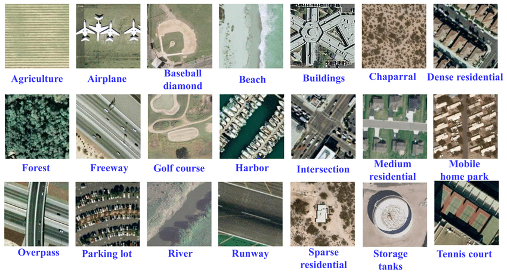
   
  <b>The UC merced dataset is a well known classification dataset.</b>

Classification is a fundamental task in remote sensing data analysis, where the goal is to assign a semantic label to each image, such as 'urban', 'forest', 'agricultural land', etc. The process of assigning labels to an image is known as image-level classification. However, in some cases, a single image might contain multiple different land cover types, such as a forest with a river running through it, or a city with both residential and commercial areas. In these cases, image-level classification becomes more complex and involves assigning multiple labels to a single image. This can be accomplished using a combination of feature extraction and machine learning algorithms to accurately identify the different land cover types. It is important to note that image-level classification should not be confused with pixel-level classification, also known as semantic segmentation. While image-level classification assigns a single label to an entire image, semantic segmentation assigns a label to each individual pixel in an image, resulting in a highly detailed and accurate representation of the land cover types in an image. Read [A brief introduction to satellite image classification with neural networks](https://www.satellite-image-deep-learning.com/p/a-brief-introduction-to-satellite)

links

* Land classification on Sentinel 2 data using a [simple sklearn cluster algorithm](https://github.com/acgeospatial/Satellite_Imagery_Python/blob/master/Clustering_KMeans-Sentinel2.ipynb) or [deep learning CNN](https://towardsdatascience.com/land-use-land-cover-classification-with-deep-learning-9a5041095ddb) `BEGINNER`
* Land Use Classification on Merced dataset using CNN [in Keras](https://github.com/tavgreen/landuse_classification)
or [fastai](https://medium.com/spatial-data-science/deep-learning-for-geospatial-data-applications-multi-label-classification-2b0a1838fcf3). Also checkout [Multi-label Land Cover Classification](https://towardsdatascience.com/multi-label-land-cover-classification-with-deep-learning-d39ce2944a3d) using the redesigned multi-label Merced dataset with 17 land cover classes `BEGINNER`
* [Multi-Label Classification of Satellite Photos of the Amazon Rainforest using keras](https://machinelearningmastery.com/how-to-develop-a-convolutional-neural-network-to-classify-satellite-photos-of-the-amazon-rainforest/) or [FastAI](https://towardsdatascience.com/fastai-multi-label-image-classification-8034be646e95) `BEGINNER`
* [Detecting Informal Settlements from Satellite Imagery using fine-tuning of ResNet-50 classifier](https://blog.goodaudience.com/detecting-informal-settlements-using-satellite-imagery-and-convolutional-neural-networks-d571a819bf44) with [repo](https://github.com/dymaxionlabs/ap-latam)
* [Land-Cover-Classification-using-Sentinel-2-Dataset](https://github.com/raoofnaushad/Land-Cover-Classification-using-Sentinel-2-Dataset) -> [well written Medium article](https://raoofnaushad7.medium.com/applying-deep-learning-on-satellite-imagery-classification-5f2588b932c1) accompanying this repo but using the EuroSAT dataset
* [Land Cover Classification of Satellite Imagery using Convolutional Neural Networks](https://towardsdatascience.com/land-cover-classification-of-satellite-imagery-using-convolutional-neural-networks-91b5bb7fe808) using Keras and a multi spectral dataset captured over vineyard fields of Salinas Valley, California
* [Detecting deforestation from satellite images](https://towardsdatascience.com/detecting-deforestation-from-satellite-images-7aa6dfbd9f61) -> using FastAI and ResNet50, with repo [fsdl_deforestation_detection](https://github.com/karthikraja95/fsdl_deforestation_detection)
* [Neural Network for Satellite Data Classification Using Tensorflow in Python](https://towardsdatascience.com/neural-network-for-satellite-data-classification-using-tensorflow-in-python-a13bcf38f3e1) -> A step-by-step guide for Landsat 5 multispectral data classification for binary built-up/non-built-up class prediction, with [repo](https://github.com/PratyushTripathy/Landsat-Classification-Using-Neural-Network)
* [Slums mapping from pretrained CNN network](https://github.com/deepankverma/slums_detection) on VHR (Pleiades: 0.5m) and MR (Sentinel: 10m) imagery
* [Comparing urban environments using satellite imagery and convolutional neural networks](https://github.com/adrianalbert/urban-environments) -> includes interesting study of the image embedding features extracted for each image on the Urban Atlas dataset. Accompanying [paper](https://www.researchgate.net/publication/315882788_Using_convolutional_networks_and_satellite_imagery_to_identify_patterns_in_urban_environments_at_a_large_scale)
* [RSI-CB](https://github.com/lehaifeng/RSI-CB) -> A Large Scale Remote Sensing Image Classification Benchmark via Crowdsource Data. See also [Remote-sensing-image-classification](https://github.com/aashishrai3799/Remote-sensing-image-classification)
* [NAIP_PoolDetection](https://github.com/annaptasznik/NAIP_PoolDetection) -> modelled as an object recognition problem, a CNN is used to identify images as being swimming pools or something else - specifically a street, rooftop, or lawn
* [Land Use and Land Cover Classification using a ResNet Deep Learning Architecture](https://www.luigiselmi.eu/eo/lulc-classification-deeplearning.html) -> uses fastai and the EuroSAT dataset
* [Vision Transformers Use Case: Satellite Image Classification without CNNs](https://medium.com/nerd-for-tech/vision-transformers-use-case-satellite-image-classification-without-cnns-2c4dbeb06f87)
* [WaterNet](https://github.com/treigerm/WaterNet) -> a CNN that identifies water in satellite images
* [Road-Network-Classification](https://github.com/ualsg/Road-Network-Classification) -> Road network classification model using ResNet-34, road classes organic, gridiron, radial and no pattern
* [Scaling AI to map every school on the planet](https://developmentseed.org/blog/2021-03-18-ai-enabling-school-mapping)
* [Landsat classification CNN tutorial](https://towardsdatascience.com/is-cnn-equally-shiny-on-mid-resolution-satellite-data-9e24e68f0c08) with [repo](https://github.com/PratyushTripathy/Landsat-Classification-Using-Convolution-Neural-Network)
* [satellite-crosswalk-classification](https://github.com/rodrigoberriel/satellite-crosswalk-classification)
* [Understanding the Amazon Rainforest with Multi-Label Classification + VGG-19, Inceptionv3, AlexNet & Transfer Learning](https://towardsdatascience.com/understanding-the-amazon-rainforest-with-multi-label-classification-vgg-19-inceptionv3-5084544fb655)
* [Implementation of the 3D-CNN model for land cover classification](https://medium.com/geekculture/remote-sensing-deep-learning-for-land-cover-classification-of-satellite-imagery-using-python-6a7b4c4f570f) -> uses the Sundarbans dataset, with [repo](https://github.com/syamkakarla98/Satellite_Imagery_Analysis). Also read [Land cover classification of Sundarbans satellite imagery using K-Nearest Neighbor(K-NNC), Support Vector Machine (SVM), and Gradient Boosting classification algorithms](https://towardsdatascience.com/land-cover-classification-in-satellite-imagery-using-python-ae39dbf2929) which is by the same author and shares the repo
* [SSTN](https://github.com/zilongzhong/SSTN) -> PyTorch Implementation of SSTNs for hyperspectral image classifications from the IEEE T-GRS paper "Spectral-Spatial Transformer Network for Hyperspectral Image Classification: A FAS Framework." Demonstrates a novel spectral-spatial transformer network (SSTN), which consists of spatial attention and spectral association modules, to overcome the constraints of convolution kernels
* [SatellitePollutionCNN](https://github.com/arnavbansal1/SatellitePollutionCNN) -> A novel algorithm to predict air pollution levels with state-of-art accuracy using deep learning and GoogleMaps satellite images
* [PropertyClassification](https://github.com/Sardhendu/PropertyClassification) -> Classifying the type of property given Real Estate, satellite and Street view Images
* [remote-sense-quickstart](https://github.com/CarryHJR/remote-sense-quickstart) -> classification on a number of datasets, including with attention visualization
* [Satellite image classification using multiple machine learning algorithms](https://github.com/tanmay-delhikar/satellite-image-analysis-ml)
* [satsense](https://github.com/DynaSlum/satsense) -> a Python library for land use/cover classification using classical features including HoG & NDVI
* [PyTorch_UCMerced_LandUse](https://github.com/GeneralLi95/PyTorch_UCMerced_LandUse) -> simple pytorch implementation fine tuned on ResNet and basic augmentations
* [EuroSAT-image-classification](https://github.com/artemisart/EuroSAT-image-classification) -> simple pytorch implementation fine tuned on ResNet
* [landcover_classification](https://github.com/reidfalconer/landcover_classification) -> using fast.ai on EuroSAT
* [IGARSS2020_BWMS](https://github.com/jiankang1991/IGARSS2020_BWMS) -> Band-Wise Multi-Scale CNN Architecture for Remote Sensing Image Scene Classification with a novel CNN architecture for the feature embedding of high-dimensional RS images
* [image.classification.on.EuroSAT](https://github.com/canturan10/image.classification.on.EuroSAT) -> solution in pure pytorch
* [hurricane_damage](https://github.com/allankapoor/hurricane_damage) -> Post-hurricane structure damage assessment based on aerial imagery with CNN
* [openai-drivendata-challenge](https://github.com/buildwithcycy/openai-drivendata-challenge) -> Using deep learning to classify the building material of rooftops (aerial imagery from South America)
* [is-it-abandoned](https://github.com/zach-brown-18/is-it-abandoned) -> Can we tell if a house is abandoned based on aerial LIDAR imagery?
* [BoulderAreaDetector](https://github.com/pszemraj/BoulderAreaDetector) -> CNN to classify whether a satellite image shows an area would be a good rock climbing spot or not
* [ISPRS_S2FL](https://github.com/danfenghong/ISPRS_S2FL) -> code for paper: Multimodal Remote Sensing Benchmark Datasets for Land Cover Classification with A Shared and Specific Feature Learning Model. S2FL is capable of decomposing multimodal RS data into modality-shared and modality-specific components, enabling the information blending of multi-modalities more effectively
* [Brazilian-Coffee-Detection](https://github.com/MrSquidward/Brazilian-Coffee-Detection) -> uses Keras with public dataset
* [tf-crash-severity](https://github.com/SoySauceNZ/tf-crash-severity) -> predict the crash severity for given road features contained within satellite images
* [ensemble_LCLU](https://github.com/burakekim/ensemble_LCLU) -> code for 2021 [paper](https://www.tandfonline.com/doi/full/10.1080/17538947.2021.1980125): Deep neural network ensembles for remote sensing land cover and land use classification
* [cerraNet](https://github.com/MirandaMat/cerraNet-v2) -> contextually classify the types of use and coverage in the Brazilian Cerrado
* [Urban-Analysis-Using-Satellite-Imagery](https://github.com/mominali12/Urban-Analysis-Using-Satellite-Imagery) -> classify urban area as planned or unplanned using a combination of segmentation and classification
* [ChipClassification](https://github.com/yurithefury/ChipClassification) -> code for 2019 [paper](https://www.sciencedirect.com/science/article/pii/S0924271619302023): Deep learning for multi-modal classification of cloud, shadow and land cover scenes in PlanetScope and Sentinel-2 imagery
* [DeeplearningClassficationLandsat-tImages](https://github.com/VinayarajPoliyapram/DeeplearningClassficationLandsat-tImages) -> Water/Ice/Land Classification Using Large-Scale Medium Resolution Landsat Satellite Images
* [wildfire-detection-from-satellite-images-ml](https://github.com/shrey24/wildfire-detection-from-satellite-images-ml) -> detect whether an image contains a wildfire, with example flask web app
* [mining-discovery-with-deep-learning](https://github.com/remis/mining-discovery-with-deep-learning) -> code for the 2020 paper: Mining and Tailings Dam Detection in Satellite Imagery Using Deep Learning
* [e-Farmerce-platform](https://github.com/efarmerce/e-Farmerce-platform) -> classify crop type
* [sentinel2-deep-learning](https://github.com/d-smit/sentinel2-deep-learning) -> Novel Training Methodologies for Land Classification of Sentinel-2 Imagery
* [RSSC-transfer](https://github.com/risojevicv/RSSC-transfer) -> code for 2021 [paper](https://arxiv.org/abs/2111.03690): The Role of Pre-Training in High-Resolution Remote Sensing Scene Classification
* [Classifying Geo-Referenced Photos and Satellite Images for Supporting Terrain Classification](https://github.com/jorgemspereira/Classifying-Geo-Referenced-Photos) -> detect floods
* [Pay-More-Attention](https://github.com/williamzhao95/Pay-More-Attention) -> code for 2021 [paper](https://ieeexplore.ieee.org/abstract/document/9157951): Remote Sensing Image Scene Classification Based on an Enhanced Attention Module
* [Remote-Sensing-Image-Classification-via-Improved-Cross-Entropy-Loss-and-Transfer-Learning-Strategy](https://github.com/AliBahri94/Remote-Sensing-Image-Classification-via-Improved-Cross-Entropy-Loss-and-Transfer-Learning-Strategy) -> code for 2019 [paper](https://ieeexplore.ieee.org/abstract/document/8844264): Remote Sensing Image Classification via Improved Cross-Entropy Loss and Transfer Learning Strategy Based on Deep Convolutional Neural Networks
* [DenseNet40-for-HRRSISC](https://github.com/BiQiWHU/DenseNet40-for-HRRSISC) -> DenseNet40 for remote sensing image scene classification, uses UC Merced Dataset
* [SKAL](https://github.com/hw2hwei/SKAL) -> code for 2022 [paper](https://ieeexplore.ieee.org/document/9298485): Looking Closer at the Scene: Multiscale Representation Learning for Remote Sensing Image Scene Classification
* [potsdam-tensorflow-practice](https://github.com/medicinely/potsdam-tensorflow-practice) -> image classification of Potsdam dataset using tensorflow
* [SAFF](https://github.com/zh-hike/SAFF) -> code for 2021 [paper](https://ieeexplore.ieee.org/abstract/document/8982033): Self-Attention-Based Deep Feature Fusion for Remote Sensing Scene Classification
* [GLNET](https://github.com/wuchangsheng951/GLNET) -> code for 2021 [paper](https://ieeexplore.ieee.org/document/9607791): Convolutional Neural Networks Based Remote Sensing Scene Classification under Clear and Cloudy Environments
* [Remote-sensing-image-classification](https://github.com/hiteshK03/Remote-sensing-image-classification) -> transfer learning using pytorch to classify remote sensing data into three classes: aircrafts, ships, none
* [remote_sensing_pretrained_models](https://github.com/lsh1994/remote_sensing_pretrained_models) -> as an alternative to fine tuning on models pretrained on ImageNet, here some CNN are pretrained on the RSD46-WHU & AID datasets
* [CNN_AircraftDetection](https://github.com/UKMIITB/CNN_AircraftDetection) -> CNN for aircraft detection in satellite images using keras
* [OBIC-GCN](https://github.com/CVEO/OBIC-GCN) -> code for 2021 [paper](https://ieeexplore.ieee.org/document/9411513): Object-based Classification Framework of Remote Sensing Images with Graph Convolutional Networks
* [aitlas-arena](https://github.com/biasvariancelabs/aitlas-arena) -> An open-source benchmark framework for evaluating state-of-the-art deep learning approaches for image classification in Earth Observation (EO)
* [droughtwatch](https://github.com/wandb/droughtwatch) -> code for 2020 [paper](https://arxiv.org/abs/2004.04081): Satellite-based Prediction of Forage Conditions for Livestock in Northern Kenya
* [JSTARS_2020_DPN-HRA](https://github.com/B-Xi/JSTARS_2020_DPN-HRA) -> code for 2020 [paper](https://ieeexplore.ieee.org/document/9126161): Deep Prototypical Networks With Hybrid Residual Attention for Hyperspectral Image Classification
* [SIGNA](https://github.com/kyle-one/SIGNA) -> code for 2022 [paper](https://arxiv.org/abs/2208.02613): Semantic Interleaving Global Channel Attention for Multilabel Remote Sensing Image Classification
* [Satellite Image Classification](https://github.com/rocketmlhq/rmldnn/tree/main/tutorials/satellite_image_classification) using rmldnn and Sentinel 2 data
* [PBDL](https://github.com/Usman1021/PBDL) -> code for 2022 [paper](https://www.mdpi.com/2072-4292/14/23/5913): Patch-Based Discriminative Learning for Remote Sensing Scene Classification
* [EmergencyNet](https://github.com/ckyrkou/EmergencyNet) -> identify fire and other emergencies from a drone
* [satellite-deforestation](https://github.com/drewhibbard/satellite-deforestation) -> Using Satellite Imagery to Identify the Leading Indicators of Deforestation, applied to the Kaggle Challenge Understanding the Amazon from Space
* [RSMLC](https://github.com/marjanstoimchev/RSMLC) -> code for 2023 [paper](https://www.mdpi.com/2072-4292/15/2/538): Deep Network Architectures as Feature Extractors for Multi-Label Classification of Remote Sensing Images

# 
## Segmentation

  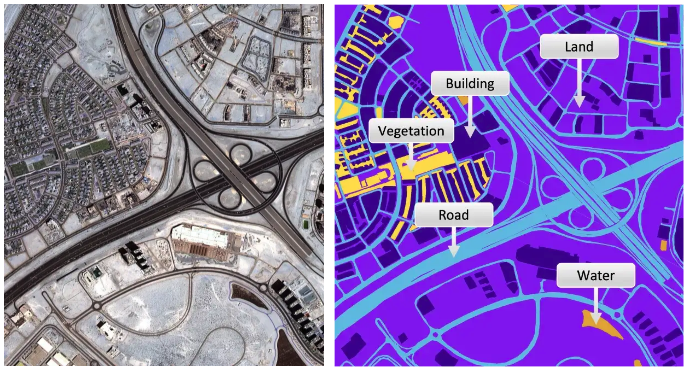
   
  <b>(left) a satellite image and (right) the semantic classes in the image.</b>

Image segmentation is a crucial step in image analysis and computer vision, with the goal of dividing an image into semantically meaningful segments or regions. The process of image segmentation assigns a class label to each pixel in an image, effectively transforming an image from a 2D grid of pixels into a 2D grid of pixels with assigned class labels. One common application of image segmentation is road or building segmentation, where the goal is to identify and separate roads and buildings from other features within an image. To accomplish this task, single class models are often trained to differentiate between roads and background, or buildings and background. These models are designed to recognize specific features, such as color, texture, and shape, that are characteristic of roads or buildings, and use this information to assign class labels to the pixels in an image. Another common application of image segmentation is land use or crop type classification, where the goal is to identify and map different land cover types within an image. In this case, multi-class models are typically used to recognize and differentiate between multiple classes within an image, such as forests, urban areas, and agricultural land. These models are capable of recognizing complex relationships between different land cover types, allowing for a more comprehensive understanding of the image content. Read [A brief introduction to satellite image segmentation with neural networks](https://www.satellite-image-deep-learning.com/p/a-brief-introduction-to-satellite-365). **Note** that many articles which refer to 'hyperspectral land classification' are often actually describing semantic segmentation. [Image source](https://towardsdatascience.com/semantic-segmentation-of-aerial-imagery-using-u-net-in-python-552705238514)

links

* [awesome-satellite-images-segmentation](https://github.com/mrgloom/awesome-semantic-segmentation#satellite-images-segmentation)
* [Satellite Image Segmentation: a Workflow with U-Net](https://medium.com/vooban-ai/satellite-image-segmentation-a-workflow-with-u-net-7ff992b2a56e) is a decent intro article `BEGINNER`
* [mmsegmentation](https://github.com/open-mmlab/mmsegmentation) -> Semantic Segmentation Toolbox with support for many remote sensing datasets including LoveDA
, Potsdam, Vaihingen & iSAID
* [segmentation_gym](https://github.com/Doodleverse/segmentation_gym) -> A neural gym for training deep learning models to carry out geoscientific image segmentation
* [How to create a DataBlock for Multispectral Satellite Image Semantic Segmentation using Fastai](https://towardsdatascience.com/how-to-create-a-datablock-for-multispectral-satellite-image-segmentation-with-the-fastai-v2-bc5e82f4eb5)
* [Using a U-Net for image segmentation, blending predicted patches smoothly is a must to please the human eye](https://github.com/Vooban/Smoothly-Blend-Image-Patches) -> python code to blend predicted patches smoothly. See [Satellite-Image-Segmentation-with-Smooth-Blending](https://github.com/MaitrySinha21/Satellite-Image-Segmentation-with-Smooth-Blending)
* [DCA](https://github.com/Luffy03/DCA) -> code for 2022 [paper](https://ieeexplore.ieee.org/document/9745130): Deep Covariance Alignment for Domain Adaptive Remote Sensing Image Segmentation
* [SCAttNet](https://github.com/lehaifeng/SCAttNet) -> Semantic Segmentation Network with Spatial and Channel Attention Mechanism
* [unetseg](https://github.com/dymaxionlabs/unetseg) -> A set of classes and CLI tools for training a semantic segmentation model based on the U-Net architecture, using Tensorflow and Keras. This implementation is tuned specifically for satellite imagery and other geospatial raster data
* [Semantic Segmentation of Satellite Imagery using U-Net & fast.ai](https://medium.com/dataseries/image-semantic-segmentation-of-satellite-imagery-using-u-net-e99ae13cf464) -> with [repo](https://github.com/raoofnaushad/Image-Semantic-Segmentation-of-Satellite-Imagery-using-U-Net.)
* [clusternet_segmentation](https://github.com/zhygallo/clusternet_segmentation) -> Unsupervised Segmentation by applying K-Means clustering to the features generated by Neural Network
* [Collection of different Unet Variant](https://github.com/ashishpatel26/satellite-Image-Semantic-Segmentation-Unet-Tensorflow-keras) -> demonstrates VggUnet, ResUnet, DenseUnet, Unet. AttUnet, MobileNetUnet, NestedUNet, R2AttUNet, R2UNet, SEUnet, scSEUnet, Unet_Xception_ResNetBlock, in keras
* [Efficient-Transformer](https://github.com/zyxu1996/Efficient-Transformer) -> code for 2021 [paper](https://www.mdpi.com/2072-4292/13/18/3585): Efficient Transformer for Remote Sensing Image Segmentation
* [weakly_supervised](https://github.com/LobellLab/weakly_supervised) -> code for the 2020 [paper](https://www.mdpi.com/2072-4292/12/2/207): Weakly Supervised Deep Learning for Segmentation of Remote Sensing Imagery
* [HRCNet-High-Resolution-Context-Extraction-Network](https://github.com/zyxu1996/HRCNet-High-Resolution-Context-Extraction-Network) -> code to 2021 [paper](https://www.mdpi.com/2072-4292/13/1/71): High-Resolution Context Extraction Network for Semantic Segmentation of Remote Sensing Images
* [Semantic segmentation of SAR images using a self supervised technique](https://github.com/cattale93/pytorch_self_supervised_learning)
* [satellite-segmentation-pytorch](https://github.com/obravo7/satellite-segmentation-pytorch) -> explores a wide variety of image augmentations to increase training dataset size
* [IEEE_TGRS_SpectralFormer](https://github.com/danfenghong/IEEE_TGRS_SpectralFormer) -> code for 2021 [paper](https://arxiv.org/abs/2107.02988): Spectralformer: Rethinking hyperspectral image classification with transformers
* [Unsupervised Segmentation of Hyperspectral Remote Sensing Images with Superpixels](https://github.com/mpBarbato/Unsupervised-Segmentation-of-Hyperspectral-Remote-Sensing-Images-with-Superpixels) -> code for 2022 [paper](https://arxiv.org/abs/2204.12296)
* [Semantic-Segmentation-with-Sparse-Labels](https://github.com/Hua-YS/Semantic-Segmentation-with-Sparse-Labels) -> codes and data for learning from sparse annotations
* [SNDF](https://github.com/mi18/SNDF) -> code for 2020 [paper](https://www.sciencedirect.com/science/article/abs/pii/S0924271619302606): Superpixel-enhanced deep neural forest for remote sensing image semantic segmentation
* [Satellite-Image-Classification](https://github.com/yxian29/Satellite-Image-Classification) -> using random forest or support vector machines (SVM) and sklearn
* [dynamic-rs-segmentation](https://github.com/keillernogueira/dynamic-rs-segmentation) -> code for 2019 [paper](https://arxiv.org/abs/1804.04020): Dynamic Multi-Context Segmentation of Remote Sensing Images based on Convolutional Networks
* [Remote-sensing-image-semantic-segmentation-tf2](https://github.com/TachibanaYoshino/Remote-sensing-image-semantic-segmentation-tf2) -> remote sensing image semantic segmentation repository based on tf.keras includes backbone networks such as resnet, densenet, mobilenet, and segmentation networks such as deeplabv3+, pspnet, panet, and refinenet
* [segmentation_models.pytorch](https://github.com/qubvel/segmentation_models.pytorch) -> Segmentation models with pretrained backbones, has been used in multiple winning solutions to remote sensing competitions
* [SSRN](https://github.com/zilongzhong/SSRN) -> code for 2017 [paper](https://ieeexplore.ieee.org/document/8061020): Spectral-Spatial Residual Network for Hyperspectral Image Classification: A 3-D Deep Learning Framework
* [SO-DNN](https://github.com/PanXinZebra/SO-DNN) -> code for 2021 [paper](https://www.sciencedirect.com/science/article/abs/pii/S0924271621002525): Simplified object-based deep neural network for very high resolution remote sensing image classification
* [SANet](https://github.com/mrluin/SANet-PyTorch) -> code for 2019 [paper](https://arxiv.org/abs/1907.03089): Scale-Aware Network for Semantic Segmentation of High-Resolution Aerial Images
* [aerial-segmentation](https://github.com/alpemek/aerial-segmentation) -> code for 2017 [paper](https://arxiv.org/abs/1707.06879): Learning Aerial Image Segmentation from Online Maps
* [IterativeSegmentation](https://github.com/gaudetcj/IterativeSegmentation) -> code for 2016 [paper](https://arxiv.org/abs/1608.03440): Recurrent Neural Networks to Correct Satellite Image Classification Maps
* [Detectron2 FPN + PointRend Model for amazing Satellite Image Segmentation](https://affine.medium.com/detectron2-fpn-pointrend-model-for-amazing-satellite-image-segmentation-183456063e15) -> 15% increase in accuracy when compared to the U-Net model
* [HybridSN](https://github.com/gokriznastic/HybridSN) -> code for 2019 [paper](https://arxiv.org/abs/1902.06701): HybridSN: Exploring 3D-2D CNN Feature Hierarchy for Hyperspectral Image Classification. Also a [pytorch implementation here](https://github.com/purbayankar/HybridSN-pytorch)
* [TNNLS_2022_X-GPN](https://github.com/B-Xi/TNNLS_2022_X-GPN) -> code for 2022 [paper](https://ieeexplore.ieee.org/document/9740412): Semisupervised Cross-scale Graph Prototypical Network for Hyperspectral Image Classification
* [singleSceneSemSegTgrs2022](https://github.com/sudipansaha/singleSceneSemSegTgrs2022) -> code for 2022 [paper](https://ieeexplore.ieee.org/document/9773162): Unsupervised Single-Scene Semantic Segmentation for Earth Observation
* [A-Fast-and-Compact-3-D-CNN-for-HSIC](https://github.com/mahmad00/A-Fast-and-Compact-3-D-CNN-for-HSIC) -> code for 2020 [paper](https://ieeexplore.ieee.org/document/9307220): A Fast and Compact 3-D CNN for Hyperspectral Image Classification
* [HSNRS](https://github.com/Walkerlikesfish/HSNRS) -> code for 2017 [paper](https://www.mdpi.com/2072-4292/9/6/522): Hourglass-ShapeNetwork Based Semantic Segmentation for High Resolution Aerial Imagery
* [GiGCN](https://github.com/ShuGuoJ/GiGCN) -> code for 2022 [paper](https://pubmed.ncbi.nlm.nih.gov/35724277/): Graph-in-Graph Convolutional Network for Hyperspectral Image Classification
* [SSAN](https://github.com/EtPan/SSAN) -> code for 2019 [paper](https://www.mdpi.com/2072-4292/11/8/963): Spectral-Spatial Attention Networks for Hyperspectral Image Classification
* [drone-images-semantic-segmentation](https://github.com/ayushdabra/drone-images-semantic-segmentation) -> Multiclass Semantic Segmentation of Aerial Drone Images Using Deep Learning
* [Satellite-Image-Segmentation-with-Smooth-Blending](https://github.com/MaitrySinha21/Satellite-Image-Segmentation-with-Smooth-Blending) -> uses [Smoothly-Blend-Image-Patches](https://github.com/Vooban/Smoothly-Blend-Image-Patches)
* [BayesianUNet](https://github.com/tha-santacruz/BayesianUNet) -> Pytorch Bayesian UNet model for segmentation and uncertainty prediction, applied to the Potsdam Dataset
* [RAANet](https://github.com/Lrr0213/RAANet) -> code for 2022 [paper](https://www.mdpi.com/2072-4292/14/13/3109): RAANet: A Residual ASPP with Attention Framework for Semantic Segmentation of High-Resolution Remote Sensing Images
* [wheelRuts_semanticSegmentation](https://github.com/SmartForest-no/wheelRuts_semanticSegmentation) -> code for 2022 [paper](https://academic.oup.com/forestry/advance-article/doi/10.1093/forestry/cpac023/6627280): Mapping wheel-ruts from timber harvesting operations using deep learning techniques in drone imagery
* [LWN-for-UAVRSI](https://github.com/syliudf/LWN-for-UAVRSI) -> Light-Weight Semantic Segmentation Network for UAV Remote Sensing Images, applied to Vaihingen, UAVid and UDD6 datasets
* [hypernet](https://github.com/ESA-PhiLab/hypernet) -> library which implements; accurate hyperspectral image (HSI) segmentation and analysis using deep neural networks, optimization of deep neural network architectures for hyperspectral data segmentation, hyperspectral data augmentation, validation of existent and emerging HSI segmentation algorithms, simulation of multispectral data using HSI
* [ST-UNet](https://github.com/XinnHe/ST-UNet) -> code for 2022 [paper](https://ieeexplore.ieee.org/abstract/document/9686686): Swin Transformer Embedding UNet for Remote Sensing Image Semantic Segmentation
* [EDFT](https://github.com/h1063135843/EDFT) -> code for 2022 [paper](https://www.mdpi.com/2072-4292/14/5/1294): Efficient Depth Fusion Transformer for Aerial Image Semantic Segmentation
* [WiCoNet](https://github.com/ggsDing/WiCoNet) -> code for 2022 [paper](https://ieeexplore.ieee.org/document/9759447): Looking Outside the Window: Wide-Context Transformer for the Semantic Segmentation of High-Resolution Remote Sensing Images
* [CRGNet](https://github.com/YonghaoXu/CRGNet) -> code for 2022 [paper](https://arxiv.org/abs/2202.03740): Consistency-Regularized Region-Growing Network for Semantic Segmentation of Urban Scenes with Point-Level Annotations
* [SA-UNet](https://github.com/Yancccccc/SA-UNet) -> code for 2022 [paper](https://www.mdpi.com/2072-4292/14/15/3591): Improved U-Net Remote Sensing Classification Algorithm Fusing Attention and Multiscale Features
* [MANet](https://github.com/lironui/Multi-Attention-Network) -> code for 2020 [paper](https://arxiv.org/abs/2009.02130): Multi-Attention-Network for Semantic Segmentation of Fine Resolution Remote Sensing Images
* [BANet](https://github.com/lironui/BANet) -> code for 2021 [paper](https://www.mdpi.com/2072-4292/13/16/3065): Transformer Meets Convolution: A Bilateral Awareness Network for Semantic Segmentation of Very Fine Resolution Urban Scene Images
* [MACU-Net](https://github.com/lironui/MACU-Net) -> code for 2022 [paper](https://arxiv.org/abs/2007.13083): MACU-Net for Semantic Segmentation of Fine-Resolution Remotely Sensed Images
* [DNAS](https://github.com/faye0078/DNAS) -> code for 2022 [paper](https://www.mdpi.com/2072-4292/14/16/3864): DNAS: Decoupling Neural Architecture Search for High-Resolution Remote Sensing Image Semantic Segmentation
* [A2-FPN](https://github.com/lironui/A2-FPN) -> code for 2021 [paper](https://arxiv.org/abs/2102.07997): A2-FPN for Semantic Segmentation of Fine-Resolution Remotely Sensed Images
* [MAResU-Net](https://github.com/lironui/MAResU-Net) -> code for 2020 [paper](https://arxiv.org/abs/2011.14302): Multi-stage Attention ResU-Net for Semantic Segmentation of Fine-Resolution Remote Sensing Images
* [ml_segmentation](https://github.com/dgriffiths3/ml_segmentation) -> semantic segmentation of buildings using Random Forest, Support Vector Machine (SVM) & Gradient Boosting Classifier (GBC)
* [RSEN](https://github.com/YonghaoXu/RSEN) -> code for 2021 [paper](https://arxiv.org/abs/2104.03765): Robust Self-Ensembling Network for Hyperspectral Image Classification
* [MSNet](https://github.com/taochx/MSNet) -> code for 2022 [paper](https://www.tandfonline.com/doi/full/10.1080/15481603.2022.2101728): MSNet: multispectral semantic segmentation network for remote sensing images
* [k-textures](https://zenodo.org/record/6359859#.Yytt6OzMK3I) -> code (R) for 2022 [paper](https://www.frontiersin.org/articles/10.3389/fenvs.2022.946729/full): K-textures, a self-supervised hard clustering deep learning algorithm for satellite image segmentation
* [Swin-Transformer-Semantic-Segmentation](https://github.com/koechslin/Swin-Transformer-Semantic-Segmentation) -> code for 2021 [paper](https://arxiv.org/abs/2110.05812): Satellite Image Semantic Segmentation
* [UDA_for_RS](https://github.com/Levantespot/UDA_for_RS) -> code for 2022 [paper](https://www.mdpi.com/2072-4292/14/19/4942): Unsupervised Domain Adaptation for Remote Sensing Semantic Segmentation with Transformer
* [A-3D-CNN-AM-DSC-model-for-hyperspectral-image-classification](https://github.com/hahatongxue/A-3D-CNN-AM-DSC-model-for-hyperspectral-image-classification) -> code for 2022 [paper](https://www.mdpi.com/2072-4292/14/9/2215): Attention Mechanism and Depthwise Separable Convolution Aided 3DCNN for Hyperspectral Remote Sensing Image Classification

### Segmentation - Land use & land cover
* [U-Net for Semantic Segmentation on Unbalanced Aerial Imagery](https://towardsdatascience.com/u-net-for-semantic-segmentation-on-unbalanced-aerial-imagery-3474fa1d3e56) -> using the Dubai dataset `BEGINNER`
* [Semantic Segmentation of Dubai dataset Using a TensorFlow U-Net Model](https://towardsdatascience.com/semantic-segmentation-of-aerial-imagery-using-u-net-in-python-552705238514) `BEGINNER`
* [nga-deep-learning](https://github.com/jordancaraballo/nga-deep-learning) -> performs semantic segmentation on high resultion GeoTIF data using a modified U-Net & Keras, published by NASA researchers
* [Automatic Detection of Landfill Using Deep Learning](https://github.com/AnupamaRajkumar/LandfillDetection_SemanticSegmentation)
* [SpectralNET](https://github.com/tanmay-ty/SpectralNET) -> a 2D wavelet CNN for Hyperspectral Image Classification, uses Salinas Scene dataset & Keras
* [laika](https://github.com/datasciencecampus/laika) -> The goal of this repo is to research potential sources of satellite image data and to implement various algorithms for satellite image segmentation
* [PEARL](https://www.landcover.io/) -> a human-in-the-loop AI tool to drastically reduce the time required to produce an accurate Land Use/Land Cover (LULC) map, [blog post](http://devseed.com/blog/2021-05-17-pearl-ai-land-cover), uses Microsoft Planetary Computer and ML models run locally in the browser. Code for [backelnd](https://github.com/developmentseed/pearl-backend) and [frontend](https://github.com/developmentseed/pearl-frontend)
* [Land Cover Classification with U-Net](https://baratam-tarunkumar.medium.com/land-cover-classification-with-u-net-aa618ea64a1b) -> Satellite Image Multi-Class Semantic Segmentation Task with PyTorch Implementation of U-Net, uses DeepGlobe Land Cover Segmentation dataset, with [code](https://github.com/TarunKumar1995-glitch/land_cover_classification_unet)
* [Multi-class semantic segmentation of satellite images using U-Net](https://github.com/rogerxujiang/dstl_unet) using DSTL dataset, tensorflow 1 & python 2.7. Accompanying [article](https://towardsdatascience.com/dstl-satellite-imagery-contest-on-kaggle-2f3ef7b8ac40)
* [Codebase for multi class land cover classification with U-Net](https://github.com/jaeeolma/lulc_ml) accompanying a masters thesis, uses Keras
* [dubai-satellite-imagery-segmentation](https://github.com/ayushdabra/dubai-satellite-imagery-segmentation) -> due to the small dataset, image augmentation was used
* [CDL-Segmentation](https://github.com/asimniazi63/CDL-Segmentation) -> code for the 2021 [paper](https://ieeexplore.ieee.org/abstract/document/9441483): Deep Learning Based Land Cover and Crop Type Classification: A Comparative Study. Compares UNet, SegNet & DeepLabv3+
* [LoveDA](https://github.com/Junjue-Wang/LoveDA) -> code for the 2021 [paper](https://arxiv.org/abs/2110.08733): A Remote Sensing Land-Cover Dataset for Domain Adaptive Semantic Segmentation
* [Satellite Imagery Semantic Segmentation with CNN](https://joshting.medium.com/satellite-imagery-segmentation-with-convolutional-neural-networks-f9254de3b907) -> 7 different segmentation classes, DeepGlobe Land Cover Classification Challenge dataset, with [repo](https://github.com/justjoshtings/satellite_image_segmentation)
* [Aerial Semantic Segmentation using U-Net Deep Learning Model](https://medium.com/@rehman.aimal/aerial-semantic-segmentation-using-u-net-deep-learning-model-3356a53c915f) medium article, with [repo](https://github.com/aimalrehman92/Multiclass-Semantic-Segmentation-with-U-NET)
* [UNet-Satellite-Image-Segmentation](https://github.com/YudeWang/UNet-Satellite-Image-Segmentation) -> A Tensorflow implentation of light UNet semantic segmentation framework
* [DeepGlobe Land Cover Classification Challenge solution](https://github.com/GeneralLi95/deepglobe_land_cover_classification_with_deeplabv3plus)
* [Semantic-segmentation-with-PyTorch-Satellite-Imagery](https://github.com/JenAlchimowicz/Semantic-segmentation-with-PyTorch-Satellite-Imagery) -> predict 25 classes on RGB imagery taken to assess the damage after Hurricane Harvey
* [Semantic Segmentation With Sentinel-2 Imagery](https://github.com/pavlo-seimskyi/semantic-segmentation-satellite-imagery) -> uses LandCoverNet dataset and fast.ai
* [CNN_Enhanced_GCN](https://github.com/qichaoliu/CNN_Enhanced_GCN) -> code for 2021 [paper](https://ieeexplore.ieee.org/document/9268479): CNN-Enhanced Graph Convolutional Network With Pixel- and Superpixel-Level Feature Fusion for Hyperspectral Image Classification
* [LULCMapping-WV3images-CORINE-DLMethods](https://github.com/esertel/LULCMapping-WV3images-CORINE-DLMethods) -> Land Use and Land Cover Mapping Using Deep Learning Based Segmentation Approaches and VHR Worldview-3 Images
* [SOLC](https://github.com/yisun98/SOLC) -> code for 2022 [paper](https://www.sciencedirect.com/science/article/pii/S0303243421003457): MCANet: A joint semantic segmentation framework of optical and SAR images for land use classification. Uses [WHU-OPT-SAR-dataset](https://github.com/AmberHen/WHU-OPT-SAR-dataset)
* [MUnet-LUC](https://github.com/abhi170599/MUnet-LUC) -> Land Use with mUnet
* [land-cover](https://github.com/lucashu1/land-cover) -> code for 2021 [paper](https://arxiv.org/abs/2008.10351): Model Generalization in Deep Learning Applications for Land Cover Mapping
* [generalizablersc](https://github.com/dgominski/generalizablersc) -> code for 2022 paper: Cross-dataset Learning for Generalizable Land Use Scene Classification
* [Large-scale-Automatic-Identification-of-Urban-Vacant-Land](https://github.com/SkydustZ/Large-scale-Automatic-Identification-of-Urban-Vacant-Land) -> code for 2022 [paper](https://www.sciencedirect.com/science/article/abs/pii/S0169204622000330): Large-scale automatic identification of urban vacant land using semantic segmentation of high-resolution remote sensing images
* [SSLTransformerRS](https://github.com/HSG-AIML/SSLTransformerRS) -> code for 2022 paper: Self-supervised Vision Transformers for Land-cover Segmentation and
Classification
* [aerial-tile-segmentation](https://github.com/mrsebai/aerial-tile-segmentation) -> Large satellite image semantic segmentation into 6 classes using Tensorflow 2.0 and ISPRS benchmark dataset
* [LULCMapping-WV3images-CORINE-DLMethods](https://github.com/burakekim/LULCMapping-WV3images-CORINE-DLMethods) -> code for 2022 [paper](https://www.mdpi.com/2072-4292/14/18/4558): Land Use and Land Cover Mapping Using Deep Learning Based Segmentation Approaches and VHR Worldview-3 Images
* [DCSA-Net](https://github.com/Julia90/DCSA-Net) -> code for 2022 [paper](https://www.mdpi.com/2072-4292/14/19/4941): Dynamic Convolution Self-Attention Network for Land-Cover Classification in VHR Remote-Sensing Images
* [CHeGCN-CNN_enhanced_Heterogeneous_Graph](https://github.com/Liuzhizhiooo/CHeGCN-CNN_enhanced_Heterogeneous_Graph) -> code for 2022 [paper](https://www.mdpi.com/2072-4292/14/19/5027): CNN-Enhanced Heterogeneous Graph Convolutional Network: Inferring Land Use from Land Cover with a Case Study of Park Segmentation
* [TCSVT_2022_DGSSC](https://github.com/B-Xi/TCSVT_2022_DGSSC) -> code for the 2022 [paper](https://ieeexplore.ieee.org/document/9924229): DGSSC: A Deep Generative Spectral-Spatial Classifier for Imbalanced Hyperspectral Imagery

### Segmentation - Vegetation, crops & crop boundaries
* [Сrор field boundary detection: approaches and main challenges](https://medium.com/geekculture/%D1%81r%D0%BE%D1%80-field-boundary-detection-approaches-and-main-challenges-46e37dd276bc) -> Medium article, covering historical and modern approaches `BEGINNER` 
* [kenya-crop-mask](https://github.com/nasaharvest/kenya-crop-mask) -> Annual and in-season crop mapping in Kenya - LSTM classifier to classify pixels as containing crop or not, and a multi-spectral forecaster that provides a 12 month time series given a partial input. Dataset downloaded from GEE and pytorch lightning used for training `BEGINNER`
* [What’s growing there? Identify crops from multi-spectral remote sensing data (Sentinel 2)](https://towardsdatascience.com/whats-growing-there-a5618a2e6933) using eo-learn for data pre-processing, cloud detection, NDVI calculation, image augmentation & fastai
* [Tree species classification from from airborne LiDAR and hyperspectral data using 3D convolutional neural networks](https://github.com/jaeeolma/tree-detection-evo) accompanies research paper and uses fastai
* [crop-type-classification](https://medium.com/nerd-for-tech/crop-type-classification-cf5cc2593396) -> using Sentinel 1 & 2 data with a U-Net + LSTM, more features (i.e. bands) and higher resolution produced better results (article, no code)
* [Find sports fields using Mask R-CNN and overlay on open-street-map](https://github.com/jremillard/images-to-osm)
* [An LSTM to generate a crop mask for Togo](https://github.com/nasaharvest/togo-crop-mask)
* [DeepSatModels](https://github.com/michaeltrs/DeepSatModels) -> Code for paper "Context-self contrastive pretraining for crop type semantic segmentation"
* [farm-pin-crop-detection-challenge](https://github.com/simongrest/farm-pin-crop-detection-challenge) -> Using eo-learn and fastai to identify crops from multi-spectral remote sensing data
* [Detecting Agricultural Croplands from Sentinel-2 Satellite Imagery](https://medium.com/radiant-earth-insights/detecting-agricultural-croplands-from-sentinel-2-satellite-imagery-a025735d3bd8) -> We developed UNet-Agri, a benchmark machine learning model that classifies croplands using open-access Sentinel-2 imagery at 10m spatial resolution
* [DeepTreeAttention](https://github.com/weecology/DeepTreeAttention) -> Implementation of Hang et al. 2020 "Hyperspectral Image Classification with Attention Aided CNNs" for tree species prediction
* [Crop-Classification](https://github.com/bhavesh907/Crop-Classification) -> crop classification using multi temporal satellite images
* [ParcelDelineation](https://github.com/sustainlab-group/ParcelDelineation) -> using a French polygons dataset and unet in keras
* [crop-mask](https://github.com/nasaharvest/crop-mask) -> End-to-end workflow for generating high resolution cropland maps, uses GEE & LSTM model
* [DeepCropMapping](https://github.com/Lab-IDEAS/DeepCropMapping) -> A multi-temporal deep learning approach with improved spatial generalizability for dynamic corn and soybean mapping, uses LSTM
* [Segment Canopy Cover and Soil using NDVI and Rasterio](https://towardsdatascience.com/segment-satellite-imagery-using-ndvi-and-rasterio-6dcae02a044b)
* [Use KMeans clustering to segment satellite imagery by land cover/land use](https://towardsdatascience.com/segment-satellite-images-using-rasterio-and-scikit-learn-fc048f465874)
* [ResUnet-a](https://github.com/Akhilesh64/ResUnet-a) -> Implementation of the paper "ResUNet-a: a deep learning framework for semantic segmentation of remotely sensed data" in TensorFlow
* [DSD_paper_2020](https://github.com/JacobJeppesen/DSD_paper_2020) -> The code for the paper: Crop Type Classification based on Machine Learning with Multitemporal Sentinel-1 Data
* [MR-DNN](https://github.com/yasir2afaq/Multi-resolution-deep-neural-network) -> extract rice field from Landsat 8 satellite imagery
* [deep_learning_forest_monitoring](https://github.com/waldeland/deep_learning_forest_monitoring) -> Estimate vegetation height, code for paper: Forest mapping and monitoring of the African continent using Sentinel-2 data and deep learning
* [global-cropland-mapping](https://github.com/Charly-tian/global-cropland-mapping) -> global multi-temporal cropland mapping
* [U-Net for Semantic Segmentation of Soyabean Crop Fields with SAR images](https://joaootavionf007.medium.com/u-net-for-semantic-segmentation-of-soyabeans-crop-fields-with-sar-images-604232e49315)
* [UNet-RemoteSensing](https://github.com/aryanVijaywargia/UNet-RemoteSensing) -> uses 7 bands of Landsat and keras
* [Landuse_DL](https://github.com/yghlc/Landuse_DL) -> delineate landforms due to the thawing of ice-rich permafrost
* [canopy](https://github.com/jonathanventura/canopy) -> code for 2019 [paper](https://www.mdpi.com/2072-4292/11/19/2326): A Convolutional Neural Network Classifier Identifies Tree Species in Mixed-Conifer Forest from Hyperspectral Imagery
* [RandomForest-Classification](https://github.com/florianbeyer/RandomForest-Classification) -> script is for random forest classification of remote sensing multi-band images, used in 2019 [paper](https://www.tandfonline.com/doi/abs/10.1080/01431161.2019.1580825): Multisensor data to derive peatland vegetation communities using a fixed-wing unmanned aerial vehicle
* [forest_change_detection](https://github.com/QuantuMobileSoftware/forest_change_detection) -> forest change segmentation with time-dependent models, including Siamese, UNet-LSTM, UNet-diff, UNet3D models. Code for 2021 [paper](https://ieeexplore.ieee.org/document/9241044): Deep Learning for Regular Change Detection in Ukrainian Forest Ecosystem With Sentinel-2
* [cultionet](https://github.com/jgrss/cultionet) -> segmentation of cultivated land, built on PyTorch Geometric and PyTorch Lightning
* [sentinel-tree-cover](https://github.com/wri/sentinel-tree-cover) -> code for 2020 [paper](https://arxiv.org/abs/2005.08702): A global method to identify trees outside of closed-canopy forests with medium-resolution satellite imagery
* [crop-type-detection-ICLR-2020](https://github.com/RadiantMLHub/crop-type-detection-ICLR-2020) -> Winning Solutions from Crop Type Detection Competition at CV4A workshop, ICLR 2020
* [Crop identification using satellite imagery](https://write.agrevolution.in/crop-identification-using-satellite-imagery-introduction-83d79344f9ee) -> Medium article, introduction to crop identification
* [S4A-Models](https://github.com/Orion-AI-Lab/S4A-Models) -> Various experiments on the Sen4AgriNet dataset
* [attention-mechanism-unet](https://github.com/davej23/attention-mechanism-unet) -> code for 2022 [paper](https://www.sciencedirect.com/science/article/pii/S0303243422000113): An attention-based U-Net for detecting deforestation within satellite sensor imagery
* [Cocoa_plantations_detection](https://github.com/antoine-spahr/Cocoa_plantations_detection) -> Detecting cocoa plantation in Ivory Coast using Sentinel-2 remote sensing data using KNN, SVM, Random Forest and MLP
* [SummerCrop_Deeplearning](https://github.com/AgriRS/SummerCrop_Deeplearning) -> code for 2022 [paper](https://www.mdpi.com/2072-4292/14/20/5216): A Transferable Learning Classification Model and Carbon Sequestration Estimation of Crops in Farmland Ecosystem
* [DeepForest](https://deepforest.readthedocs.io/en/latest/index.html) is a python package for training and predicting individual tree crowns from airborne RGB imagery
* [Official repository for the "Identifying trees on satellite images" challenge from Omdena](https://github.com/cienciaydatos/ai-challenge-trees)
* [Counting-Trees-using-Satellite-Images](https://github.com/A2Amir/Counting-Trees-using-Satellite-Images) -> create an inventory of incoming and outgoing trees for an annual tree inspections, uses keras & semantic segmentation
* [2020 Nature paper - An unexpectedly large count of trees in the West African Sahara and Sahel](https://www.nature.com/articles/s41586-020-2824-5) -> tree detection framework based on U-Net & tensorflow 2 with code [here](https://github.com/ankitkariryaa/An-unexpectedly-large-count-of-trees-in-the-western-Sahara-and-Sahel/tree/v1.0.0)
* [TreeDetection](https://github.com/AmirNiaraki/TreeDetection) -> A color-based classifier to detect the trees in google image data along with tree visual localization and crown size calculations via OpenCV
* [PTDM](https://github.com/hr8yhtzb/PTDM) -> code for 2022 [paper](https://www.mdpi.com/2072-4292/14/16/3902): Pomelo Tree Detection Method Based on Attention Mechanism and Cross-Layer Feature Fusion
* [urban-tree-detection](https://github.com/jonathanventura/urban-tree-detection) -> code for 2022 [paper](https://arxiv.org/abs/2208.10607): Individual Tree Detection in Large-Scale Urban Environments using High-Resolution Multispectral Imagery. With [dataset](https://github.com/jonathanventura/urban-tree-detection-data)
* [BioMassters_baseline](https://github.com/fnands/BioMassters_baseline) -> a basic pytorch ligning baseline using a UNet for getting started with the [BioMassters challenge](https://www.drivendata.org/competitions/99/biomass-estimation/) (biomass estimation)
* [3DUNetGSFormer](https://github.com/aj1365/3DUNetGSFormer) -> code for 2022 [paper](https://www.sciencedirect.com/science/article/pii/S1574954122003545): 3DUNetGSFormer: A deep learning pipeline for complex wetland mapping using generative adversarial networks and Swin transformer

### Segmentation - Water, coastlines & floods
* [Flood Detection and Analysis using UNET with Resnet-34 as the back bone](https://github.com/orion29/Satellite-Image-Segmentation-for-Flood-Damage-Analysis) uses fastai `BEGINNER`
* [Automatic Flood Detection from Satellite Images Using Deep Learning](https://medium.com/@omercaliskan99/automatic-flood-detection-from-satellite-images-using-deep-learning-f14fafd369e0) `BEGINNER`
* [UNSOAT used fastai to train a Unet to perform semantic segmentation on satellite imageries to detect water](https://forums.fast.ai/t/unosat-used-fastai-ai-for-their-floodai-model-discussion-on-how-to-move-forward/78468) - [paper](https://www.mdpi.com/2072-4292/12/16/2532) + [notebook](https://github.com/UNITAR-UNOSAT/UNOSAT-AI-Based-Rapid-Mapping-Service/blob/master/Fastai%20training.ipynb), accuracy 0.97, precision 0.91, recall 0.92
* [Semi-Supervised Classification and Segmentation on High Resolution Aerial Images - Solving the FloodNet problem](https://sahilkhose.medium.com/paper-presentation-e9bd0f3fb0bf)
* [Houston_flooding](https://github.com/Lichtphyz/Houston_flooding) -> labeling each pixel as either flooded or not using data from Hurricane Harvey. Dataset consisted of pre and post flood images, and a ground truth floodwater mask was created using unsupervised clustering (with DBScan) of image pixels with human cluster verification/adjustment
* [ml4floods](https://github.com/spaceml-org/ml4floods) -> An ecosystem of data, models and code pipelines to tackle flooding with ML
* [A comprehensive guide to getting started with the ETCI Flood Detection competition](https://medium.com/cloud-to-street/jumpstart-your-machine-learning-satellite-competition-submission-2443b40d0a5a) -> using Sentinel1 SAR & pytorch
* [Map Floodwater of SAR Imagery with SageMaker](https://github.com/JayThibs/map-floodwater-sar-imagery-on-sagemaker) -> applied to Sentinel-1 dataset
* [1st place solution for STAC Overflow: Map Floodwater from Radar Imagery hosted by Microsoft AI for Earth](https://github.com/sweetlhare/STAC-Overflow) -> combines Unet with Catboostclassifier, taking their maxima, not the average
* [hydra-floods](https://github.com/Servir-Mekong/hydra-floods) -> an open source Python application for downloading, processing, and delivering surface water maps derived from remote sensing data
* [CoastSat](https://github.com/kvos/CoastSat) -> tool for mapping coastlines which has an extension [CoastSeg](https://github.com/dbuscombe-usgs/CoastSeg) using  segmentation models
* [Satellite_Flood_Segmentation_of_Harvey](https://github.com/morgan-tam/Satellite_Flood_Segmentation_of_Harvey) -> explores both deep learning and traditional kmeans
* [Flood Event Detection Utilizing Satellite Images](https://github.com/KonstantinosF/Flood-Detection---Satellite-Images)
* [ETCI-2021-Competition-on-Flood-Detection](https://github.com/sidgan/ETCI-2021-Competition-on-Flood-Detection) -> Experiments on Flood Segmentation on Sentinel-1 SAR Imagery with Cyclical Pseudo Labeling and Noisy Student Training, with [arxiv paper](https://arxiv.org/abs/2107.08369)
* [FDSI](https://github.com/keillernogueira/FDSI) -> Flood Detection in Satellite Images - 2017 Multimedia Satellite Task
* [deepwatermap](https://github.com/isikdogan/deepwatermap) -> a deep model that segments water on multispectral images
* [rivamap](https://github.com/isikdogan/rivamap) -> an automated river analysis and mapping engine
* [deep-water](https://github.com/maxbeber/deep-water) -> track changes in water level
* [WatNet](https://github.com/xinluo2018/WatNet) -> A deep ConvNet for surface water mapping based on Sentinel-2 image, uses the [Earth Surface Water Dataset](https://zenodo.org/record/5205674#.YoMjyZPMK3I)
* [A-U-Net-for-Flood-Extent-Mapping](https://github.com/jorgemspereira/A-U-Net-for-Flood-Extent-Mapping) -> in keras
* [floatingobjects](https://github.com/ESA-PhiLab/floatingobjects) -> code for the paper: TOWARDS DETECTING FLOATING OBJECTS ON A GLOBAL SCALE WITHLEARNED SPATIAL FEATURES USING SENTINEL 2. Uses U-Net & pytorch
* [River-Network-Extraction-from-Satellite-Image-using-UNet-and-Tensorflow](https://github.com/Diwas524/River-Network-Extraction-from-Satellite-Image-using-UNet-and-Tensorflow) -> uses Sentinel-2 imagery
* [SpaceNet8](https://github.com/SpaceNetChallenge/SpaceNet8) -> baseline Unet solution to detect flooded roads and buildings
* [dlsim](https://github.com/nyokoya/dlsim) -> code for 2020 [paper](https://arxiv.org/abs/2006.05180): Breaking the Limits of Remote Sensing by Simulation and Deep Learning for Flood and Debris Flow Mapping
* [Water-HRNet](https://github.com/faye0078/Water-Extraction) -> HRNet trained on Sentinel 2
* [semantic segmentation model to identify newly developed or flooded land](https://github.com/Azure/pixel_level_land_classification) using NAIP imagery provided by the Chesapeake Conservancy, training on MS Azure
* [BandNet](https://github.com/IamShubhamGupto/BandNet) -> code for 2022 [paper](https://arxiv.org/abs/2212.08749): Analysis and application of multispectral data
for water segmentation using machine learning. Uses Sentinel-2 data

### Segmentation - Fire, smoke & burn areas
* [SatelliteVu-AWS-Disaster-Response-Hackathon](https://github.com/SatelliteVu/SatelliteVu-AWS-Disaster-Response-Hackathon) -> fire spread prediction using classical ML & deep learning `BEGINNER`
* [Wild Fire Detection](https://github.com/yueureka/WildFireDetection) using U-Net trained on Databricks & Keras, semantic segmentation
* [A Practical Method for High-Resolution Burned Area Monitoring Using Sentinel-2 and VIIRS](https://www.mdpi.com/2072-4292/13/9/1608) with [code](https://github.com/mnpinto/FireHR). Dataset created on Google Earth Engine, downloaded to local machine for model training using fastai. The BA-Net model used is much smaller than U-Net, resulting in lower memory requirements and a faster computation
* [AI Geospatial Wildfire Risk Prediction](https://towardsdatascience.com/ai-geospatial-wildfire-risk-prediction-8c6b1d415eb4) -> A predictive model using geospatial raster data to asses wildfire hazard potential over the contiguous United States using Unet
* [IndustrialSmokePlumeDetection](https://github.com/HSG-AIML/IndustrialSmokePlumeDetection) -> using Sentinel-2 & a modified ResNet-50
* [burned-area-detection](https://github.com/dymaxionlabs/burned-area-detection) -> uses Sentinel-2
* [rescue](https://github.com/dbdmg/rescue) -> code of the paper: Attention to fires: multi-channel deep-learning models forwildfire severity prediction
* [smoke_segmentation](https://github.com/jeffwen/smoke_segmentation) -> Segmenting smoke plumes and predicting density from GOES imagery
* [wildfire-detection](https://github.com/amanbasu/wildfire-detection) -> Using Vision Transformers for enhanced wildfire detection in satellite images
* [Burned_Area_Detection](https://github.com/prhuppertz/Burned_Area_Detection) -> Detecting Burned Areas with Sentinel-2 data
* [burned-area-baseline](https://github.com/lccol/burned-area-baseline) -> baseline unet model accompanying the Satellite Burned Area Dataset (Sentinel 1 & 2)

### Segmentation - Landslides
* [landslide4sense](https://www.iarai.ac.at/landslide4sense/) -> a competition focused on landslide detection using globally distributed multi-source satellite imagery. [Baseline solution unet](https://github.com/isaaccorley/landslide4sense)  `BEGINNER`
* [landslide-mapping-with-cnn](https://github.com/nprksh/landslide-mapping-with-cnn) -> code for 2021 [paper](https://www.nature.com/articles/s41598-021-89015-8): A new strategy to map landslides with a generalized convolutional neural network
* [Relict_landslides_CNN_kmeans](https://github.com/SPAMLab/data_sharing/tree/main/Relict_landslides_CNN_kmeans) -> code for 2022 [paper](https://arxiv.org/abs/2208.02693): Relict landslide detection in rainforest areas using a combination of k-means clustering algorithm and Deep-Learning semantic segmentation models
* [Landslide-mapping-on-SAR-data-by-Attention-U-Net](https://github.com/lorenzonava96/Landslide-mapping-on-SAR-data-by-Attention-U-Net) -> code for 2022 [paper](https://www.mdpi.com/2072-4292/14/6/1449): Rapid Mapping of landslide on SAR data by Attention U-net
* [SAR-landslide-detection-pretraining](https://github.com/VMBoehm/SAR-landslide-detection-pretraining) -> code for the 2022 [paper](https://arxiv.org/abs/2211.09927): SAR-based landslide classification pretraining leads to better segmentation
* [landslide-sar-unet](https://github.com/iprapas/landslide-sar-unet) -> code for 2022 [paper](https://arxiv.org/abs/2211.02869): Deep Learning for Rapid Landslide Detection using Synthetic Aperture Radar (SAR) Datacubes

### Segmentation - Glaciers
* [HED-UNet](https://github.com/khdlr/HED-UNet) -> a model for simultaneous semantic segmentation and edge detection, examples provided are glacier fronts and building footprints using the Inria Aerial Image Labeling dataset
* [glacier_mapping](https://github.com/krisrs1128/glacier_mapping) -> Mapping glaciers in the Hindu Kush Himalaya, Landsat 7 images, Shapefile labels of the glaciers, Unet with dropout
* [glacier-detect-ML](https://github.com/mikeskaug/glacier-detect-ML) -> a simple logistic regression model to identify a glacier in Landsat satellite imagery
* [GlacierSemanticSegmentation](https://github.com/n9Mtq4/GlacierSemanticSegmentation) -> uses unet
* [Antarctic-fracture-detection](https://github.com/chingyaolai/Antarctic-fracture-detection) -> uses UNet with the MODIS Mosaic of Antarctica to detect surface fractures ([paper](https://www.nature.com/articles/s41586-020-2627-8#code-availability))

### Segmentation - Other environmental
* [Detection of Open Landfills](https://github.com/dymaxionlabs/basurales) -> uses Sentinel-2 to detect large changes in the Normalized Burn Ratio (NBR)
* [sea_ice_remote_sensing](https://github.com/sum1lim/sea_ice_remote_sensing) -> Sea Ice Concentration classification
* [Methane-detection-from-hyperspectral-imagery](https://github.com/satish1901/Methane-detection-from-hyperspectral-imagery) -> code for 2020 [paper](https://ieeexplore.ieee.org/document/9093600): Deep Remote Sensing Methods for Methane Detection in Overhead Hyperspectral Imagery
* [EddyNet](https://github.com/redouanelg/EddyNet) -> A Deep Neural Network For Pixel-Wise Classification of Oceanic Eddies
* [schisto-vegetation](https://github.com/deleo-lab/schisto-vegetation) -> code for 2022 [paper](https://www.mdpi.com/2072-4292/14/6/1345): Deep Learning Segmentation of Satellite Imagery Identifies Aquatic Vegetation Associated with Snail Intermediate Hosts of Schistosomiasis in Senegal, Africa
* [earth-forecasting-transformer](https://github.com/amazon-science/earth-forecasting-transformer) -> code for 2022 [paper](https://www.amazon.science/publications/earthformer-exploring-space-time-transformers-for-earth-system-forecasting): Earthformer: exploring space-time transformers for earth system forecasting
* [weather4cast-2022](https://github.com/iarai/weather4cast-2022) -> Unet-3D baseline model for Weather4cast Rain Movie Prediction competition
* [WeatherFusionNet](https://github.com/Datalab-FIT-CTU/weather4cast-2022) -> code for [paper](https://arxiv.org/abs/2211.16824): WeatherFusionNet: Predicting Precipitation from Satellite Data. weather4cast-2022 1st place solution

### Segmentation - Roads
Extracting roads is challenging due to the occlusions caused by other objects and the complex traffic environment
* [Road detection using semantic segmentation and albumentations for data augmention](https://towardsdatascience.com/road-detection-using-segmentation-models-and-albumentations-libraries-on-keras-d5434eaf73a8) using the Massachusetts Roads Dataset, U-net & Keras. With [code](https://github.com/Diyago/ML-DL-scripts/tree/master/DEEP%20LEARNING/segmentation/Segmentation%20pipeline) `BEGINNER`
* [ML_EPFL_Project_2](https://github.com/LucasBrazCappelo/ML_EPFL_Project_2) -> U-Net in Pytorch to perform semantic segmentation of roads on satellite images `BEGINNER`
* [Semantic Segmentation of roads](https://vihan-tyagi.medium.com/semantic-segmentation-of-satellite-images-based-on-deep-learning-algorithms-ea5ec408ac53) using  U-net Keras, OSM data, project summary article by student, no code
* [Winning Solutions from SpaceNet Road Detection and Routing Challenge](https://github.com/SpaceNetChallenge/RoadDetector)
* [RoadVecNet](https://github.com/gismodelling/RoadVecNet) -> Road-Network-Segmentation-and-Vectorization in keras with dataset and [paper](https://www.tandfonline.com/doi/abs/10.1080/15481603.2021.1972713?journalCode=tgrs20&)
* [Detecting road and road types jupyter notebook](https://github.com/taspinar/sidl/blob/master/notebooks/2_Detecting_road_and_roadtypes_in_sattelite_images.ipynb)
* [awesome-deep-map](https://github.com/antran89/awesome-deep-map) -> A curated list of resources dedicated to deep learning / computer vision algorithms for mapping. The mapping problems include road network inference, building footprint extraction, etc.
* [RoadTracer: Automatic Extraction of Road Networks from Aerial Images](https://github.com/mitroadmaps/roadtracer) -> uses an iterative search process guided by a CNN-based decision function to derive the road network graph directly from the output of the CNN
* [road_detection_mtl](https://github.com/ntelo007/road_detection_mtl) -> Road Detection using a multi-task Learning technique to improve the performance of the road detection task by incorporating prior knowledge constraints, uses the SpaceNet Roads Dataset
* [road_connectivity](https://github.com/anilbatra2185/road_connectivity) -> Improved Road Connectivity by Joint Learning of Orientation and Segmentation (CVPR2019)
* [Road-Network-Extraction using classical Image processing](https://github.com/abhaykes1/Road-Network-Extraction) -> blur & canny edge detection
* [SPIN_RoadMapper](https://github.com/wgcban/SPIN_RoadMapper) -> Extracting Roads from Aerial Images via Spatial and Interaction Space Graph Reasoning for Autonomous Driving
* [road_extraction_remote_sensing](https://github.com/jiankang1991/road_extraction_remote_sensing) -> pytorch implementation, CVPR2018 DeepGlobe Road Extraction Challenge submission. See also [DeepGlobe-Road-Extraction-Challenge](https://github.com/zlckanata/DeepGlobe-Road-Extraction-Challenge)
* [RoadDetections dataset by Microsoft](https://github.com/microsoft/RoadDetections)
* [CoANet](https://github.com/mj129/CoANet) -> Connectivity Attention Network for Road Extraction From Satellite Imagery. The CoA module incorporates graphical information to ensure the connectivity of roads are better preserved. With [paper](https://ieeexplore.ieee.org/document/9563125)
* [Satellite Imagery Road Segmentation](https://medium.com/@nithishmailme/satellite-imagery-road-segmentation-ad2964dc3812) -> intro articule on Medium using the kaggle [Massachusetts Roads Dataset](https://www.kaggle.com/datasets/balraj98/massachusetts-roads-dataset)
* [Label-Pixels](https://github.com/venkanna37/Label-Pixels) -> for semantic segmentation of roads and other features
* [Satellite-image-road-extraction](https://github.com/amanhari-projects/Satellite-image-road-extraction) -> code for 2018 paper: Road Extraction by Deep Residual U-Net
* [road_building_extraction](https://github.com/jeffwen/road_building_extraction) -> Pytorch implementation of U-Net architecture for road and building extraction
* [Satellite-Imagery-Road-Extraction](https://github.com/Akash-Ramjyothi/Satellite-Imagery-Road-Extraction) -> research project in keras
* [SGCN](https://github.com/tist0bsc/SGCN) -> code for 2021 [paper](https://ieeexplore.ieee.org/document/9614130): Split Depth-Wise Separable Graph-Convolution Network for Road Extraction in Complex Environments From High-Resolution Remote-Sensing Images
* [ASPN](https://github.com/pshams55/ASPN) -> code for 2020 [paper](https://arxiv.org/abs/2008.04021): Road Segmentation for Remote Sensing Images using Adversarial Spatial Pyramid Networks
* [FCNs-for-road-extraction-keras](https://github.com/zetrun-liu/FCNs-for-road-extraction-keras) -> Road extraction of high-resolution remote sensing images based on various semantic segmentation networks
* [cresi](https://github.com/avanetten/cresi) -> Road network extraction from satellite imagery, with speed and travel time estimates
* [road-extraction-d-linknet](https://github.com/NekoApocalypse/road-extraction-d-linknet) -> code for 2018 [paper](https://ieeexplore.ieee.org/document/8575492): D-LinkNet: LinkNet with Pretrained Encoder and Dilated Convolution for High Resolution Satellite Imagery Road Extraction
* [Sat2Graph](https://github.com/songtaohe/Sat2Graph) -> code for 2020 paper: Road Graph Extraction through Graph-Tensor Encoding
* [Image-Segmentation)](https://github.com/mschulz/Image-Segmentation) -> using Massachusetts Road dataset and fast.ai
* [RoadTracer-M](https://github.com/astro-ck/RoadTracer-M) -> code for 2019 [paper](https://ieeexplore.ieee.org/abstract/document/8898565): Road Network Extraction from Satellite Images Using CNN Based Segmentation and Tracing
* [ScRoadExtractor](https://github.com/weiyao1996/ScRoadExtractor) -> code for 2020 [paper](https://arxiv.org/abs/2010.13106): Scribble-based Weakly Supervised Deep Learning for Road Surface Extraction from Remote Sensing Images
* [RoadDA](https://github.com/LANMNG/RoadDA) -> code for 2021 [paper](https://arxiv.org/abs/2108.12611): Stagewise Unsupervised Domain Adaptation with Adversarial Self-Training for Road Segmentation of Remote Sensing Images
* [DeepSegmentor](https://github.com/yhlleo/DeepSegmentor) -> A Pytorch implementation of DeepCrack and RoadNet projects
* [Cascade_Residual_Attention_Enhanced_for_Refinement_Road_Extraction](https://github.com/liaochengcsu/Cascade_Residual_Attention_Enhanced_for_Refinement_Road_Extraction) -> code for 2021 [paper](https://www.mdpi.com/2220-9964/11/1/9): Cascaded Residual Attention Enhanced Road Extraction from Remote Sensing Images
* [nia-road-baseline](https://github.com/SIAnalytics/nia-road-baseline) -> code for 2020 [paper](https://arxiv.org/abs/1908.08223): NL-LinkNet: Toward Lighter but More Accurate Road Extraction with Non-Local Operations
* [IRSR-net](https://github.com/yangzhen1252/IRSR-net) -> code for 2022 [paper](https://ieeexplore.ieee.org/document/9785827): Lightweight Remote Sensing Road Detection Network
* [hironex](https://github.com/johannesuhl/hironex) -> A python tool for automatic, fully unsupervised extraction of historical road networks from historical maps
* [Road_detection_model](https://github.com/JonasImazon/Road_detection_model) -> code for 2022 [paper](https://www.mdpi.com/2072-4292/14/15/3625): Mapping Roads in the Brazilian Amazon with Artificial Intelligence and Sentinel-2
* [DTnet](https://github.com/huzican695/DTnet) -> code for 2022 [paper](https://arxiv.org/abs/2208.08116): Road detection via a dual-task network based on cross-layer graph fusion modules
* [Automatic-Road-Extraction-from-Historical-Maps-using-Deep-Learning-Techniques](https://github.com/UrbanOccupationsOETR/Automatic-Road-Extraction-from-Historical-Maps-using-Deep-Learning-Techniques) -> code for the paper: Automatic Road Extraction from Historical Maps using Deep Learning Techniques: A Regional Case Study of Turkey in a German World War II map
* [Istanbul_Dataset](https://github.com/TolgaBkm/Istanbul_Dataset) -> segmentation on the Istanbul, Inria and Massachusetts datasets
* [Road-Segmentation](https://github.com/ralph-elhaddad/Road-Segmentation) -> Road segmentation on Satellite Images using CNN (U-Nets and FCN8) and Logistic Regression

### Segmentation - Buildings & rooftops
* [Road and Building Semantic Segmentation in Satellite Imagery](https://github.com/Paulymorphous/Road-Segmentation) uses U-Net on the Massachusetts Roads Dataset & keras `BEGINNER`
* [find-unauthorized-constructions-using-aerial-photography](https://medium.com/towards-artificial-intelligence/find-unauthorized-constructions-using-aerial-photography-and-deep-learning-with-code-part-2-b56ca80c8c99) -> semantic segmentation using U-Net with custom_f1 metric & Keras. The creation of the dataset is described in [this article](https://pub.towardsai.net/find-unauthorized-constructions-using-aerial-photography-and-deep-learning-with-code-part-1-6d3ca7ff6fa0) `BEGINNER`
* [Semantic Segmentation on Aerial Images using fastai](https://medium.com/swlh/semantic-segmentation-on-aerial-images-using-fastai-a2696e4db127) uses U-Net on the Inria Aerial Image Labeling Dataset of urban settlements in Europe and the United States, and is labelled as a building and not building classes (no repo) `BEGINNER`
* [Building footprint detection with fastai on the challenging SpaceNet7 dataset](https://deeplearning.berlin/satellite%20imagery/computer%20vision/fastai/2021/02/17/Building-Detection-SpaceNet7.html) uses U-Net & fastai `BEGINNER`
* [Pix2Pix-for-Semantic-Segmentation-of-Satellite-Images](https://github.com/A2Amir/Pix2Pix-for-Semantic-Segmentation-of-Satellite-Images) -> using Pix2Pix GAN network to segment the building footprint from Satellite Images, uses tensorflow
* [SpaceNetUnet](https://github.com/boggis30/SpaceNetUnet) -> Baseline model is U-net like, applied to SpaceNet Vegas data, using Keras
* [automated-building-detection](https://github.com/rodekruis/automated-building-detection) -> Input: very-high-resolution (<= 0.5 m/pixel) RGB satellite images. Output: buildings in vector format (geojson), to be used in digital map products. Built on top of robosat and robosat.pink.
* [project_sunroof_india](https://github.com/AKASH2907/project_sunroof_india) -> Analyzed Google Satellite images to generate a report on individual house rooftop's solar power potential, uses a range of classical computer vision techniques (e.g Canny Edge Detection) to segment the roofs
* [JointNet-A-Common-Neural-Network-for-Road-and-Building-Extraction](https://github.com/ThomasWangWeiHong/JointNet-A-Common-Neural-Network-for-Road-and-Building-Extraction)
* [Mapping Africa’s Buildings with Satellite Imagery: Google AI blog post](https://ai.googleblog.com/2021/07/mapping-africas-buildings-with.html). See the [open-buildings](https://sites.research.google/open-buildings/) dataset
* [nz_convnet](https://github.com/weiji14/nz_convnet) -> A U-net based ConvNet for New Zealand imagery to classify building outlines
* [polycnn](https://github.com/Lydorn/polycnn) -> End-to-End Learning of Polygons for Remote Sensing Image Classification
* [spacenet_building_detection](https://github.com/motokimura/spacenet_building_detection) solution by [motokimura](https://github.com/motokimura) using Unet
* [How to extract building footprints from satellite images using deep learning](https://azure.microsoft.com/en-gb/blog/how-to-extract-building-footprints-from-satellite-images-using-deep-learning/)
* [Vec2Instance](https://github.com/lakmalnd/Vec2Instance) -> applied to the SpaceNet challenge AOI 2 (Vegas) building footprint dataset, tensorflow v1.12
* [EarthquakeDamageDetection](https://github.com/JaneKravchenko/EarthquakeDamageDetection) -> Buildings segmentation from satellite imagery and damage classification for each build, using Keras
* [Semantic-segmentation repo by fuweifu-vtoo](https://github.com/fuweifu-vtoo/Semantic-segmentation) -> uses pytorch and the [Massachusetts Buildings & Roads Datasets](https://www.cs.toronto.edu/~vmnih/data/)
* [Extracting buildings and roads from AWS Open Data using Amazon SageMaker](https://aws.amazon.com/blogs/machine-learning/extracting-buildings-and-roads-from-aws-open-data-using-amazon-sagemaker/) -> uses merged RGB (SpaceNet) and LiDAR (USGS 3DEP) datasets with Unet to reproduce the winning algorithm from SpaceNet challenge 4 by XD_XD. With [repo](https://github.com/aws-samples/aws-open-data-satellite-lidar-tutorial)
* [TF-SegNet](https://github.com/mathildor/TF-SegNet) -> AirNet is a segmentation network based on SegNet, but with some modifications
* [rgb-footprint-extract](https://github.com/aatifjiwani/rgb-footprint-extract) -> a Semantic Segmentation Network for Urban-Scale Building Footprint Extraction Using RGB Satellite Imagery, DeepLavV3+ module with a Dilated ResNet C42 backbone
* [SpaceNetExploration](https://github.com/yangsiyu007/SpaceNetExploration) -> A sample project demonstrating how to extract building footprints from satellite images using a semantic segmentation model. Data from the SpaceNet Challenge
* [Rooftop-Instance-Segmentation](https://github.com/MasterSkepticista/Rooftop-Instance-Segmentation) -> VGG-16, Instance Segmentation, uses the Airs dataset
* [solar-farms-mapping](https://github.com/microsoft/solar-farms-mapping) -> An Artificial Intelligence Dataset for Solar Energy Locations in India
* [poultry-cafos](https://github.com/microsoft/poultry-cafos) -> This repo contains code for detecting poultry barns from high-resolution aerial imagery and an accompanying dataset of predicted barns over the United States
* [ssai-cnn](https://github.com/mitmul/ssai-cnn) -> This is an implementation of Volodymyr Mnih's dissertation methods on his Massachusetts road & building dataset
* [Remote-sensing-building-extraction-to-3D-model-using-Paddle-and-Grasshopper](https://github.com/Youssef-Harby/Remote-sensing-building-extraction-to-3D-model-using-Paddle-and-Grasshopper)
* [segmentation-enhanced-resunet](https://github.com/tranleanh/segmentation-enhanced-resunet) -> Urban building extraction in Daejeon region using Modified Residual U-Net (Modified ResUnet) and applying post-processing
* [Mask RCNN for Spacenet Off Nadir Building Detection](https://github.com/ashnair1/Mask-RCNN-for-Off-Nadir-Building-Detection)
* [GRSL_BFE_MA](https://github.com/jiankang1991/GRSL_BFE_MA) -> Deep Learning-based Building Footprint Extraction with Missing Annotations using a novel loss function
* [FER-CNN](https://github.com/runnergirl13/FER-CNN) -> Detection, Classification and Boundary Regularization of Buildings in Satellite Imagery Using Faster Edge Region Convolutional Neural Networks, with [paper](https://www.mdpi.com/2072-4292/12/14/2240/htm)
* [UNET-Image-Segmentation-Satellite-Picture](https://github.com/rwie1and/UNET-Image-Segmentation-Satellite-Pictures) -> Unet to predict roof tops on Crowed AI Mapping dataset, uses keras
* [Vector-Map-Generation-from-Aerial-Imagery-using-Deep-Learning-GeoSpatial-UNET](https://github.com/ManishSahu53/Vector-Map-Generation-from-Aerial-Imagery-using-Deep-Learning-GeoSpatial-UNET) -> applied to geo-referenced images which are very large size > 10k x 10k pixels
* [building-footprint-segmentation](https://github.com/fuzailpalnak/building-footprint-segmentation) -> pip installable library to train building footprint segmentation on satellite and aerial imagery, applied to Massachusetts Buildings Dataset and Inria Aerial Image Labeling Dataset
* [SemSegBuildings](https://github.com/SharpestProjects/SemSegBuildings) -> Project using fast.ai framework for semantic segmentation on Inria building segmentation dataset
* [FCNN-example](https://github.com/emredog/FCNN-example) -> overfit to a given single image to detect houses
* [SAT2LOD2](https://github.com/gdaosu/lod2buildingmodel) -> an open-source, python-based GUI-enabled software that takes the satellite images as inputs and returns LoD2 building models as outputs, with [paper](https://arxiv.org/abs/2204.04139)
* [SatFootprint](https://github.com/PriyanK7n/SatFootprint) -> building segmentation on the Spacenet 7 dataset
* [Building-Detection](https://github.com/EL-BID/Building-Detection) -> code for running a Raster Vision experiment to train a model to detect buildings from satellite imagery in three cities in Latin America
* [Multi-building-tracker](https://github.com/sebasmos/Multi-building-tracker) -> code for paper: Multi-target building tracker for satellite images using deep learning
* [Boundary Enhancement Semantic Segmentation for Building Extraction](https://github.com/hin1115/BEmodule-Satellite-Building-Segmentation)
* [UNet_keras_for_RSimage](https://github.com/loveswine/UNet_keras_for_RSimage) -> keras code for binary semantic segmentation
* [Spacenet-Building-Detection](https://github.com/IdanC1s2/Spacenet-Building-Detection) -> uses keras
* [LGPNet-BCD](https://github.com/TongfeiLiu/LGPNet-BCD) -> code for 2021 paper: Building Change Detection for VHR Remote Sensing Images via Local-Global Pyramid Network and Cross-Task Transfer Learning Strategy
* [MTL_homoscedastic_SRB](https://github.com/burakekim/MTL_homoscedastic_SRB) -> code for 2021 [paper](https://ieeexplore.ieee.org/document/9554766): A Multi-Task Deep Learning Framework for Building Footprint Segmentation
* [UNet_CNN](https://github.com/Inamdarpushkar/UNet_CNN) -> UNet model to segment building coverage in Boston using Remote sensing data, uses keras
* [FDANet](https://github.com/daifeng2016/FDANet) -> code for 2021 [paper](https://ieeexplore.ieee.org/document/9481881): Full-Level Domain Adaptation for Building Extraction in Very-High-Resolution Optical Remote-Sensing Images
* [CBRNet](https://github.com/HaonanGuo/CBRNet) -> code for 2022 [paper](https://www.sciencedirect.com/science/article/abs/pii/S0924271621002975): A Coarse-to-fine Boundary Refinement Network for Building Extraction from Remote Sensing Imagery
* [ASLNet](https://github.com/ggsDing/ASLNet) -> code for 2021 [paper](https://ieeexplore.ieee.org/document/9653801): Adversarial Shape Learning for Building Extraction in VHR Remote Sensing Images
* [BRRNet](https://github.com/wangyi111/Building-Extraction) -> implementation of Modified U-Net from 2020 [paper](https://www.mdpi.com/2072-4292/12/6/1050): BRRNet: A Fully Convolutional Neural Network for Automatic Building Extraction From High-Resolution Remote Sensing Images
* [Multi-Scale-Filtering-Building-Index](https://github.com/ThomasWangWeiHong/Multi-Scale-Filtering-Building-Index) -> Python implementation of building extraction index proposed in 2019 [paper](https://www.mdpi.com/2072-4292/11/5/482): A Multi - Scale Filtering Building Index for Building Extraction in Very High - Resolution Satellite Imagery
* [Models for Remote Sensing](https://github.com/bohaohuang/mrs) -> long list of unets etc applied to building detection
* [boundary_loss_for_remote_sensing](https://github.com/yiskw713/boundary_loss_for_remote_sensing) -> code for 2019 paper: Boundary Loss for Remote Sensing Imagery
Semantic Segmentation
* [Open Cities AI Challenge](https://www.drivendata.org/competitions/60/building-segmentation-disaster-resilience/) -> Segmenting Buildings for Disaster Resilience. Winning solutions [on Github](https://github.com/drivendataorg/open-cities-ai-challenge/)
* [MAPNet](https://github.com/lehaifeng/MAPNet) -> code for 2020 [paper](https://arxiv.org/abs/1910.12060): Multi Attending Path Neural Network for Building Footprint Extraction from Remote Sensed Imagery
* [dual-hrnet](https://github.com/SIAnalytics/dual-hrnet) -> localizing buildings and classifying their damage level
* [ESFNet](https://github.com/mrluin/ESFNet-Pytorch) -> code for 2019 [paper](https://arxiv.org/abs/1903.12337): Efficient Network for Building Extraction from High-Resolution Aerial Images
* [rooftop-detection-python](https://github.com/sayonpalit/rooftop-detection-python) -> Detect Rooftops from low resolution satellite images and calculate area for cultivation and solar panel installment using classical computer vision techniques
* [keras_segmentation_models](https://github.com/sajmonogy/keras_segmentation_models) -> code for 2022 [paper](https://www.mdpi.com/2072-4292/14/12/2745): Using Open Vector-Based Spatial Data to Create Semantic Datasets for Building Segmentation for Raster Data
* [CVCMFFNet](https://github.com/Jiankun-chen/CVCMFFNet-master) -> code for 2021 [paper](https://ieeexplore.ieee.org/document/9397870): Complex-Valued Convolutional and Multifeature Fusion Network for Building Semantic Segmentation of InSAR Images
* [STEB-UNet](https://github.com/BrightGuo048/STEB-UNet) -> code for 2022 [paper](https://www.mdpi.com/2072-4292/14/11/2611): A Swin Transformer-Based Encoding Booster Integrated in U-Shaped Network for Building Extraction
* [dfc2020_baseline](https://github.com/lukasliebel/dfc2020_baseline) -> Baseline solution for the IEEE GRSS Data Fusion Contest 2020. Predict land cover labels from Sentinel-1 and Sentinel-2 imagery. Code for 2020 [paper](https://arxiv.org/abs/2002.08254): Weakly Supervised Semantic Segmentation of Satellite Images for Land Cover Mapping
* [Fusing multiple segmentation models based on different datasets into a single edge-deployable model](https://github.com/markusmeingast/Satellite-Classifier) -> roof, car & road segmentation
* [ground-truth-gan-segmentation](https://github.com/zakariamejdoul/ground-truth-gan-segmentation) -> use Pix2Pix to segment the footprint of a building. The dataset used is AIRS
* [UNICEF-Giga_Sudan](https://github.com/Kamal-Eldin/UNICEF-Giga_Sudan) -> Detecting school lots from satellite imagery in Southern Sudan using a UNET segmentation model
* [building_footprint_extraction](https://github.com/shubhamgoel27/building_footprint_extraction) -> The project retrieves satellite imagery from Google and performs building footprint extraction using a U-Net.
* [projectRegularization](https://github.com/zorzi-s/projectRegularization) -> code for 2019 [paper](https://arxiv.org/abs/2007.11840): Regularization of building boundaries in satellite images using adversarial and regularized losses
* [PolyWorldPretrainedNetwork](https://github.com/zorzi-s/PolyWorldPretrainedNetwork) -> code for 2021 [paper](https://arxiv.org/abs/2111.15491): Polygonal Building Extraction with Graph Neural Networks in Satellite Images
* [dl_image_segmentation](https://github.com/harry-gibson/dl_image_segmentation) -> code for 2022 [paper](https://www.mdpi.com/2072-4292/14/13/3072): Uncertainty-Aware Interpretable Deep Learning for Slum Mapping and Monitoring. Uses SHAP
* [UBC-dataset](https://github.com/AICyberTeam/UBC-dataset) -> a dataset for building detection and classification from very high-resolution satellite imagery with the focus on object-level interpretation of individual buildings
* [GeoSeg](https://github.com/WangLibo1995/GeoSeg) -> code for 2022 [paper](https://www.sciencedirect.com/science/article/pii/S0924271622001654): UNetFormer: A UNet-like transformer for efficient semantic segmentation of remote sensing urban scene imagery
* [BESNet](https://github.com/FlyC235/BESNet) -> code for 2022 [paper](https://www.mdpi.com/2072-4292/14/7/1638): BES-Net: Boundary Enhancing Semantic Context Network for High-Resolution Image Semantic Segmentation. Applied to Vaihingen and Potsdam datasets
* [CVNet](https://github.com/xzq-njust/CVNet) -> code for 2022 paper: CVNet: Contour Vibration Network for Building Extraction
* [CFENet](https://github.com/djzgroup/CFENet) -> code for 2022 [paper](https://www.mdpi.com/2072-4292/14/9/2276): A Context Feature Enhancement Network for Building Extraction from High-Resolution Remote Sensing Imagery
* [HiSup](https://github.com/SarahwXU/HiSup) -> code for 2022 [paper](https://arxiv.org/abs/2208.00609): Accurate Polygonal Mapping of Buildings in Satellite Imagery
* [BuildingExtraction](https://github.com/KyanChen/BuildingExtraction) -> code for 2021 [paper](https://www.mdpi.com/2072-4292/13/21/4441): Building Extraction from Remote Sensing Images with Sparse Token Transformers
* [coseg_building](https://github.com/lqycrystal/coseg_building) -> code for the 2022 [paper](https://www.sciencedirect.com/science/article/pii/S1569843222000267): CrossGeoNet: A Framework for Building Footprint Generation of Label-Scarce Geographical Regions
* [AFM_building](https://github.com/lqycrystal/AFM_building) -> code for 2021 [paper](https://ieeexplore.ieee.org/document/9538384): Building Footprint Generation Through Convolutional Neural Networks With Attraction Field Representation
* [ramp-code](https://github.com/devglobalpartners/ramp-code) -> repository for the ramp (Replicable AI for MicroPlanning) project
* [Building-instance-segmentation](https://github.com/yuanqinglie/Building-instance-segmentation-combining-anchor-free-detectors-and-multi-modal-feature-fusion) -> code for 2022 [paper](https://www.mdpi.com/2072-4292/14/19/4920): Multi-Modal Feature Fusion Network with Adaptive Center Point Detector for Building Instance Extraction
* [CGSANet](https://github.com/MrChen18/CGSANet) -> code for the 2021 [paper](https://ieeexplore.ieee.org/document/9664368): CGSANet: A Contour-Guided and Local Structure-Aware Encoder–Decoder Network for Accurate Building Extraction From Very High-Resolution Remote Sensing Imagery
* [building-footprints-update](https://github.com/wangzehui20/building-footprints-update) -> code for 2022 [paper](https://www.mdpi.com/2072-4292/14/22/5851): Learning Color Distributions from Bitemporal Remote Sensing Images to Update Existing Building Footprints

### Segmentation - Solar panels
* [DeepSolar](https://github.com/wangzhecheng/DeepSolar) -> A Machine Learning Framework to Efficiently Construct a Solar Deployment Database in the United States. [Dataset on kaggle](https://www.kaggle.com/tunguz/deep-solar-dataset), actually used a CNN for classification and segmentation is obtained by applying a threshold to the activation map. Original code is tf1 but [tf2/kers](https://github.com/aidan-fitz/deepsolar-v2) and a [pytorch implementation](https://github.com/wangzhecheng/deepsolar_pytorch) are available. Also checkout [Visualizations and in-depth analysis .. of the factors that can explain the adoption of solar energy in ..  Virginia](https://github.com/bessammehenni/DeepSolar_adoption_Virginia) and [DeepSolar tracker: towards unsupervised assessment with open-source data of the accuracy of deep learning-based distributed PV mapping](https://github.com/gabrielkasmi/dsfrance)
* [hyperion_solar_net](https://github.com/fvergaracontesse/hyperion_solar_net) -> trained classificaton & segmentation models on RGB imagery from Google Maps. Provides app for viewing predictions, and has [arxiv paper](https://arxiv.org/abs/2201.02107)
* [3D-PV-Locator](https://github.com/kdmayer/3D-PV-Locator) -> Large-scale detection of rooftop-mounted photovoltaic systems in 3D
* [PV_Pipeline](https://github.com/kdmayer/PV_Pipeline) -> PyTorch models and pipeline developed for "DeepSolar for Germany"
* [solar-panels-detection](https://github.com/dbaofd/solar-panels-detection) -> using SegNet, Fast SCNN & ResNet
* [predict_pv_yield](https://github.com/openclimatefix/predict_pv_yield) -> Using optical flow & machine learning to predict PV yield
* [Large-scale-solar-plant-monitoring](https://github.com/osmarluiz/Large-scale-solar-plant-monitoring) -> code for the paper "Remote Sensing for Monitoring of Photovoltaic Power Plants in Brazil Using Deep Semantic Segmentation"
* [Panel-Segmentation](https://github.com/NREL/Panel-Segmentation) -> Determine the presence of a solar array in the satellite image (boolean True/False), using a VGG16 classification model
* [Roofpedia](https://github.com/ualsg/Roofpedia) -> an open registry of green roofs and solar roofs across the globe identified by Roofpedia through deep learning
* [Predicting the Solar Potential of Rooftops using Image Segmentation and Structured Data](https://medium.com/nam-r/predicting-the-solar-potential-of-rooftops-using-image-segmentation-and-structured-data-61198c39d57c) Medium article, using 20cm imagery & Unet
* [solar-pv-global-inventory](https://github.com/Lkruitwagen/solar-pv-global-inventory) -> code from the Nature paper of Kruitwagen et al, used to produce a global inventory of utility-scale solar photvoltaic generating stations
* [remote-sensing-solar-pv](https://github.com/Lkruitwagen/remote-sensing-solar-pv) -> A repository for sharing progress on the automated detection of solar PV arrays in sentinel-2 remote sensing imagery
* [solar-panel-segmentation)](https://github.com/gabrieltseng/solar-panel-segmentation) -> Finding solar panels using USGS satellite imagery
* [solar_seg](https://github.com/tcapelle/solar_seg) -> Solar segmentation of PV modules (sub elements of panels) using drone images and fast.ai
* [solar_plant_detection](https://github.com/Amirmoradi94/solar_plant_detection) -> boundary extraction of Photovoltaic (PV) plants using Mask RCNN and Amir dataset
* [SolarDetection](https://github.com/A-Stangeland/SolarDetection) -> unet on satellite image from the USA and France
* [adopptrs](https://github.com/francois-rozet/adopptrs) -> Automatic Detection Of Photovoltaic Panels Through Remote Sensing using unet & pytorch
* [solar-panel-locator](https://github.com/TorrBorr/solar-panel-locator) -> the number of solar panel pixels was only ~0.2% of the total pixels in the dataset, so solar panel data was upsampled to account for the class imbalance
* [projects-solar-panel-detection](https://github.com/top-on/projects-solar-panel-detection) -> List of project to detect solar panels from aerial/satellite images
* [Satellite_ComputerVision](https://github.com/mjevans26/Satellite_ComputerVision) -> UNET to detect solar arrays from Sentinel-2 data, using Google Earth Engine and Tensorflow. Also covers parking lot detection
* [photovoltaic-detection](https://github.com/riccardocadei/photovoltaic-detection) -> Detecting available rooftop area from satellite images to install photovoltaic panels

### Segmentation - Other manmade
* [Aarsh2001/ML_Challenge_NRSC](https://github.com/Aarsh2001/ML_Challenge_NRSC) -> Electrical Substation detection
* [electrical_substation_detection](https://github.com/thisishardik/electrical_substation_detection) -> using UNet, Albumentations for image augmentation, and OpenCV for computer vision tasks
* [PLGAN-for-Power-Line-Segmentation](https://github.com/R3ab/PLGAN-for-Power-Line-Segmentation) -> code for 2022 [paper](https://arxiv.org/abs/2204.07243): PLGAN: Generative Adversarial Networks for Power-Line Segmentation in Aerial Images
* [MCAN-OilSpillDetection](https://github.com/liyongqingupc/MCAN-OilSpillDetection) -> Oil Spill Detection with A Multiscale Conditional Adversarial Network under Small Data Training, with [paper](https://www.mdpi.com/2072-4292/13/12/2378). A multiscale conditional adversarial network (MCAN) trained with four oil spill observation images accurately detects oil spills in new images.
* [plastics](https://github.com/earthrise-media/plastics) -> Detecting and Monitoring Plastic Waste Aggregations in Sentinel-2 Imagery for [globalplasticwatch.org](https://globalplasticwatch.org/)
* [mining-detector](https://github.com/earthrise-media/mining-detector) -> detection of artisanal gold mines in Sentinel-2 satellite imagery for [Amazon Mining Watch](https://amazonminingwatch.org/). Also covers clandestine airstrips

### Instance segmentation
In instance segmentation, each individual 'instance' of a segmented area is given a unique lable. For detection of very small objects this may a good approach, but it can struggle seperating individual objects that are closely spaced.
* [Mask_RCNN](https://github.com/matterport/Mask_RCNN) generates bounding boxes and segmentation masks for each instance of an object in the image. It is very commonly used for instance segmentation & object detection
* [Instance segmentation of center pivot irrigation system in Brazil](https://github.com/saraivaufc/instance-segmentation-maskrcnn) using free Landsat images, mask R-CNN & Keras `BEGINNER`
* [Building-Detection-MaskRCNN](https://github.com/Mstfakts/Building-Detection-MaskRCNN) -> Building detection from the SpaceNet dataset by using Mask RCNN `BEGINNER`
* [Oil tank instance segmentation with Mask R-CNN](https://github.com/georgiosouzounis/instance-segmentation-mask-rcnn) with [accompanying article](https://medium.com/@georgios.ouzounis/oil-storage-tank-instance-segmentation-with-mask-r-cnn-77c94433045f) using Keras & Airbus Oil Storage Detection Dataset on Kaggle
* [Mask_RCNN-for-Caravans](https://github.com/OrdnanceSurvey/Mask_RCNN-for-Caravans) -> detect caravan footprints from OS imagery
* [parking_bays_detectron2](https://github.com/spiyer99/parking_bays_detectron2) -> Detecting parking bays with satellite imagery. Used Detectron2 and synthetic data with Unreal, superior performance to using Mask RCNN
* [Locate buildings with a dark roof that feed heat island phenomenon using Mask RCNN](https://towardsdatascience.com/my-rooftop-project-a-satellite-imagery-computer-vision-example-e45a296129a0) -> with [repo](https://github.com/vintel38/RoofTop-Project), used INRIA dataset & labelme for annotation
* [Circle_Finder](https://github.com/zinsmatt/Circle_Finder) -> Circular Shapes Detection in Satellite Imagery, 2nd place solution to the Circle Finder Challenge
* [Lawn_maskRCNN](https://github.com/matthewnaples/Lawn_maskRCNN) -> Detecting lawns from satellite images of properties in the Cedar Rapids area using Mask-R-CNN
* [CropMask_RCNN](https://github.com/ecohydro/CropMask_RCNN) -> Segmenting center pivot agriculture to monitor crop water use in drylands with Mask R-CNN and Landsat satellite imagery
* [Mask RCNN for Spacenet Off Nadir Building Detection](https://github.com/ashnair1/Mask-RCNN-for-Off-Nadir-Building-Detection)
* [CATNet](https://github.com/yeliudev/CATNet) -> code for 2021 [paper](https://arxiv.org/abs/2111.11057): Learning to Aggregate Multi-Scale Context for Instance Segmentation in Remote Sensing Images
* [Object-Detection-on-Satellite-Images-using-Mask-R-CNN](https://github.com/ThayN15/Object-Detection-on-Satellite-Images-using-Mask-R-CNN) -> detect ships
* [FactSeg](https://github.com/Junjue-Wang/FactSeg) -> Foreground Activation Driven Small Object Semantic Segmentation in Large-Scale Remote Sensing Imagery (TGRS), also see [FarSeg](https://github.com/Z-Zheng/FarSeg) and [FreeNet](https://github.com/Z-Zheng/FreeNet), implementations of research paper
* [aqua_python](https://github.com/tclavelle/aqua_python) -> detecting aquaculture farms using Mask R-CNN

### Panoptic segmentation
* [Things and stuff or how remote sensing could benefit from panoptic segmentation](https://softwaremill.com/things-and-stuff-or-how-remote-sensing-could-benefit-from-panoptic-segmentation/)
* [Panoptic Segmentation Meets Remote Sensing (paper)](https://www.mdpi.com/2072-4292/14/4/965)
* [pastis-benchmark](https://github.com/VSainteuf/pastis-benchmark)
* [Panoptic-Generator](https://github.com/abilius-app/Panoptic-Generator) -> This module converts GIS data into panoptic segmentation tiles
* [BSB-Aerial-Dataset](https://github.com/osmarluiz/BSB-Aerial-Dataset) -> an example on how to use Detectron2's Panoptic-FPN in the BSB Aerial Dataset
* [utae-paps](https://github.com/VSainteuf/utae-paps) -> PyTorch implementation of U-TAE and PaPs for satellite image time series panoptic segmentation

#
## Object detection

  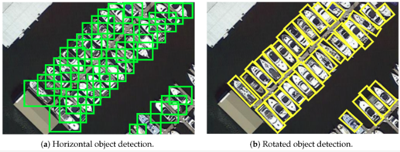
   
  <b>Image showing the suitability of rotated bounding boxes in remote sensing.</b>

Object detection in remote sensing involves locating and surrounding objects of interest with bounding boxes. Due to the large size of remote sensing images and the fact that objects may only comprise a few pixels, object detection can be challenging in this context. The imbalance between the area of the objects to be detected and the background, combined with the potential for objects to be easily confused with random features in the background, further complicates the task. Object detection generally performs better on larger objects, but becomes increasingly difficult as the objects become smaller and more densely packed. The accuracy of object detection models can also degrade rapidly as image resolution decreases, which is why it is common to use high resolution imagery, such as 30cm RGB, for object detection in remote sensing. A unique characteristic of aerial images is that objects can be oriented in any direction. To effectively extract measurements of the length and width of an object, it can be crucial to use rotated bounding boxes that align with the orientation of the object. This approach enables more accurate and meaningful analysis of the objects within the image. [Image source](https://www.mdpi.com/2072-4292/13/21/4291)

links

* [Object detection on Satellite Imagery using RetinaNet](https://medium.com/@ije_good/object-detection-on-satellite-imagery-using-retinanet-part-1-training-e589975afbd5) -> using the Kaggle Swimming Pool and Car Detection dataset `BEGINNER`
* [Tackling the Small Object Problem in Object Detection](https://blog.roboflow.com/tackling-the-small-object-problem-in-object-detection) `BEGINNER`
* [Object Detection and Image Segmentation with Deep Learning on Earth Observation Data: A Review](https://www.mdpi.com/2072-4292/12/10/1667)
* [awesome-aerial-object-detection bu murari023](https://github.com/murari023/awesome-aerial-object-detection), [another by visionxiang](https://github.com/visionxiang/awesome-object-detection-in-aerial-images) and [awesome-tiny-object-detection](https://github.com/kuanhungchen/awesome-tiny-object-detection) list many relevant papers
* [Object Detection Accuracy as a Function of Image Resolution](https://medium.com/the-downlinq/the-satellite-utility-manifold-object-detection-accuracy-as-a-function-of-image-resolution-ebb982310e8c) -> Medium article using COWC dataset, performance rapidly degrades below 30cm imagery
* [Satellite Imagery Multiscale Rapid Detection with Windowed Networks (SIMRDWN)](https://github.com/avanetten/simrdwn) -> combines some of the leading object detection algorithms into a unified framework designed to detect objects both large and small in overhead imagery. Train models and test on arbitrary image sizes with YOLO (versions 2 and 3), Faster R-CNN, SSD, or R-FCN.
* [YOLTv4](https://github.com/avanetten/yoltv4) -> YOLTv4 is designed to detect objects in aerial or satellite imagery in arbitrarily large images that far exceed the ~600×600 pixel size typically ingested by deep learning object detection frameworks. Read [Announcing YOLTv4: Improved Satellite Imagery Object Detection](https://towardsdatascience.com/announcing-yoltv4-improved-satellite-imagery-object-detection-f5091e913fad)
* [Tensorflow Benchmarks for Object Detection in Aerial Images](https://github.com/yangxue0827/RotationDetection) -> tensorflow-based codebase created to build benchmarks for object detection in aerial images
* [Pytorch Benchmarks for Object Detection in Aerial Images](https://github.com/dingjiansw101/AerialDetection) -> pytorch-based codebase created to build benchmarks for object detection in aerial images using mmdetection
* [ASPDNet](https://github.com/liuqingjie/ASPDNet) -> Counting dense objects in remote sensing images, [arxiv paper](https://arxiv.org/abs/2002.05928)
* [xview-yolov3](https://github.com/ultralytics/xview-yolov3) -> xView 2018 Object Detection Challenge: YOLOv3 Training and Inference
* [Faster RCNN for xView satellite data challenge](https://github.com/samirsen/small-object-detection)
* [How to detect small objects in (very) large images](https://blog.ml6.eu/how-to-detect-small-objects-in-very-large-images-70234bab0f98) -> A practical guide to using Slicing-Aided Hyper Inference (SAHI) for performing inference on the DOTAv1.0 object detection dataset using the mmdetection framework
* [Object Detection Satellite Imagery Multi-vehicles Dataset (SIMD)](https://github.com/asimniazi63/Object-Detection-on-Satellite-Images) -> RetinaNet,Yolov3 and Faster RCNN for multi object detection on satellite images dataset
* [SNIPER/AutoFocus](https://github.com/mahyarnajibi/SNIPER) -> an efficient multi-scale object detection training/inference algorithm
* [marine_debris_ML](https://github.com/NASA-IMPACT/marine_debris_ML) -> Marine debris detection, uses 3-meter imagery product called Planetscope with bands in the red, green, blue, and near-infrared. Uses Tensorflow Object Detection API with pre-trained resnet 101
* [pool-detection-from-aerial-imagery](https://towardsdatascience.com/pool-detection-from-aerial-imagery-f5b76d0a6093) -> Use Icevision and Detectron2 to detect swimming pools from aerial imagery
* [Electric-Pylon-Detection-in-RSI](https://github.com/qsjxyz/Electric-Pylon-Detection-in-RSI) -> a dataset which contains 1500 remote sensing images of electric pylons used to train ten deep learning models
* [Synthesizing Robustness YOLTv4 Results Part 2: Dataset Size Requirements and Geographic Insights](https://www.iqt.org/synthesizing-robustness-yoltv4-results-part-2-dataset-size-requirements-and-geographic-insights/) -> quantify how much harder rare objects are to localize
* [IS-Count](https://github.com/sustainlab-group/IS-Count) -> IS-Count is a sampling-based and learnable method for estimating the total object count in a region. 
* [Object Detection On Aerial Imagery Using RetinaNet](https://towardsdatascience.com/object-detection-on-aerial-imagery-using-retinanet-626130ba2203)
* [Clustered-Object-Detection-in-Aerial-Image](https://github.com/fyangneil/Clustered-Object-Detection-in-Aerial-Image)
* [yolov5s_for_satellite_imagery](https://github.com/KevinMuyaoGuo/yolov5s_for_satellite_imagery) -> yolov5s applied to the DOTA dataset
* [RetinaNet-PyTorch](https://github.com/HsLOL/RetinaNet-PyTorch) -> RetinaNet implementation on remote sensing ship dataset (SSDD)
* [Detecting-Cyclone-Centers-Custom-YOLOv3](https://github.com/ShubhayanS/Detecting-Cyclone-Centers-Custom-YOLOv3) -> tropical cyclones (TCs) are intense warm-corded cyclonic vortices, developed from low-pressure systems over the tropical oceans and driven by complex air-sea interaction
* [Object-Detection-YoloV3-RetinaNet-FasterRCNN](https://github.com/bostankhan6/Object-Detection-YoloV3-RetinaNet-FasterRCNN) -> trained on a private datset
* [Google-earth-Object-Recognition](https://github.com/InnovAIco/Google-earth-Object-Recognition) -> Code for training and evaluating on Dior Dataset (Google Earth Images) using RetinaNet and YOLOV5
* [HIECTOR: Hierarchical object detector at scale](https://medium.com/sentinel-hub/hiector-hierarchical-object-detector-at-scale-5a61753b51a3) -> HIECTOR facilitates multiple satellite data collections of increasingly detailed spatial resolution for a cost-efficient and accurate object detection over large areas
* [Detection of Multiclass Objects in Optical Remote Sensing Images](https://github.com/WenchaoliuMUC/Detection-of-Multiclass-Objects-in-Optical-Remote-Sensing-Images) -> code for 2018 [paper](https://ieeexplore.ieee.org/document/8573851): Detection of Multiclass Objects in Optical Remote Sensing Images
* [SB-MSN](https://github.com/weihancug/Sampling-Balance_Multi-stage_Network) -> Sampling-Balance based Multi-stage Network (SB-MSN) for aerial image object detection. Code for 2021 [paper](https://ieeexplore.ieee.org/document/9281082): Improving Training Instance Quality in Aerial Image Object Detection With a Sampling-Balance-Based Multistage Network
* [yoltv5](https://github.com/avanetten/yoltv5) -> detects objects in arbitrarily large aerial or satellite images that far exceed the ~600×600 pixel size typically ingested by deep learning object detection frameworks. Uses YOLOv5 & pytorch
* [AIR](https://github.com/Accenture/AIR) -> A deep learning object detector framework written in Python for supporting Land Search and Rescue Missions
* [dior_detect](https://github.com/hm-better/dior_detect) -> benchmarks for object detection on DIOR dataset
* [Panchromatic to Multispectral: Object Detection Performance as a Function of Imaging Bands](https://medium.com/the-downlinq/panchromatic-to-multispectral-object-detection-performance-as-a-function-of-imaging-bands-51ecaaa3dc56) -> Medium article, concludes that more bands are not always beneficial, but likely varies by use case
* [OPLD-Pytorch](https://github.com/yf19970118/OPLD-Pytorch) -> code for 2020 [paper](https://ieeexplore.ieee.org/document/9252176): Learning Point-Guided Localization for Detection in Remote Sensing Images
* [F3Net](https://github.com/yxhnjust/F3Net) -> code for 2020 [paper](https://www.mdpi.com/2072-4292/12/24/4027): Feature Fusion and Filtration Network for Object Detection in Optical Remote Sensing Images
* [GLNet](https://github.com/Zhu1Teng/GLNet) -> code for 2021 [paper](https://ieeexplore.ieee.org/document/9386208): Global to Local: Clip-LSTM-Based Object Detection From Remote Sensing Images
* [SRAF-Net](https://github.com/Complicateddd/SRAF-Net) -> code for 2021 [paper](https://ieeexplore.ieee.org/document/9598916): A Scene-Relevant Anchor-Free Object Detection Network in Remote Sensing Images
* [object_detection_in_remote_sensing_images](https://github.com/EEexplorer001/object_detection_in_remote_sensing_images) -> using CNN and attention mechanism
* [SHAPObjectDetection](https://github.com/hiroki-kawauchi/SHAPObjectDetection) -> code for 2022 [paper](https://www.mdpi.com/2072-4292/14/9/1970): SHAP-Based Interpretable Object Detection Method for Satellite Imagery
* [NWD](https://github.com/jwwangchn/NWD) -> code for 2021 [paper](https://arxiv.org/abs/2110.13389): A Normalized Gaussian Wasserstein Distance for Tiny Object Detection. Uses AI-TOD dataset
* [MSFC-Net](https://github.com/ZhAnGToNG1/MSFC-Net) -> code for 2021 [paper](https://ieeexplore.ieee.org/document/9535169): Multiscale Semantic Fusion-Guided Fractal Convolutional Object Detection Network for Optical Remote Sensing Imagery
* [LO-Det](https://github.com/Shank2358/LO-Det) -> code for the 2021 [paper](https://ieeexplore.ieee.org/document/9390310): LO-Det: Lightweight Oriented Object Detection in Remote Sensing Images
* [R2IPoints](https://github.com/shnew/R2IPoints) -> code for 2022 [paper](https://ieeexplore.ieee.org/abstract/document/9770816): R²IPoints: Pursuing Rotation-Insensitive Point Representation for Aerial Object Detection
* [Object-Detection](https://github.com/xiaojs18/Object-Detection) -> code for 2022 [paper](https://www.mdpi.com/2072-4292/14/16/3969): Multi-Scale Object Detection with the Pixel Attention Mechanism in a Complex Background
* [mmdet-rfla](https://github.com/Chasel-Tsui/mmdet-rfla) -> code for 2022 [paper](https://arxiv.org/abs/2208.08738): RFLA: Gaussian Receptive based Label Assignment for Tiny Object Detection
* [Interactive-Multi-Class-Tiny-Object-Detection](https://github.com/ChungYi347/Interactive-Multi-Class-Tiny-Object-Detection) -> code for 2022 [paper](https://arxiv.org/abs/2203.15266): Interactive Multi-Class Tiny-Object Detection
* [small-object-detection-benchmark](https://github.com/fcakyon/small-object-detection-benchmark) -> code for ICIP 2022 [paper](https://arxiv.org/abs/2202.06934): Slicing Aided Hyper Inference and Fine-tuning for Small Object Detection

#### Object detection with rotated bounding boxes
Orinted bounding boxes (OBB) are polygons representing rotated rectangles. For datasets checkout DOTA & HRSC2016
* [mmrotate](https://github.com/open-mmlab/mmrotate) -> Rotated Object Detection Benchmark, with pretrained models and function for inferencing on very large images
* [OBBDetection](https://github.com/jbwang1997/OBBDetection) -> an oriented object detection library, which is based on MMdetection
* [rotate-yolov3](https://github.com/ming71/rotate-yolov3) -> Rotation object detection implemented with yolov3. Also see [yolov3-polygon](https://github.com/ming71/yolov3-polygon)
* [DRBox](https://github.com/liulei01/DRBox) -> for detection tasks where the objects are orientated arbitrarily, e.g. vehicles, ships and airplanes
* [s2anet](https://github.com/csuhan/s2anet) -> Official code of the paper 'Align Deep Features for Oriented Object Detection'
* [CFC-Net](https://github.com/ming71/CFC-Net) -> Official implementation of "CFC-Net: A Critical Feature Capturing Network for Arbitrary-Oriented Object Detection in Remote Sensing Images"
* [ReDet](https://github.com/csuhan/ReDet) -> Official code of the paper "ReDet: A Rotation-equivariant Detector for Aerial Object Detection"
* [BBAVectors-Oriented-Object-Detection](https://github.com/yijingru/BBAVectors-Oriented-Object-Detection) -> Oriented Object Detection in Aerial Images with Box Boundary-Aware Vectors
* [CSL_RetinaNet_Tensorflow](https://github.com/Thinklab-SJTU/CSL_RetinaNet_Tensorflow) -> Code for ECCV 2020 paper: Arbitrary-Oriented Object Detection with Circular Smooth Label
* [r3det-on-mmdetection](https://github.com/SJTU-Thinklab-Det/r3det-on-mmdetection) -> R3Det: Refined Single-Stage Detector with Feature Refinement for Rotating Object
* [R-DFPN_FPN_Tensorflow](https://github.com/yangxue0827/R-DFPN_FPN_Tensorflow) -> Rotation Dense Feature Pyramid Networks (Tensorflow)
* [R2CNN_Faster-RCNN_Tensorflow](https://github.com/DetectionTeamUCAS/R2CNN_Faster-RCNN_Tensorflow) -> Rotational region detection based on Faster-RCNN
* [Rotated-RetinaNet](https://github.com/ming71/Rotated-RetinaNet) -> implemented in pytorch, it supports the following datasets: DOTA, HRSC2016, ICDAR2013, ICDAR2015, UCAS-AOD, NWPU VHR-10, VOC2007
* [OBBDet_Swin](https://github.com/ming71/OBBDet_Swin) -> The sixth place winning solution in 2021 Gaofen Challenge
* [CG-Net](https://github.com/WeiZongqi/CG-Net) -> Learning Calibrated-Guidance for Object Detection in Aerial Images. With [paper](https://ieeexplore.ieee.org/abstract/document/9735375)
* [OrientedRepPoints_DOTA](https://github.com/hukaixuan19970627/OrientedRepPoints_DOTA) -> Oriented RepPoints + Swin Transformer/ReResNet
* [yolov5_obb](https://github.com/hukaixuan19970627/yolov5_obb) -> yolov5 + Oriented Object Detection
* [How to Train YOLOv5 OBB](https://blog.roboflow.com/yolov5-for-oriented-object-detection/) -> YOLOv5 OBB tutorial and [YOLOv5 OBB noteboook](https://colab.research.google.com/drive/16nRwsioEYqWFLBF5VpT_NvELeOeupURM#scrollTo=1NZxhXTMWvek)
* [OHDet_Tensorflow](https://github.com/SJTU-Thinklab-Det/OHDet_Tensorflow) -> can be applied to rotation detection and object heading detection
* [Seodore](https://github.com/nijkah/Seodore) -> framework maintaining recent updates of mmdetection
* [Rotation-RetinaNet-PyTorch](https://github.com/HsLOL/Rotation-RetinaNet-PyTorch) -> oriented detector Rotation-RetinaNet implementation on Optical and SAR ship dataset
* [AIDet](https://github.com/jwwangchn/aidet) -> an open source object detection in aerial image toolbox based on MMDetection
* [rotation-yolov5](https://github.com/BossZard/rotation-yolov5) -> rotation detection based on yolov5
* [ShipDetection](https://github.com/lilinhao/ShipDetection) -> Ship Detection in HR Optical Remote Sensing Images via Rotated Bounding Box, based on Faster R-CNN and ORN, uses caffe
* [SLRDet](https://github.com/LUCKMOONLIGHT/SLRDet) -> project based on mmdetection to reimplement RRPN and use the model Faster R-CNN OBB
* [AxisLearning](https://github.com/RSIA-LIESMARS-WHU/AxisLearning) -> code for 2020 [paper](https://www.mdpi.com/2072-4292/12/6/908): Axis Learning for Orientated Objects Detection in Aerial Images
* [Detection_and_Recognition_in_Remote_Sensing_Image](https://github.com/whywhs/Detection_and_Recognition_in_Remote_Sensing_Image) -> This work uses PaNet to realize Detection and Recognition in Remote Sensing Image by MXNet
* [DrBox-v2-tensorflow](https://github.com/ZongxuPan/DrBox-v2-tensorflow) -> tensorflow implementation of DrBox-v2 which is an improved detector with rotatable boxes for target detection in remote sensing images
* [Rotation-EfficientDet-D0](https://github.com/HsLOL/Rotation-EfficientDet-D0) -> A PyTorch Implementation Rotation Detector based EfficientDet Detector, applied to custom rotation vehicle datasets
* [DODet](https://github.com/yanqingyao1994/DODet) -> Dual alignment for oriented object detection, uses DOTA dataset. With [paper](https://ieeexplore.ieee.org/abstract/document/9706434)
* [GF-CSL](https://github.com/WangJian981002/GF-CSL) -> code for 2022 [paper](https://ieeexplore.ieee.org/document/9776580): Gaussian Focal Loss: Learning Distribution Polarized Angle Prediction for Rotated Object Detection in Aerial Images
* [simplified_rbox_cnn](https://github.com/SIAnalytics/simplified_rbox_cnn) -> code for 2018 [paper](https://dl.acm.org/doi/10.1145/3274895.3274915): RBox-CNN: rotated bounding box based CNN for ship detection in remote sensing image. Uses Tensorflow object detection API
* [Polar-Encodings](https://github.com/flyingshan/Learning-Polar-Encodings-For-Arbitrary-Oriented-Ship-Detection-In-SAR-Images) -> code for 2021 [paper](Learning Polar Encodings for Arbitrary-Oriented Ship Detection in SAR Images)
* [R-CenterNet](https://github.com/ZeroE04/R-CenterNet) -> detector for rotated-object based on CenterNet
* [piou](https://github.com/clobotics/piou) -> Orientated Object Detection; IoU Loss, applied to DOTA dataset
* [DAFNe](https://github.com/steven-lang/DAFNe) -> code for 2021 [paper](https://arxiv.org/abs/2109.06148): DAFNe: A One-Stage Anchor-Free Approach for Oriented Object Detection
* [AProNet](https://github.com/geovsion/AProNet) -> code for 2021 [paper](https://www.sciencedirect.com/science/article/abs/pii/S092427162100229X): AProNet: Detecting objects with precise orientation from aerial images. Applied to datasets DOTA and HRSC2016
* [UCAS-AOD-benchmark](https://github.com/ming71/UCAS-AOD-benchmark) -> A benchmark of UCAS-AOD dataset
* [RotateObjectDetection](https://github.com/XinzeLee/RotateObjectDetection) -> based on Ultralytics/yolov5, with adjustments to enable rotate prediction boxes. Also see [PolygonObjectDetection](https://github.com/XinzeLee/PolygonObjectDetection)
* [AD-Toolbox](https://github.com/liuyanyi/AD-Toolbox) -> Aerial Detection Toolbox based on MMDetection and MMRotate, with support for more datasets
* [GGHL](https://github.com/Shank2358/GGHL) -> code for 2022 [paper](https://arxiv.org/abs/2109.12848): A General Gaussian Heatmap Label Assignment for Arbitrary-Oriented Object Detection
* [NPMMR-Det](https://github.com/Shank2358/NPMMR-Det) -> code for 2021 [paper](https://ieeexplore.ieee.org/document/9364888): A Novel Nonlocal-Aware Pyramid and Multiscale Multitask Refinement Detector for Object Detection in Remote Sensing Images
* [AOPG](https://github.com/jbwang1997/AOPG) -> code for 2022 [paper](https://ieeexplore.ieee.org/abstract/document/9795321): Anchor-Free Oriented Proposal Generator for Object Detection
* [SE2-Det](https://github.com/Virusxxxxxxx/SE2-Det) -> code for 2022 [paper](https://www.mdpi.com/2072-4292/14/15/3637): Semantic-Edge-Supervised Single-Stage Detector for Oriented Object Detection in Remote Sensing Imagery
* [OrientedRepPoints](https://github.com/LiWentomng/OrientedRepPoints) -> code for 2021 [paper](https://arxiv.org/abs/2105.11111): Oriented RepPoints for Aerial Object Detection
* [TS-Conv](https://github.com/Shank2358/TS-Conv) -> code for 2022 [paper](https://arxiv.org/abs/2209.02200): Task-wise Sampling Convolutions for Arbitrary-Oriented Object Detection in Aerial Images
* [FCOSR](https://github.com/lzh420202/FCOSR) -> A Simple Anchor-free Rotated Detector for Aerial Object Detection. This implement is modified from mmdetection. See also [TensorRT_Inference](https://github.com/lzh420202/TensorRT_Inference)

#### Object detection enhanced by super resolution
* [Super-Resolution and Object Detection](https://medium.com/the-downlinq/super-resolution-and-object-detection-a-love-story-part-4-8ad971eef81e) -> Super-resolution is a relatively inexpensive enhancement that can improve object detection performance
* [EESRGAN](https://github.com/Jakaria08/EESRGAN) -> Small-Object Detection in Remote Sensing Images with End-to-End Edge-Enhanced GAN and Object Detector Network
* [Mid-Low Resolution Remote Sensing Ship Detection Using Super-Resolved Feature Representation](https://www.preprints.org/manuscript/202108.0337/v1)
* [EESRGAN](https://github.com/divyam96/EESRGAN) -> code for 2020 [paper](https://www.mdpi.com/2072-4292/12/9/1432): Small-Object Detection in Remote Sensing Images with End-to-End Edge-Enhanced GAN and Object Detector Network. Applied to COWC & [OGST](https://data.mendeley.com/datasets/bkxj8z84m9/3) datasets
* [FBNet](https://github.com/wdzhao123/FBNet) -> code for 2022 [paper](https://ieeexplore.ieee.org/document/9739789): Feature Balance for Fine-Grained Object Classification in Aerial Images
* [SuperYOLO](https://github.com/icey-zhang/SuperYOLO) -> code for 2022 [paper](https://arxiv.org/abs/2209.13351): SuperYOLO: Super Resolution Assisted Object Detection in Multimodal Remote Sensing Imagery

#### Salient object detection
Detecting the most noticeable or important object in a scene
* [ACCoNet](https://github.com/MathLee/ACCoNet) -> code for 2022 [paper](https://ieeexplore.ieee.org/abstract/document/9756652): Adjacent Context Coordination Network for Salient Object Detection in Optical Remote Sensing Images
* [MCCNet](https://github.com/MathLee/MCCNet) -> Multi-Content Complementation Network for Salient Object Detection in Optical Remote Sensing Images
* [CorrNet](https://github.com/MathLee/CorrNet) -> Lightweight Salient Object Detection in Optical Remote Sensing Images via Feature Correlation. With [paper](https://arxiv.org/abs/2201.08049)
* [Reading list for deep learning based Salient Object Detection in Optical Remote Sensing Images](https://github.com/MathLee/ORSI-SOD_Summary)
* [ORSSD-dataset](https://github.com/rmcong/ORSSD-dataset) -> salient object detection dataset
* [EORSSD-dataset](https://github.com/rmcong/EORSSD-dataset) -> Extended Optical Remote Sensing Saliency Detection (EORSSD) Dataset
* [DAFNet_TIP20](https://github.com/rmcong/DAFNet_TIP20) -> code for 2020 [paper](https://arxiv.org/abs/2011.13144): Dense Attention Fluid Network for Salient Object Detection in Optical Remote Sensing Images
* [EMFINet](https://github.com/Kunye-Shen/EMFINet) -> code for 2021 paper: Edge-Aware Multiscale Feature Integration Network for Salient Object Detection in Optical Remote Sensing Images
* [ERPNet](https://github.com/zxforchid/ERPNet) -> code for 2022 paper: Edge-guided Recurrent Positioning Network for Salient Object Detection in Optical Remote Sensing Images
* [FSMINet](https://github.com/zxforchid/FSMINet) -> code for 2022 paper: Fully Squeezed Multi-Scale Inference Network for Fast and Accurate Saliency Detection in Optical Remote Sensing Images
* [AGNet](https://github.com/NuaaYH/AGNet) -> code for 2022 paper: AGNet: Attention Guided Network for Salient Object Detection in Optical Remote Sensing Images
* [MSCNet](https://github.com/NuaaYH/MSCNet) -> code for 2022 [paper](https://arxiv.org/abs/2205.08959): A lightweight multi-scale context network for salient object detection in optical remote sensing images
* [GPnet](https://github.com/liuyu1002/GPnet) -> code for 2022 [paper](https://ieeexplore.ieee.org/abstract/document/9687549): Global Perception Network for Salient Object Detection in Remote Sensing Images
* [SeaNet](https://github.com/MathLee/SeaNet) -> code for 2023 [paper](https://arxiv.org/abs/2301.02778): Lightweight Salient Object Detection in Optical Remote Sensing Images via Semantic Matching and Edge Alignment

#### Object detection - Buildings, rooftops & solar panels
* [satellite_image_tinhouse_detector](https://github.com/yasserius/satellite_image_tinhouse_detector) -> Detection of tin houses from satellite/aerial images using the Tensorflow Object Detection API `BEGINNER`
* [Machine Learning For Rooftop Detection and Solar Panel Installment](https://omdena.com/blog/machine-learning-rooftops/) discusses tiling large images and generating annotations from OSM data. Features of the roofs were calculated using a combination of contour detection and classification. [Follow up article using semantic segmentation](https://omdena.com/blog/rooftops-classification/)
* [Building Extraction with YOLT2 and SpaceNet Data](https://medium.com/the-downlinq/building-extraction-with-yolt2-and-spacenet-data-a926f9ffac4f)
* [XBD-hurricanes](https://github.com/dbuscombe-usgs/XBD-hurricanes) -> Models for building (and building damage) detection in high-resolution (<1m) satellite and aerial imagery using a modified RetinaNet model
* [Detecting solar panels from satellite imagery](https://towardsdatascience.com/weekend-project-detecting-solar-panels-from-satellite-imagery-f6f5d5e0da40) using segmentation
* [ssd-spacenet](https://github.com/aurotripathy/ssd-spacenet) -> Detect buildings in the Spacenet dataset using Single Shot MultiBox Detector (SSD)
* [3DBuildingInfoMap](https://github.com/LllC-mmd/3DBuildingInfoMap) -> simultaneous extraction of building height and footprint from Sentinel imagery using ResNet
* [Solar Panel Detection](https://medium.com/analytics-vidhya/solar-panel-detection-from-aerial-view-or-satellite-images-648c22c260ba) -> using Faster R-CNN & Tensorflow object detection API. With [repo](https://github.com/shiva2410/Solar_Panel-Detection-in-Aerial-Images) 
* [DeepSolaris](https://github.com/thinkpractice/DeepSolaris) -> a EuroStat project to detect solar panels in aerial images, further material [here](https://github.com/FHNW-IVGI/workshop_geopython2019/tree/master/Ex.02_SolarPanels)
* [ML_ObjectDetection_CAFO](https://github.com/Qberto/ML_ObjectDetection_CAFO) -> Detect Concentrated Animal Feeding Operations (CAFO) in Satellite Imagery
* [Multi-level-Building-Detection-Framework](https://github.com/luoxiaoliaolan/Multi-level-Building-Detection-Framework) -> code for 2018 [paper](https://ieeexplore.ieee.org/document/8458225): Multilevel Building Detection Framework in Remote Sensing Images Based on Convolutional Neural Networks
* [Automatic Damage Annotation on Post-Hurricane Satellite Imagery](https://dds-lab.github.io/disaster-damage-detection/) -> detect damaged buildings using tensorflow object detection API. With repos [here](https://github.com/DDS-Lab/disaster-image-processing) and [here](https://github.com/annieyan/PreprocessSatelliteImagery-ObjectDetection)
* [mappingchallenge](https://github.com/krishanr/mappingchallenge) -> YOLOv5 applied to the AICrowd Mapping Challenge dataset

#### Object detection - Ships & boats
* [kaggle-ships-in-Google-Earth-yolov5](https://github.com/robmarkcole/kaggle-ships-in-Google-Earth-yolov5) -> Applying YOLOv5 to Kaggle Ships in Google Earth dataset `BEGINNER`
* [How hard is it for an AI to detect ships on satellite images?](https://medium.com/earthcube-stories/how-hard-it-is-for-an-ai-to-detect-ships-on-satellite-images-7265e34aadf0)
* [Object Detection in Satellite Imagery, a Low Overhead Approach](https://medium.com/the-downlinq/object-detection-in-satellite-imagery-a-low-overhead-approach-part-i-cbd96154a1b7)
* [Detecting Ships in Satellite Imagery](https://medium.com/dataseries/detecting-ships-in-satellite-imagery-7f0ca04e7964) using the Planet dataset and Keras
* [Planet use non DL felzenszwalb algorithm to detect ships](https://github.com/planetlabs/notebooks/blob/master/jupyter-notebooks/ship-detector/01_ship_detector.ipynb)
* [Ship detection using k-means clustering & CNN classifier on patches](https://towardsdatascience.com/data-science-and-satellite-imagery-985229e1cd2f)
* [sentinel2-xcube-boat-detection](https://github.com/MichelDeudon/sentinel2-xcube-boat-detection) -> detect and count boat traffic in Sentinel-2 imagery using temporal, spectral and spatial features
* [Arbitrary-Oriented Ship Detection through Center-Head Point Extraction](https://arxiv.org/abs/2101.11189) -> arxiv paper. Keypoint estimation is performed to find the center of ships. Then, the size and head point of the ships are regressed. Repo [ASD](https://github.com/JinleiMa/ASD)
* [ship_detection](https://github.com/rugg2/ship_detection) -> using an interesting combination of CNN classifier, Class Activation Mapping (CAM) & UNET segmentation. Accompanying [three part blog post](https://www.vortexa.com/insights/technology/satellite-images-object-detection/)
* [Building a complete Ship detection algorithm using YOLOv3 and Planet satellite images](https://medium.com/intel-software-innovators/ship-detection-in-satellite-images-from-scratch-849ccfcc3072) -> covers finding and annotating data (using LabelMe), preprocessing large images into chips, and training Yolov3. [Repo](https://github.com/amanbasu/ship-detection)
* [Ship-detection-in-satellite-images](https://github.com/zmf0507/Ship-detection-in-satellite-images) -> experiments with  UNET, YOLO, Mask R-CNN, SSD, Faster R-CNN, RETINA-NET
* [Ship-Detection-from-Satellite-Images-using-YOLOV4](https://github.com/debasis-dotcom/Ship-Detection-from-Satellite-Images-using-YOLOV4) -> uses Kaggle Airbus Ship Detection dataset
* [kaggle-airbus-ship-detection-challenge](https://github.com/toshi-k/kaggle-airbus-ship-detection-challenge) -> using oriented SSD
* [shipsnet-detector](https://github.com/rhammell/shipsnet-detector) -> Detect container ships in Planet imagery using machine learning
* [Classifying Ships in Satellite Imagery with Neural Networks](https://towardsdatascience.com/classifying-ships-in-satellite-imagery-with-neural-networks-944024879651) -> applied to the Kaggle Ships in Satellite Imagery dataset
* [Mask R-CNN for Ship Detection & Segmentation](https://medium.com/@gabogarza/mask-r-cnn-for-ship-detection-segmentation-a1108b5a083) blog post with [repo](https://github.com/gabrielgarza/Mask_RCNN)
* [contrastive_SSL_ship_detection](https://github.com/alina2204/contrastive_SSL_ship_detection) -> Contrastive self supervised learning for ship detection in Sentinel 2 images
* [Boat detection with multi-region-growing method in satellite images](https://medium.com/@ipmach/boat-detection-with-multi-region-growing-method-in-satellite-images-3339a6c29a8c)
* [small-boat-detector](https://github.com/swricci/small-boat-detector) -> Trained yolo v3 model weights and configuration file to detect small boats in satellite imagery
* [Satellite-Imagery-Datasets-Containing-Ships](https://github.com/JasonManesis/Satellite-Imagery-Datasets-Containing-Ships) -> A list of optical and radar satellite datasets for ship detection, classification, semantic segmentation and instance segmentation tasks
* [Ship-Classification-in-Satellite-Images](https://github.com/JasonManesis/Ship-Classification-in-Satellite-Images) -> Convolutional neural network model for ship classification in satellite images
* [Ship-Detection](https://github.com/gouravbarkle/Ship-Detection) -> CNN approach for ship detection in the ocean using a satellite image
* [vesselTracker](https://github.com/carlossantamarizq/vesselTracker) -> Project based on reduced model of Yolov5 architecture using Pytorch. Custom dataset based on SAR imagery provided by Sentinel-1 through Earth Engine API
* [marine-debris-ml-model](https://github.com/danieltyukov/marine-debris-ml-model) -> Marine Debris Detection using tensorflow object detection API
* [SDGH-Net](https://github.com/WangZhenqing-RS/SDGH-Net-Ship-Detection-in-Optical-Remote-Sensing-Images-Based-on-Gaussian-Heatmap-Regression) -> code for 2021 [paper](https://www.mdpi.com/2072-4292/13/3/499): SDGH-Net: Ship Detection in Optical Remote Sensing Images Based on Gaussian Heatmap Regression
* [LR-TSDet](https://github.com/Lausen-Ng/LR-TSDet) -> code for 2021 [paper](https://www.mdpi.com/2072-4292/13/19/3890): LR-TSDet: Towards Tiny Ship Detection in Low-Resolution Remote Sensing Images
* [FGSCR-42](https://github.com/DYH666/FGSCR-42) -> A public Dataset for Fine-Grained Ship Classification in Remote sensing images
* [ShipDetection](https://github.com/lilinhao/ShipDetection) -> Ship Detection in HR Optical Remote Sensing Images via Rotated Bounding Box, based on Faster R-CNN and ORN, uses caffe
* [WakeNet](https://github.com/Lilytopia/WakeNet) -> A CNN-based optical image ship wake detector, code for 2021 paper: Rethinking Automatic Ship Wake Detection: State-of-the-Art CNN-based Wake Detection via Optical Images
* [Histogram of Oriented Gradients (HOG) Boat Heading Classification](https://medium.com/the-downlinq/histogram-of-oriented-gradients-hog-heading-classification-a92d1cf5b3cc) -> Medium article
* [Object Detection in Satellite Imagery, a Low Overhead Approach](https://medium.com/the-downlinq/object-detection-in-satellite-imagery-a-low-overhead-approach-part-i-cbd96154a1b7) -> Medium article which demonstrates how to combine Canny edge detector pre-filters with HOG feature descriptors, random forest classifiers, and sliding windows to perform ship detection
* [simplified_rbox_cnn](https://github.com/SIAnalytics/simplified_rbox_cnn) -> code for 2018 [paper](https://dl.acm.org/doi/10.1145/3274895.3274915): RBox-CNN: rotated bounding box based CNN for ship detection in remote sensing image. Uses Tensorflow object detection API
* [Ship-Detection-based-on-YOLOv3-and-KV260](https://github.com/xlsjdjdk/Ship-Detection-based-on-YOLOv3-and-KV260) -> entry project of the Xilinx Adaptive Computing Challenge 2021. It uses YOLOv3 for ship target detection in optical remote sensing images, and deploys DPU on the KV260 platform to achieve hardware acceleration
* [LEVIR-Ship](https://github.com/WindVChen/LEVIR-Ship) -> a dataset for tiny ship detection under medium-resolution remote sensing images
* [Push-and-Pull-Network](https://github.com/WindVChen/Push-and-Pull-Network) -> code for 2022 paper: Contrastive Learning for Fine-grained Ship Classification in Remote Sensing Images
* [DRENet](https://github.com/WindVChen/DRENet) -> code for 2022 [paper])(https://ieeexplore.ieee.org/abstract/document/9791363): A Degraded Reconstruction Enhancement-Based Method for Tiny Ship Detection in Remote Sensing Images With a New Large-Scale Dataset
* [xView3-The-First-Place-Solution](https://github.com/BloodAxe/xView3-The-First-Place-Solution) - A winning solution for [xView 3](https://iuu.xview.us/) challenge (Vessel detection, classification and length estimation on Sentinetl-1 images). Contains trained models, inference pipeline and training code & configs to reproduce the results.
* [SARfish](https://github.com/MJCruickshank/SARfish) -> Ship detection in Sentinel 1 Synthetic Aperture Radar (SAR) imagery

#### Object detection - Cars, vehicles & trains
* [Detection of parkinglots and driveways with retinanet](https://github.com/spiyer99/retinanet) `BEGINNER`
* [pytorch-vedai](https://github.com/MichelHalmes/pytorch-vedai) -> object detection on the VEDAI dataset: Vehicle Detection in Aerial Imagery `BEGINNER`
* [Truck Detection with Sentinel-2 during COVID-19 crisis](https://github.com/hfisser/Truck_Detection_Sentinel2_COVID19) -> moving objects in Sentinel-2 data causes a specific reflectance relationship in the RGB, which looks like a rainbow, and serves as a marker for trucks. Improve accuracy by only analysing roads. Not using object detection but relevant. Also see [S2TD](https://github.com/hfisser/S2TD)
* [cowc_car_counting](https://github.com/motokimura/cowc_car_counting) -> car counting on the [Cars Overhead With Context (COWC) dataset](https://gdo152.llnl.gov/cowc/). Not sctictly object detection but a CNN to predict the car count in a tile
* [CarCounting](https://github.com/JacksonPeoples/CarCounting) -> using Yolov3 & COWC dataset
* [Traffic density estimation as a regression problem instead of object detection](https://omdena.com/blog/ai-road-safety/) -> inspired by [this paper](https://ieeexplore.ieee.org/document/8916990)
* [Applying Computer Vision to Railcar Detection](https://orbitalinsight.com/blog/apping-computer-vision-to-railcar-detection) -> useful insights into counting railcars (i.e. train carriages) using Mask-RCNN with rotated bounding boxes output
* [Leveraging Deep Learning for Vehicle Detection And Classification](https://orbitalinsight.com/blog/leveraging-deep-learning-for-vehicle-detection-and-classification)
* [Rotation-EfficientDet-D0](https://github.com/HsLOL/Rotation-EfficientDet-D0) -> PyTorch implementation of Rotated EfficientDet, applied to a custom rotation vehicle dataset (car counting)
* [RSVC2021-Dataset](https://github.com/YinongGuo/RSVC2021-Dataset) -> A dataset for Vehicle Counting in Remote Sensing images, created from the DOTA & ITCVD
* [Car Localization and Counting with Overhead Imagery, an Interactive Exploration](https://medium.com/the-downlinq/car-localization-and-counting-with-overhead-imagery-an-interactive-exploration-9d5a029a596b) -> Medium article by Adam Van Etten
* [Vehicle-Counting-in-Very-Low-Resolution-Aerial-Images](https://github.com/hbsszq/Vehicle-Counting-in-Very-Low-Resolution-Aerial-Images) -> code for 2022 [paper](https://ieeexplore.ieee.org/abstract/document/9775767): Vehicle Counting in Very Low-Resolution Aerial Images via Cross-Resolution Spatial Consistency and Intraresolution Time Continuity
* [Vehicle Detection blog post](https://www.silvispace.xyz/posts/vehicle-post/) by Grant Pearse: detecting vehicles across New Zealand without collecting local training data

#### Object detection - Planes & aircraft
* [Faster RCNN to detect airplanes](https://github.com/ShubhankarRawat/Airplane-Detection-for-Satellites) `BEGINNER`
* [yoltv4](https://github.com/avanetten/yoltv4) includes examples on the [RarePlanes dataset](https://registry.opendata.aws/rareplanes/)
* [aircraft-detection](https://github.com/hakeemtfrank/aircraft-detection) -> experiments to test the performance of a Gaussian process (GP) classifier with various kernels on the UC Merced land use land cover (LULC) dataset
* [Using Detectron2 to segment aircraft from satellite imagery](https://share.buitrongan.com/using-detectron2-to-segments-aircraft-from-satellite-images-5a8ac1a0d35e) -> pytorch and Rare Planes
* [aircraft-detection-from-satellite-images-yolov3](https://github.com/emrekrtorun/aircraft-detection-from-satellite-images-yolov3) -> trained on kaggle cgi-planes-in-satellite-imagery-w-bboxes dataset
* [HRPlanesv2-Data-Set](https://github.com/dilsadunsal/HRPlanesv2-Data-Set) -> YOLOv4 and YOLOv5 weights trained on the HRPlanesv2 dataset
* [Deep-Learning-for-Aircraft-Recognition](https://github.com/Shayan-Bravo/Deep-Learning-for-Aircraft-Recognition) -> A CNN model trained to classify and identify various military aircraft through satellite imagery
* [FRCNN-for-Aircraft-Detection](https://github.com/Huatsing-Lau/FRCNN-for-Aircraft-Detection) -> faster-rcnn & keras
* [ergo-planes-detector](https://github.com/evilsocket/ergo-planes-detector) -> An ergo based project that relies on a convolutional neural network to detect airplanes from satellite imagery, uses the PlanesNet dataset
* [pytorch-remote-sensing](https://github.com/miko7879/pytorch-remote-sensing) -> Aircraft detection using the 'Airbus Aircraft Detection' dataset and Faster-RCNN with ResNet-50 backbone using pytorch
* [FasterRCNN_ObjectDetection](https://github.com/UKMIITB/FasterRCNN_ObjectDetection) -> faster RCNN model for aircraft detection and localisation in satellite images and creating a webpage with live server for public usage
* [HRPlanes](https://github.com/TolgaBkm/HRPlanes) -> weights of YOLOv4 and Faster R-CNN networks trained with HRPlanes dataset
* [aerial-detection](https://github.com/alexbakr/aerial-detection) -> uses Yolov5 & Icevision
* [How to choose a deep learning architecture to detect aircrafts in satellite imagery?](https://medium.com/artificialis/how-to-choose-a-deep-learning-model-to-detect-aircrafts-in-satellite-imagery-cd7d106e76ad)
* [rareplanes-yolov5](https://github.com/jeffaudi/rareplanes-yolov5) -> using YOLOv5 and the RarePlanes dataset to detect and classify sub-characteristics of aircraft, with [article](https://medium.com/artificialis/detecting-aircrafts-on-airbus-pleiades-imagery-with-yolov5-5f3d464b75ad)

#### Object detection - Infrastructure & utilities
* [wind-turbine-detector](https://github.com/lbborkowski/wind-turbine-detector) -> Wind Turbine Object Detection from Aerial Imagery Using TensorFlow Object Detection API
* [Water Tanks and Swimming Pools Detection](https://github.com/EduardoFernandes1410/PATREO-Dengue) -> uses Faster R-CNN
* [PCAN](https://www.mdpi.com/2072-4292/13/7/1243) -> Part-Based Context Attention Network for Thermal Power Plant Detection in Remote Sensing Imagery, with [dataset](https://github.com/wenxinYin/AIR-TPPDD)

#### Object detection - Oil storage tank detection
Oil is stored in tanks at many points between extraction and sale, and the volume of oil in storage is an important economic indicator.
* [A Beginner’s Guide To Calculating Oil Storage Tank Occupancy With Help Of Satellite Imagery](https://medium.com/planet-stories/a-beginners-guide-to-calculating-oil-storage-tank-occupancy-with-help-of-satellite-imagery-e8f387200178)
* [Oil Storage Tank’s Volume Occupancy On Satellite Imagery Using YoloV3](https://towardsdatascience.com/oil-storage-tanks-volume-occupancy-on-satellite-imagery-using-yolov3-3cf251362d9d) with [repo](https://github.com/mdmub0587/Oil-Storage-Tank-s-Volume-Occupancy)
* [Oil-Tank-Volume-Estimation](https://github.com/kheyer/Oil-Tank-Volume-Estimation) -> combines object detection and classical computer vision
* [Oil tank instance segmentation with Mask R-CNN](https://github.com/georgiosouzounis/instance-segmentation-mask-rcnn) with [accompanying article](https://medium.com/@georgios.ouzounis/oil-storage-tank-instance-segmentation-with-mask-r-cnn-77c94433045f) using Keras & Airbus Oil Storage Detection Dataset on Kaggle
* https://www.kaggle.com/towardsentropy/oil-storage-tanks -> large kaggle dataset, note however that approx 85% of images contain no tanks
* https://www.kaggle.com/airbusgeo/airbus-oil-storage-detection-dataset -> smaller kaggle dataset
* [ognet](https://stanfordmlgroup.github.io/projects/ognet/) -> a Global Oil and Gas Infrastructure Database using Deep Learning on Remotely Sensed Imagery
* [RSOD-Dataset](https://github.com/RSIA-LIESMARS-WHU/RSOD-Dataset-) -> dataset for object detection in PASCAL VOC format. Aircraft, playgrounds, overpasses & oiltanks. Used in the 2022 [paper](https://link.springer.com/article/10.1007/s00500-022-07106-8): Improved YOLOv5 network method for remote sensing image-based ground objects recognition
* [oil_storage-detector](https://github.com/TheodorEmanuelsson/oil_storage-detector) -> using yolov5 and the Airbus Oil Storage Detection dataset
* [oil_well_detector](https://github.com/dzubke/oil_well_detector) -> detect oil wells in the Bakken oil field based on satellite imagery
* [OGST](https://data.mendeley.com/datasets/bkxj8z84m9/3) -> Oil and Gas Tank Dataset
* [AContrarioTankDetection](https://github.com/anttad/AContrarioTankDetection) -> code for 2020 [paper](https://ieeexplore.ieee.org/document/9323249): Oil Tank Detection in Satellite Images via a Contrario Clustering
* [SubpixelCircleDetection](https://github.com/anttad/SubpixelCircleDetection) -> code for 2020 [paper](https://www.isprs-ann-photogramm-remote-sens-spatial-inf-sci.net/V-2-2020/901/2020/): CIRCULAR-SHAPED OBJECT DETECTION IN LOW RESOLUTION SATELLITE IMAGES
* [Oil Storage Detection on Airbus Imagery with YOLOX](https://medium.com/artificialis/oil-storage-detection-on-airbus-imagery-with-yolox-9e38eb6f7e62) -> uses the Kaggle Airbus Oil Storage Detection dataset

#### Object detection - Animals
A variety of techniques can be used to count animals, including object detection and instance segmentation. For convenience they are all listed here:
* [cownter_strike](https://github.com/IssamLaradji/cownter_strike) -> counting cows, located with point-annotations, two models: CSRNet (a density-based method) & LCFCN (a detection-based method)
* [elephant_detection](https://github.com/akharina/elephant_detection) -> Using Keras-Retinanet to detect elephants from aerial images
* [CNN-Mosquito-Detection](https://github.com/sriramelango/CNN-Mosquito-Detection) -> determining the locations of potentially dangerous breeding grounds, compared YOLOv4, YOLOR & YOLOv5
* [Borowicz_etal_Spacewhale](https://github.com/lynch-lab/Borowicz_etal_Spacewhale) -> locate whales using ResNet
* [walrus-detection-and-count](https://github.com/sweetlhare/walrus-detection-and-count) -> uses Mask R-CNN instance segmentation
* [MarineMammalsDetection](https://github.com/Pangoraw/MarineMammalsDetection) -> Weakly Supervised Detection of Marine Animals in High Resolution Aerial Images
* [Audubon_F21](https://github.com/RiceD2KLab/Audubon_F21) -> code for 2022 [paper](https://arxiv.org/abs/2210.04868): Deep object detection for waterbird monitoring using aerial imagery

#### Object tracking in videos
* [Object Tracking in Satellite Videos Based on a Multi-Frame Optical Flow Tracker](https://arxiv.org/abs/1804.09323) arxiv paper
* [CFME](https://github.com/SY-Xuan/CFME) -> Object Tracking in Satellite Videos by Improved Correlation Filters With Motion Estimations
* [TGraM](https://github.com/HeQibin/TGraM) -> code and dataset for 2022 [paper](https://ieeexplore.ieee.org/document/9715124): Multi-Object Tracking in Satellite Videos with Graph-Based Multi-Task Modeling
* [satellite_video_mod_groundtruth](https://github.com/zhangjunpeng9354/satellite_video_mod_groundtruth) -> groundtruth on satellite video for evaluating moving object detection algorithm
* [Moving-object-detection-DSFNet](https://github.com/ChaoXiao12/Moving-object-detection-DSFNet) -> code for 2021 [paper](https://ieeexplore.ieee.org/document/9594855): DSFNet: Dynamic and Static Fusion Network for Moving Object Detection in Satellite Videos
* [HiFT](https://github.com/vision4robotics/HiFT) -> code for 2021 [paper](https://arxiv.org/abs/2108.00202): HiFT: Hierarchical Feature Transformer for Aerial Tracking
* [TCTrack](https://github.com/vision4robotics/TCTrack) -> code for 2022 [paper](https://arxiv.org/abs/2203.01885): TCTrack: Temporal Contexts for Aerial Tracking

## Object counting
When the object count, but not its shape is required, U-net can be used to treat this as an image-to-image translation problem.
* [centroid-unet](https://github.com/gicait/centroid-unet) -> Centroid-UNet is deep neural network model to detect centroids from satellite images, with [paper](https://arxiv.org/abs/2112.06530) `BEGINNER`
* [cownter_strike](https://github.com/IssamLaradji/cownter_strike) -> counting cows, located with point-annotations, two models: CSRNet (a density-based method) & LCFCN (a detection-based method)
* [DO-U-Net](https://github.com/ToyahJade/DO-U-Net) -> an effective approach for when the size of an object needs to be known, as well as the number of objects in the image, initially created to segment and count Internally Displaced People (IDP) camps in Afghanistan
* [Cassava Crop Counting](https://medium.com/@wongsirikuln/cassava-standing-crop-counting-869cca486ce3)
* [Counting from Sky](https://github.com/gaoguangshuai/Counting-from-Sky-A-Large-scale-Dataset-for-Remote-Sensing-Object-Counting-and-A-Benchmark-Method) -> A Large-scale Dataset for Remote Sensing Object Counting and A Benchmark Method
* [PSGCNet](https://github.com/gaoguangshuai/PSGCNet) -> code for 2022 [paper](https://arxiv.org/abs/2012.03597): PSGCNet: A Pyramidal Scale and Global Context Guided Network for Dense Object Counting in Remote Sensing Images
* [psgcnet](https://github.com/gaoguangshuai/psgcnet) -> code for 2022 [paper](https://ieeexplore.ieee.org/abstract/document/9720990): PSGCNet: A Pyramidal Scale and Global Context Guided Network for Dense Object Counting in Remote-Sensing Images

# 
## Regression

  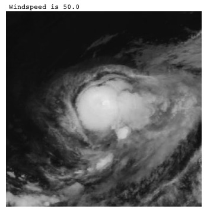
   
  <b>Regression prediction of windspeed.</b>

Regression in remote sensing involves predicting continuous variables such as wind speed, tree height, or soil moisture from an image. Both classical machine learning and deep learning approaches can be used to accomplish this task. Classical machine learning utilizes feature engineering to extract numerical values from the input data, which are then used as input for a regression algorithm like linear regression. On the other hand, deep learning typically employs a convolutional neural network (CNN) to process the image data, followed by a fully connected neural network (FCNN) for regression. The FCNN is trained to map the input image to the desired output, providing predictions for the continuous variables of interest. [Image source](https://github.com/h-fuzzy-logic/python-windspeed)

links

* [python-windspeed](https://github.com/h-fuzzy-logic/python-windspeed) -> Predicting windspeed of hurricanes from satellite images, uses CNN regression in keras
* [hurricane-wind-speed-cnn](https://github.com/23ccozad/hurricane-wind-speed-cnn) -> Predicting windspeed of hurricanes from satellite images, uses CNN regression in keras
* [GEDI-BDL](https://github.com/langnico/GEDI-BDL) -> code for paper: Global canopy height regression and uncertainty estimation from GEDI LIDAR waveforms with deep ensembles
* [Traffic density estimation as a regression problem instead of object detection](https://omdena.com/blog/ai-road-safety/) -> inspired by [this paper](https://ieeexplore.ieee.org/document/8916990)
* [OpticalWaveGauging_DNN](https://github.com/OpticalWaveGauging/OpticalWaveGauging_DNN) -> code for 2020 [paper](https://www.sciencedirect.com/science/article/abs/pii/S0378383919301243): Optical wave gauging using deep neural networks

#
## Cloud detection & removal

  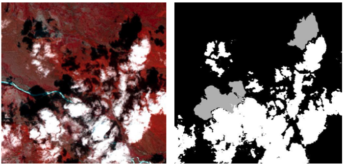
   
  <b>(left) False colour image and (right) a cloud & shadow mask.</b>

Clouds are a major issue in remote sensing images as they can obscure the underlying ground features. This hinders the accuracy and effectiveness of remote sensing analysis, as the obscured regions cannot be properly interpreted. In order to address this challenge, various techniques have been developed to detect clouds in remote sensing images. Both classical algorithms and deep learning approaches can be employed for cloud detection. Classical algorithms typically use threshold-based techniques and hand-crafted features to identify cloud pixels. However, these techniques can be limited in their accuracy and are sensitive to changes in image appearance and cloud structure. On the other hand, deep learning approaches leverage the power of convolutional neural networks (CNNs) to accurately detect clouds in remote sensing images. These models are trained on large datasets of remote sensing images, allowing them to learn and generalize the unique features and patterns of clouds. The generated cloud mask can be used to identify the cloud pixels and eliminate them from further analysis or, alternatively, cloud inpainting techniques can be used to fill in the gaps left by the clouds. This approach helps to improve the accuracy of remote sensing analysis and provides a clearer view of the ground, even in the presence of clouds. Image adapted from [this source](https://www.sciencedirect.com/science/article/pii/S1877050922005361)

links

* [CloudSEN12](https://github.com/cloudsen12) -> Sentinel 2 cloud dataset with a [varierty of models here](https://github.com/cloudsen12/models)
* From [this article on sentinelhub](https://medium.com/sentinel-hub/improving-cloud-detection-with-machine-learning-c09dc5d7cf13) there are three popular classical algorithms that detects thresholds in multiple bands in order to identify clouds. In the same article they propose using semantic segmentation combined with a CNN for a cloud classifier (excellent review paper [here](https://arxiv.org/pdf/1704.06857.pdf)), but state that this requires too much compute resources.
* [This article](https://www.mdpi.com/2072-4292/8/8/666) compares a number of ML algorithms, random forests, stochastic gradient descent, support vector machines, Bayesian method.
* [Segmentation of Clouds in Satellite Images Using Deep Learning](https://medium.com/swlh/segmentation-of-clouds-in-satellite-images-using-deep-learning-a9f56e0aa83d) -> semantic segmentation using a Unet on the Kaggle 38-Cloud dataset
* [Cloud Detection in Satellite Imagery](https://www.azavea.com/blog/2021/02/08/cloud-detection-in-satellite-imagery/) compares FPN+ResNet18 and CheapLab architectures on Sentinel-2 L1C and L2A imagery
* [Benchmarking Deep Learning models for Cloud Detection in Landsat-8 and Sentinel-2 images](https://github.com/IPL-UV/DL-L8S2-UV)
* [Landsat-8 to Proba-V Transfer Learning and Domain Adaptation for Cloud detection](https://github.com/IPL-UV/pvl8dagans)
* [Multitemporal Cloud Masking in Google Earth Engine](https://github.com/IPL-UV/ee_ipl_uv)
* [s2cloudmask](https://github.com/daleroberts/s2cloudmask) -> Sentinel-2 Cloud and Shadow Detection using Machine Learning
* [sentinel2-cloud-detector](https://github.com/sentinel-hub/sentinel2-cloud-detector) -> Sentinel Hub Cloud Detector for Sentinel-2 images in Python
* [dsen2-cr](https://github.com/ameraner/dsen2-cr) -> cloud removal in Sentinel-2 imagery using a deep residual neural network and SAR-optical data fusion, contains the model code, written in Python/Keras, as well as links to pre-trained checkpoints and the SEN12MS-CR dataset
* [pyatsa](https://github.com/agroimpacts/pyatsa) -> Python package implementing the Automated Time-Series Analysis method for masking clouds in satellite imagery developed by Zhu and Helmer 2018
* [decloud](https://github.com/CNES/decloud) -> Decloud enables the training of various deep nets to remove clouds in optical image, using e.g. Sentinel 1 & 2
* [cloudless](https://github.com/BradNeuberg/cloudless) -> Deep learning pipeline for orbital satellite data for detecting clouds
* [Deep-Gapfill](https://github.com/remicres/Deep-Gapfill) -> Official implementation of Optical image gap filling using deep convolutional autoencoder from optical and radar images
* [satellite-cloud-removal-dip](https://github.com/cidcom/satellite-cloud-removal-dip) -> Satellite cloud removal with Deep Image Prior, with [paper](https://www.mdpi.com/2072-4292/14/6/1342)
* [cloudFCN](https://github.com/aliFrancis/cloudFCN) -> Python 3 package for Fully Convolutional Network development, specifically for cloud masking
* [Fmask](https://github.com/GERSL/Fmask) -> Fmask (Function of mask) is used for automated clouds, cloud shadows, snow, and water masking for Landsats 4-9 and Sentinel 2 images, in Matlab. Also see [PyFmask](https://github.com/akalenda/PyFmask)
* [HOW TO USE DEEP LEARNING, PYTORCH LIGHTNING, AND THE PLANETARY COMPUTER TO PREDICT CLOUD COVER IN SATELLITE IMAGERY](https://www.drivendata.co/blog/cloud-cover-benchmark/)
* [cloud-cover-winners](https://github.com/drivendataorg/cloud-cover-winners) -> Code from the winning submissions for the On Cloud N: Cloud Cover Detection Challenge
* [On-Cloud-N: Cloud Cover Detection Challenge - 19th Place Solution](https://github.com/max-schaefer-dev/on-cloud-n-19th-place-solution)
* [ukis-csmask](https://github.com/dlr-eoc/ukis-csmask) -> package to masks clouds in Sentinel-2, Landsat-8, Landsat-7 and Landsat-5 images
* [OpenSICDR](https://github.com/dr-lizhiwei/OpenSICDR) -> long list of satellite image cloud detection resources
* [RS-Net](https://github.com/JacobJeppesen/RS-Net) -> code for the paper: A cloud detection algorithm for satellite imagery based on deep learning
* [Clouds-Segmentation-Project](https://github.com/TamirShalev/Clouds-Segmentation-Project) -> treats as a 3 class problem; Open clouds, Closed clouds and no clouds, uses pytorch on a dataset that consists of IR & Visual Grayscale images
* [STGAN](https://github.com/ermongroup/STGAN) -> PyTorch Implementation of STGAN for Cloud Removal in Satellite Images, with [paper](https://arxiv.org/abs/1912.06838)
* [mcgan-cvprw2017-pytorch](https://github.com/enomotokenji/mcgan-cvprw2017-pytorch) -> code for 2017 paper: Filmy Cloud Removal on Satellite Imagery with Multispectral Conditional Generative Adversarial Nets
* [Cloud-Net: A semantic segmentation CNN for cloud detection](https://github.com/SorourMo/Cloud-Net-A-semantic-segmentation-CNN-for-cloud-detection) -> an end-to-end cloud detection algorithm for Landsat 8 imagery, trained on 38-Cloud Training Set
* [fcd](https://github.com/jnyborg/fcd) -> code for 2021 paper: Fixed-Point GAN for Cloud Detection. A weakly-supervised approach, training with only image-level labels
* [CloudX-Net](https://github.com/sumitkanu/CloudX-Net) -> an efficient and robust architecture used for detection of clouds from satellite images
* [A simple cloud-detection walk-through using Convolutional Neural Network (CNN and U-Net) and fast.ai library](https://medium.com/analytics-vidhya/a-simple-cloud-detection-walk-through-using-convolutional-neural-network-cnn-and-u-net-and-bc745dda4b04)
* [38Cloud-Medium](https://github.com/cordmaur/38Cloud-Medium) -> Walk-through using u-net to detect clouds in satellite images with fast.ai
* [cloud_detection_using_satellite_data](https://github.com/ZhouPeng-NIMST/cloud_detection_using_satellite_data) -> performed on Sentinel 2 data
* [Luojia1-Cloud-Detection](https://github.com/dedztbh/Luojia1-Cloud-Detection) -> Luojia-1 Satellite Visible Band Nighttime Imagery Cloud Detection
* [SEN12MS-CR-TS](https://github.com/PatrickTUM/SEN12MS-CR-TS) -> code for 2022 paper: A Remote Sensing Data Set for Multi-modal Multi-temporal Cloud Removal
* [ES-CCGAN](https://github.com/AnnaCUG/ES-CCGAN) -> This is a dehazed method for remote sensing image, which based on CycleGAN
* [Cloud_Classification_DL](https://github.com/nishp763/Cloud_Classification_DL) -> Classifying cloud organization patterns from satellite images using Deep Learning techniques (Mask R-CNN)
* [CNN-based-Cloud-Detection-Methods](https://github.com/LK-Peng/CNN-based-Cloud-Detection-Methods) -> Understanding the Role of Receptive Field of Convolutional Neural Network for Cloud Detection in Landsat 8 OLI Imagery
* [cloud-removal-deploy](https://github.com/XavierJiezou/cloud-removal-deploy) -> flask app for cloud removal
* [CloudMattingGAN](https://github.com/flyakon/CloudMattingGAN) -> code for 2019 [paper](https://ieeexplore.ieee.org/document/9009465): Generative Adversarial Training for Weakly Supervised Cloud Matting
* [atrain-cloudseg](https://github.com/seanremy/atrain-cloudseg) -> Official repository for the A-Train Cloud Segmentation Dataset
* [CDnet](https://github.com/nkszjx/CDnet-pytorch-master) -> code for 2019 paper: CNN-Based Cloud Detection for Remote Sensing Imager
* [GLNET](https://github.com/wuchangsheng951/GLNET) -> code for 2021 [paper](https://ieeexplore.ieee.org/document/9607791): Convolutional Neural Networks Based Remote Sensing Scene Classification under Clear and Cloudy Environments
* [CDnetV2](https://github.com/nkszjx/CDnetV2-pytorch-master) -> code for 2021 [paper](https://ieeexplore.ieee.org/document/9094671): CNN-Based Cloud Detection for Remote Sensing Imagery With Cloud-Snow Coexistence
* [grouped-features-alignment](https://github.com/nkszjx/grouped-features-alignment) -> code for 2021 [paper](https://ieeexplore.ieee.org/document/9387459): Unsupervised Domain Adaptation for Cloud Detection Based on Grouped Features Alignment and Entropy Minimization
* [Detecting Cloud Cover Via Sentinel-2 Satellite Data](https://benjaminwarner.dev/2022/03/11/detecting-cloud-cover-via-satellite) -> blog post on Benjamin Warners Top-10 Percent Solution to DrivenData’s On CloudN Competition using fast.ai & customized version of XResNeXt50. [Repo](https://github.com/warner-benjamin/code_for_blog_posts/tree/main/2022/drivendata_cloudn)
* [AISD](https://github.com/RSrscoder/AISD) -> code (Matlab) and dataset for 2020 [paper](https://www.sciencedirect.com/science/article/abs/pii/S0924271620302045): Deeply supervised convolutional neural network for shadow detection based on a novel aerial shadow imagery dataset
* [CloudGAN](https://github.com/JerrySchonenberg/CloudGAN) -> Detecting and Removing Clouds from RGB-images using Image Inpainting
* [Using GANs to Augment Data for Cloud Image Segmentation Task](https://github.com/jain15mayank/GAN-augmentation-cloud-image-segmentation) -> code for 2021 [paper](https://arxiv.org/abs/2106.03064)
* [Cloud-Segmentation-from-Satellite-Imagery](https://github.com/vedantk-b/Cloud-Segmentation-from-Satellite-Imagery) -> applied to Sentinel-2 dataset
* [HRC_WHU](https://github.com/dr-lizhiwei/HRC_WHU) -> High-Resolution Cloud Detection Dataset comprising 150 RGB images and a resolution varying from 0.5 to 15 m in different global regions
* [MEcGANs](https://github.com/andrzejmizera/MEcGANs) -> Cloud Removal from Satellite Imagery using Multispectral Edge-filtered Conditional Generative Adversarial Networks
* [CloudXNet](https://github.com/shyamfec/CloudXNet) -> code for 2020 [paper](https://www.sciencedirect.com/science/article/abs/pii/S2352938520303803): CloudX-net: A robust encoder-decoder architecture for cloud detection from satellite remote sensing images
* [refined-unet-lite](https://github.com/92xianshen/refined-unet-lite) -> code for 2022 [paper](https://www.sciencedirect.com/science/article/pii/S1877050922005361): Refined UNet Lite: End-to-End Lightweight Network for Edge-precise Cloud Detection
* [cloud-buster](https://github.com/azavea/cloud-buster) -> Sentinel-2 L1C and L2A Imagery with Fewer Clouds
* [SatelliteCloudGenerator](https://github.com/cidcom/SatelliteCloudGenerator) -> A PyTorch-based tool to generate clouds for satellite images
* [SEnSeI](https://github.com/aliFrancis/SEnSeI) -> A python 3 package for developing sensor independent deep learning models for cloud masking in satellite imagery
* [cloud-detection-venus](https://github.com/pesekon2/cloud-detection-venus) -> code for 2022 [paper](https://www.mdpi.com/2072-4292/14/20/5210): Using Convolutional Neural Networks for Cloud Detection on VENμS Images over Multiple Land-Cover Types
* [explaining_cloud_effects](https://github.com/JakobCode/explaining_cloud_effects) -> code for 2022 [paper](https://ieeexplore.ieee.org/abstract/document/9956865): Explaining the Effects of Clouds on Remote Sensing Scene Classification
* [Clouds-Images-Segmentation](https://github.com/DavidHuji/Clouds-Images-Segmentation) -> Marine Stratocumulus Cloud-Type Classification from SEVIRI Using Convolutional Neural Networks

#
## Change detection

  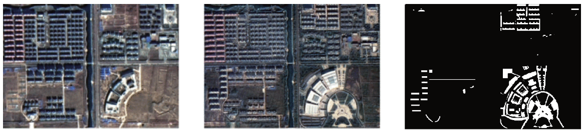
   
  <b>(left) Initial and (middle) after some development, with (right) the change highlighted.</b>

Change detection is a vital component of remote sensing analysis, enabling the monitoring of landscape changes over time. This technique can be applied to identify a wide range of changes, including land use changes, urban development, coastal erosion, and deforestation. Change detection can be performed on a pair of images taken at different times, or by analyzing multiple images collected over a period of time. It is important to note that while change detection is primarily used to detect changes in the landscape, it can also be influenced by the presence of clouds and shadows. These dynamic elements can alter the appearance of the image, leading to false positives in change detection results. Therefore, it is essential to consider the impact of clouds and shadows on change detection analysis, and to employ appropriate methods to mitigate their influence. [Image source](https://www.mdpi.com/2072-4292/11/3/240)

links

* [awesome-remote-sensing-change-detection](https://github.com/wenhwu/awesome-remote-sensing-change-detection) lists many datasets and publications
* [Change-Detection-Review](https://github.com/MinZHANG-WHU/Change-Detection-Review) -> A review of change detection methods, including code and open data sets for deep learning
* [Change Detection using Siamese Networks](https://towardsdatascience.com/change-detection-using-siamese-networks-fc2935fff82) -> Medium article `BEGINNER`
* [STANet](https://github.com/justchenhao/STANet) -> official implementation of the spatial-temporal attention neural network (STANet) for remote sensing image change detection `BEGINNER`
* [UNet-based-Unsupervised-Change-Detection](https://github.com/annabosman/UNet-based-Unsupervised-Change-Detection) -> A convolutional neural network (CNN) and semantic segmentation is implemented to detect the changes between the images, as well as classify the changes into the correct semantic class, with [arxiv paper](https://arxiv.org/abs/1812.05815) `BEGINNER`
* [BIT_CD](https://github.com/justchenhao/BIT_CD) -> Official Pytorch Implementation of Remote Sensing Image Change Detection with Transformers
* [Unstructured-change-detection-using-CNN](https://github.com/vbhavank/Unstructured-change-detection-using-CNN)
* [Siamese neural network to detect changes in aerial images](https://github.com/vbhavank/Siamese-neural-network-for-change-detection) -> uses Keras and VGG16 architecture
* [Change Detection in 3D: Generating Digital Elevation Models from Dove Imagery](https://www.planet.com/pulse/publications/change-detection-in-3d-generating-digital-elevation-models-from-dove-imagery/)
* [QGIS plugin for applying change detection algorithms on high resolution satellite imagery](https://github.com/dymaxionlabs/massive-change-detection)
* [LamboiseNet](https://github.com/hbaudhuin/LamboiseNet) -> Master thesis about change detection in satellite imagery using Deep Learning
* [Fully Convolutional Siamese Networks for Change Detection](https://github.com/rcdaudt/fully_convolutional_change_detection) -> with [paper](https://ieeexplore.ieee.org/abstract/document/8451652)
* [Urban Change Detection for Multispectral Earth Observation Using Convolutional Neural Networks](https://github.com/rcdaudt/patch_based_change_detection) -> with [paper](https://ieeexplore.ieee.org/abstract/document/8518015), used the Onera Satellite Change Detection (OSCD) dataset
* [IAug_CDNet](https://github.com/justchenhao/IAug_CDNet) -> Official Pytorch Implementation of Adversarial Instance Augmentation for Building Change Detection in Remote Sensing Images
* [dpm-rnn-public](https://github.com/olliestephenson/dpm-rnn-public) -> Code implementing a damage mapping method combining satellite data with deep learning
* [SenseEarth2020-ChangeDetection](https://github.com/LiheYoung/SenseEarth2020-ChangeDetection) -> 1st place solution to the Satellite Image Change Detection Challenge hosted by SenseTime; predictions of five HRNet-based segmentation models are ensembled, serving as pseudo labels of unchanged areas
* [KPCAMNet](https://github.com/I-Hope-Peace/KPCAMNet) -> Python implementation of the paper Unsupervised Change Detection in Multi-temporal VHR Images Based on Deep Kernel PCA Convolutional Mapping Network
* [CDLab](https://github.com/Bobholamovic/CDLab) -> benchmarking deep learning-based change detection methods.
* [Siam-NestedUNet](https://github.com/likyoo/Siam-NestedUNet) -> The pytorch implementation for "SNUNet-CD: A Densely Connected Siamese Network for Change Detection of VHR Images"
* [SUNet-change_detection](https://github.com/ShaoRuizhe/SUNet-change_detection) -> Implementation of paper SUNet: Change Detection for Heterogeneous Remote Sensing Images from Satellite and UAV Using a Dual-Channel Fully Convolution Network
* [Self-supervised Change Detection in Multi-view Remote Sensing Images](https://github.com/cyx669521/self-supervised_change_detetction)
* [MFPNet](https://github.com/wzjialang/MFPNet) -> Remote Sensing Change Detection Based on Multidirectional Adaptive Feature Fusion and Perceptual Similarity
* [GitHub for the DIUx xView Detection Challenge](https://github.com/DIUx-xView) -> The xView2 Challenge focuses on automating the process of assessing building damage after a natural disaster
* [DASNet](https://github.com/lehaifeng/DASNet) -> Dual attentive fully convolutional siamese networks for change detection of high-resolution satellite images
* [Self-Attention for Raw Optical Satellite Time Series Classification](https://github.com/MarcCoru/crop-type-mapping)
* [planet-movement](https://github.com/rhammell/planet-movement) -> Find and process Planet image pairs to highlight object movement
* [temporal-cluster-matching](https://github.com/microsoft/temporal-cluster-matching) -> detecting change in structure footprints from time series of remotely sensed imagery
* [autoRIFT](https://github.com/nasa-jpl/autoRIFT) -> fast and intelligent algorithm for finding the pixel displacement between two images
* [DSAMNet](https://github.com/liumency/DSAMNet) -> Code for “A Deeply Supervised Attention Metric-Based Network and an Open Aerial Image Dataset for Remote Sensing Change Detection”. The main types of changes in the dataset include: (a) newly built urban buildings; (b) suburban dilation; (c) groundwork before construction; (d) change of vegetation; (e) road expansion; (f) sea construction.
* [SRCDNet](https://github.com/liumency/SRCDNet) -> The pytorch implementation for "Super-resolution-based Change Detection Network with Stacked Attention Module for Images with Different Resolutions ". SRCDNet is designed to learn and predict change maps from bi-temporal images with different resolutions
* [Land-Cover-Analysis](https://github.com/Kalit31/Land-Cover-Analysis) -> Land Cover Change Detection using Satellite Image Segmentation
* [A deeply supervised image fusion network for change detection in high resolution bi-temporal remote sening images](https://github.com/GeoZcx/A-deeply-supervised-image-fusion-network-for-change-detection-in-remote-sensing-images)
* [Satellite-Image-Alignment-Differencing-and-Segmentation](https://github.com/rishi5kesh/Satellite-Image-Alignment-Differencing-and-Segmentation) -> thesis on change detection
* [Change Detection in Multi-temporal Satellite Images](https://github.com/IhebeddineRyahi/Change-detection-in-multitemporal-satellite-images) -> uses Principal Component Analysis (PCA) and K-means clustering
* [Unsupervised Change Detection Algorithm using PCA and K-Means Clustering](https://github.com/leduckhai/Change-Detection-PCA-KMeans) -> in Matlab but has paper
* [ChangeFormer](https://github.com/wgcban/ChangeFormer) -> A Transformer-Based Siamese Network for Change Detection. Uses transformer architecture to address the limitations of CNN in handling multi-scale long-range details. Demonstrates that ChangeFormer captures much finer details compared to the other SOTA methods, achieving better performance on benchmark datasets
* [Heterogeneous_CD](https://github.com/llu025/Heterogeneous_CD) -> Heterogeneous Change Detection in Remote Sensing Images. Accompanies [Code-Aligned Autoencoders for Unsupervised Change Detection in Multimodal Remote Sensing Images](https://arxiv.org/abs/2004.07011)
* [ChangeDetectionProject](https://github.com/previtus/ChangeDetectionProject) -> Trying out Active Learning in with deep CNNs for Change detection on remote sensing data
* [DSFANet](https://github.com/rulixiang/DSFANet) -> Unsupervised Deep Slow Feature Analysis for Change Detection in Multi-Temporal Remote Sensing Images
* [siamese-change-detection](https://github.com/mvkolos/siamese-change-detection) -> Targeted synthesis of multi-temporal remote sensing images for change detection using siamese neural networks
* [Bi-SRNet](https://github.com/ggsDing/Bi-SRNet) -> code for 2022 [paper](https://ieeexplore.ieee.org/abstract/document/9721305): Bi-Temporal Semantic Reasoning for the Semantic Change Detection in HR Remote Sensing Images
* [SiROC](https://github.com/lukaskondmann/SiROC) -> Implementation of the [paper](https://ieeexplore.ieee.org/document/9627707) Spatial Context Awareness for Unsupervised Change Detection in Optical Satellite Images. Applied to Sentinel-2 and high-resolution Planetscope imagery on four datasets
* [DSMSCN](https://github.com/I-Hope-Peace/DSMSCN) -> Tensorflow implementation for Change Detection in Multi-temporal VHR Images Based on Deep Siamese Multi-scale Convolutional Neural Networks
* [RaVAEn](https://github.com/spaceml-org/RaVAEn) -> a lightweight, unsupervised approach for change detection in satellite data based on Variational Auto-Encoders (VAEs) with the specific purpose of on-board deployment. It flags changed areas to prioritise for downlink, shortening the response time
* [SemiCD](https://github.com/wgcban/SemiCD) -> Code for [paper](https://arxiv.org/abs/2204.08454): Revisiting Consistency Regularization for Semi-supervised Change Detection in Remote Sensing Images. Achieves the performance of supervised CD even with access to as little as 10% of the annotated training data
* [FCCDN_pytorch](https://github.com/chenpan0615/FCCDN_pytorch) -> code for [paper](https://www.sciencedirect.com/science/article/abs/pii/S0924271622000636): FCCDN: Feature Constraint Network for VHR Image Change Detection. Uses the [LEVIR-CD](https://justchenhao.github.io/LEVIR/) building change detection dataset
* [INLPG_Python](https://github.com/zcsisiyao/INLPG_Python) -> code for paper: Structure Consistency based Graph for Unsupervised Change Detection with Homogeneous and Heterogeneous Remote Sensing Images
* [NSPG_Python](https://github.com/zcsisiyao/NSPG_Python) -> code for paper: Nonlocal patch similarity based heterogeneous remote sensing change detection
* [LGPNet-BCD](https://github.com/TongfeiLiu/LGPNet-BCD) -> code for 2021 paper: Building Change Detection for VHR Remote Sensing Images via Local-Global Pyramid Network and Cross-Task Transfer Learning Strategy
* [DS_UNet](https://github.com/SebastianHafner/DS_UNet) -> code for 2021 paper: Sentinel-1 and Sentinel-2 Data Fusion for Urban Change Detection using a Dual Stream U-Net, uses Onera Satellite Change Detection dataset
* [SiameseSSL](https://github.com/SebastianHafner/SiameseSSL) -> code for 2022 [paper](https://arxiv.org/abs/2204.12202): Urban change detection with a Dual-Task Siamese network and semi-supervised learning. Uses SpaceNet 7 dataset
* [CD-SOTA-methods](https://github.com/wgcban/CD-SOTA-methods) -> Remote sensing change detection: State-of-the-art methods and available datasets
* [multimodalCD_ISPRS21](https://github.com/PatrickTUM/multimodalCD_ISPRS21) -> code for 2021 paper: Fusing Multi-modal Data for Supervised Change Detection
* [Unsupervised-CD-in-SITS-using-DL-and-Graphs](https://github.com/ekalinicheva/Unsupervised-CD-in-SITS-using-DL-and-Graphs) -> code for article: Unsupervised Change Detection Analysis in Satellite Image Time Series using Deep Learning Combined with Graph-Based Approaches
* [LSNet](https://github.com/qaz670756/LSNet) -> code for 2022 [paper](https://arxiv.org/abs/2201.09156): Extremely Light-Weight Siamese Network For Change Detection in Remote Sensing Image
* [Change-Detection-in-Remote-Sensing-Images](https://github.com/themrityunjay/Change-Detection-in-Remote-Sensing-Images) ->  using PCA & K-means
* [End-to-end-CD-for-VHR-satellite-image](https://github.com/daifeng2016/End-to-end-CD-for-VHR-satellite-image) -> code for 2019 [paper](https://www.mdpi.com/2072-4292/11/11/1382): End-to-End Change Detection for High Resolution Satellite Images Using Improved UNet++
* [Semantic-Change-Detection](https://github.com/daifeng2016/Semantic-Change-Detection) -> code for 2021 [paper](https://www.sciencedirect.com/science/article/pii/S0303243421001720): SCDNET: A novel convolutional network for semantic change detection in high resolution optical remote sensing imagery
* [ERCNN-DRS_urban_change_monitoring](https://github.com/It4innovations/ERCNN-DRS_urban_change_monitoring) -> code for 2021 [paper](https://www.mdpi.com/2072-4292/13/15/3000): Neural Network-Based Urban Change Monitoring with Deep-Temporal Multispectral and SAR Remote Sensing Data
* [EGRCNN](https://github.com/luting-hnu/EGRCNN) -> code for 2021 [paper](https://ieeexplore.ieee.org/document/9524849): Edge-guided Recurrent Convolutional Neural Network for Multi-temporal Remote Sensing Image Building Change Detection
* [Unsupervised-Remote-Sensing-Change-Detection](https://github.com/TangXu-Group/Unsupervised-Remote-Sensing-Change-Detection) -> code for 2021 [paper](https://ieeexplore.ieee.org/document/9526855): An Unsupervised Remote Sensing Change Detection Method Based on Multiscale Graph Convolutional Network and Metric Learning
* [CropLand-CD](https://github.com/liumency/CropLand-CD) -> code for 2022 [paper](https://ieeexplore.ieee.org/document/9780164): A CNN-transformer Network with Multi-scale Context Aggregation for Fine-grained Cropland Change Detection
* [contrastive-surface-image-pretraining](https://github.com/isaaccorley/contrastive-surface-image-pretraining) -> code for 2022 [paper](https://arxiv.org/abs/2202.13251): Supervising Remote Sensing Change Detection Models with 3D Surface Semantics
* [dcvaVHROptical](https://github.com/sudipansaha/dcvaVHROptical) -> Deep Change Vector Analysis (DCVA) change detection. Code for 2019 [paper](https://ieeexplore.ieee.org/document/8608001): Unsupervised Deep Change Vector Analysis for Multiple-Change Detection in VHR Images
* [hyperdimensionalCD](https://github.com/sudipansaha/hyperdimensionalCD) -> code for 2021 [paper](https://ieeexplore.ieee.org/abstract/document/9582825): Change Detection in Hyperdimensional Images Using Untrained Models
* [DSFANet](https://github.com/wwdAlger/DSFANet) -> code for 2018 [paper](https://arxiv.org/abs/1812.00645): Unsupervised Deep Slow Feature Analysis for Change Detection in Multi-Temporal Remote Sensing Images
* [FCD-GAN-pytorch](https://github.com/Cwuwhu/FCD-GAN-pytorch) -> Fully Convolutional Change Detection Framework with Generative Adversarial Network (FCD-GAN) is a framework for change detection in multi-temporal remote sensing images
* [DARNet-CD](https://github.com/jimmyli08/DARNet-CD) -> code for 2022 paper: A Densely Attentive Refinement Network for Change Detection Based on Very-High-Resolution Bitemporal Remote Sensing Images
* [xView2_Vulcan](https://github.com/RitwikGupta/xView2-Vulcan) -> Damage assessment using pre and post orthoimagery. Modified + productionized model based off the first-place model from the xView2 challenge.
* [ESCNet](https://github.com/Bobholamovic/ESCNet) -> code for 2021 [paper](https://ieeexplore.ieee.org/document/9474911): An End-to-End Superpixel-Enhanced Change Detection Network for Very-High-Resolution Remote Sensing Images
* [ForestCoverChange](https://github.com/annusgit/ForestCoverChange) -> Detecting and Predicting Forest Cover Change in Pakistani Areas Using Remote Sensing Imagery
* [deforestation-detection](https://github.com/vldkhramtsov/deforestation-detection) -> code for 2020 paper: DEEP LEARNING FOR HIGH-FREQUENCY CHANGE DETECTION IN UKRAINIAN FOREST ECOSYSTEM WITH SENTINEL-2
* [forest_change_detection](https://github.com/QuantuMobileSoftware/forest_change_detection) -> forest change segmentation with time-dependent models, including Siamese, UNet-LSTM, UNet-diff, UNet3D models. Code for 2021 [paper](https://ieeexplore.ieee.org/document/9241044): Deep Learning for Regular Change Detection in Ukrainian Forest Ecosystem With Sentinel-2
* [SentinelClearcutDetection](https://github.com/vldkhramtsov/SentinelClearcutDetection) -> Scripts for deforestation detection on the Sentinel-2 Level-A images
* [clearcut_detection](https://github.com/QuantuMobileSoftware/clearcut_detection) -> research & web-service for clearcut detection
* [CDRL](https://github.com/cjf8899/CDRL) -> code for 2022 [paper](https://arxiv.org/abs/2204.01200): Unsupervised Change Detection Based on Image Reconstruction Loss
* [ddpm-cd](https://github.com/wgcban/ddpm-cd) -> code for 2022 [paper](https://arxiv.org/abs/2206.11892): Remote Sensing Change Detection (Segmentation) using Denoising Diffusion Probabilistic Models
* [Remote-sensing-time-series-change-detection](https://github.com/liulianni1688/Remote-sensing-time-series-change-detection) -> code for 2022 [paper](https://www.sciencedirect.com/science/article/abs/pii/S0034425722001079): Graph-based block-level urban change detection using Sentinel-2 time series
* [austin-ml-change-detection-demo](https://github.com/makepath/austin-ml-change-detection-demo) -> A change detection demo for the Austin area using a pre-trained PyTorch model scaled with Dask on Planet imagery
* [dfc2021-msd-baseline](https://github.com/calebrob6/dfc2021-msd-baseline) -> A baseline for the "Multitemporal Semantic Change Detection" track of the 2021 IEEE GRSS Data Fusion Competition
* [CorrFusionNet](https://github.com/rulixiang/CorrFusionNet) -> code for 2020 [paper](https://arxiv.org/abs/2006.02176): Multi-Temporal Scene Classification and Scene Change Detection with Correlation based Fusion
* [ChangeDetectionPCAKmeans](https://github.com/rulixiang/ChangeDetectionPCAKmeans) -> MATLAB implementation for Unsupervised Change Detection in Satellite Images Using Principal Component Analysis and k-Means Clustering.
* [IRCNN](https://github.com/thebinyang/IRCNN) -> code for 2022 [paper](https://ieeexplore.ieee.org/abstract/document/9721897): IRCNN: An Irregular-Time-Distanced Recurrent Convolutional Neural Network for Change Detection in Satellite Time Series
* [UTRNet](https://github.com/thebinyang/UTRNet) -> An Unsupervised Time-Distance-Guided Convolutional Recurrent Network for Change Detection in Irregularly Collected Images
* [open-cd](https://github.com/likyoo/open-cd) -> an open source change detection toolbox based on a series of open source general vision task tools
* [Tiny_model_4_CD](https://github.com/AndreaCodegoni/Tiny_model_4_CD) -> code for 2022 [paper](https://arxiv.org/abs/2207.13159): TINYCD: A (Not So) Deep Learning Model For Change Detection. Uses LEVIR-CD & WHU-CD datasets
* [FHD](https://github.com/ZSVOS/FHD) -> code for 2022 [paper](https://ieeexplore.ieee.org/document/9837915): Feature Hierarchical Differentiation for Remote Sensing Image Change Detection
* [Change detection with Raster Vision](https://www.azavea.com/blog/2022/04/18/change-detection-with-raster-vision/) -> blog post with Colab notebook
* [building-expansion](https://github.com/reglab/building-expansion) -> code for 2021 [paper](https://arxiv.org/abs/2105.14159): Enhancing Environmental Enforcement with Near Real-Time Monitoring: Likelihood-Based Detection of Structural Expansion of Intensive Livestock Farms
* [SaDL_CD](https://github.com/justchenhao/SaDL_CD) -> code for 2022 [paper](https://arxiv.org/abs/2205.13769): Semantic-aware Dense Representation Learning for Remote Sensing Image Change Detection
* [EGCTNet_pytorch](https://github.com/chen11221/EGCTNet_pytorch) -> code for 2022 [paper](https://www.mdpi.com/2072-4292/14/18/4524): Building Change Detection Based on an Edge-Guided Convolutional Neural Network Combined with a Transformer
* [S2-cGAN](https://git.tu-berlin.de/rsim/S2-cGAN) -> code for 2020 [paper](https://arxiv.org/abs/2007.02565): S2-cGAN: Self-Supervised Adversarial Representation Learning for Binary Change Detection in Multispectral Images
* [A-loss-function-for-change-detection](https://github.com/Chuan-shanjia/A-loss-function-for-change-detection) -> code for 2022 [paper](https://ieeexplore.ieee.org/document/9884382): UAL: Unchanged Area Loss-Function for Change Detection Networks
* [IEEE_TGRS_SSTFormer](https://github.com/yanhengwang-heu/IEEE_TGRS_SSTFormer) -> code for 2022 [paper](https://ieeexplore.ieee.org/abstract/document/9870837): Spectral–Spatial–Temporal Transformers for Hyperspectral Image Change Detection

#
## Time series

  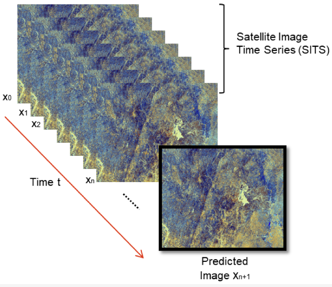
   
  <b>Prediction of the next image in a series.</b>

The analysis of time series observations in remote sensing data has numerous applications, including enhancing the accuracy of classification models and forecasting future patterns and events. [Image source](https://www.mdpi.com/2072-4292/13/23/4822). Note: since classifying crops and predicting crop yield are such prominent use case for time series data, these tasks have dedicated sections after this one.

links

* [LANDSAT Time Series Analysis for Multi-temporal Land Cover Classification using Random Forest](https://github.com/agr-ayush/Landsat-Time-Series-Analysis-for-Multi-Temporal-Land-Cover-Classification)
* [temporalCNN](https://github.com/charlotte-pel/temporalCNN) -> Temporal Convolutional Neural Network for the Classification of Satellite Image Time Series
* [pytorch-psetae](https://github.com/VSainteuf/pytorch-psetae) -> code for the paper: Satellite Image Time Series Classification with Pixel-Set Encoders and Temporal Self-Attention
* [satflow](https://github.com/openclimatefix/satflow) -> optical flow models for predicting future satellite images from current and past ones
* [esa-superresolution-forecasting](https://github.com/PiSchool/esa-superresolution-forecasting) -> Forecasting air pollution using ESA Sentinel-5p data, and an encoder-decoder convolutional LSTM neural network architecture, implemented in Pytorch
* [lightweight-temporal-attention-pytorch](https://github.com/VSainteuf/lightweight-temporal-attention-pytorch) -> A PyTorch implementation of the Light Temporal Attention Encoder (L-TAE) for satellite image time series
* [dtwSat](https://github.com/vwmaus/dtwSat) -> Time-Weighted Dynamic Time Warping for satellite image time series analysis
* [MTLCC](https://github.com/MarcCoru/MTLCC) -> code for paper: Multitemporal Land Cover Classification Network. A recurrent neural network approach to encode multi-temporal data for land cover classification
* [PWWB](https://github.com/PannuMuthu/PWWB) -> Code for the 2021 [paper](https://link.springer.com/chapter/10.1007/978-3-030-71704-9_20): Real-Time Spatiotemporal Air Pollution Prediction with Deep Convolutional LSTM through Satellite Image Analysis
* [spaceweather](https://github.com/sarttiso/spaceweather) -> predicting geomagnetic storms from satellite measurements of the solar wind and solar corona, uses LSTMs
* [Forest_wildfire_spreading_convLSTM](https://github.com/bessammehenni/Forest_wildfire_spreading_convLSTM) -> Modeling of the spreading of forest wildfire using a neural network with ConvLSTM cells. Prediction 3-days forward
* [ConvTimeLSTM](https://github.com/jdiaz4302/ConvTimeLSTM) -> Extension of ConvLSTM and Time-LSTM for irregularly spaced images, appropriate for Remote Sensing
* [dl-time-series](https://github.com/NexGenMap/dl-time-series) -> Deep Learning algorithms applied to characterization of Remote Sensing time-series
* [tpe](https://github.com/jnyborg/tpe) -> code for 2022 [paper](https://openaccess.thecvf.com/content/CVPR2022W/EarthVision/html/Nyborg_Generalized_Classification_of_Satellite_Image_Time_Series_With_Thermal_Positional_CVPRW_2022_paper.html): Generalized Classification of Satellite Image Time Series With Thermal Positional Encoding
* [wildfire_forecasting](https://github.com/Orion-AI-Lab/wildfire_forecasting) -> code for 2021 [paper](https://arxiv.org/abs/2111.02736): Deep Learning Methods for Daily Wildfire Danger Forecasting. Uses ConvLSTM
* [satellite_image_forecasting](https://github.com/rudolfwilliam/satellite_image_forecasting) -> predict future satellite images from past ones using features such as precipitation and elevation maps. Entry for the [EarthNet2021](https://www.earthnet.tech/) challenge
* [Deep Learning for Cloud Gap-Filling on Normalized Difference Vegetation Index using Sentinel Time-Series](https://github.com/Agri-Hub/Deep-Learning-for-Cloud-Gap-Filling-on-Normalized-Difference-Vegetation-Index) -> A CNN-RNN based model that identifies correlations between optical and SAR data and exports dense Normalized Difference Vegetation Index (NDVI) time-series of a static 6-day time resolution and can be used for Events Detection tasks
* [DeepSatModels](https://github.com/michaeltrs/DeepSatModels) -> code for the 2023 [paper](https://arxiv.org/abs/2301.04944): ViTs for SITS: Vision Transformers for Satellite Image Time Series

#
## Crop classification

  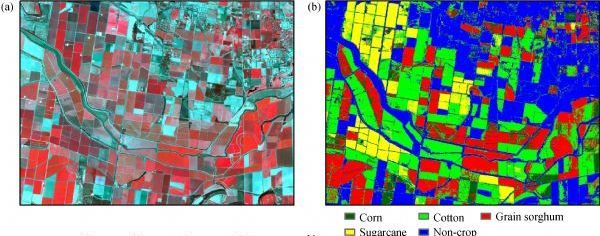
   
  <b>(left) false colour image and (right) the crop map.</b>

Crop classification in remote sensing is the identification and mapping of different crops in images or sequences of images. It aims to provide insight into the distribution and composition of crops in a specific area, with applications that include monitoring crop growth and evaluating crop damage. Both traditional machine learning methods, such as decision trees and support vector machines, and deep learning techniques, such as convolutional neural networks (CNNs), can be used to perform crop classification. The optimal method depends on the size and complexity of the dataset, the desired accuracy, and the available computational resources. However, the success of crop classification relies heavily on the quality and resolution of the input data, as well as the availability of labeled training data. [Image source](https://journal.hep.com.cn/fase/EN/10.15302/J-FASE-2018226).

links

* [Classification of Crop Fields through Satellite Image Time Series](https://medium.com/dida-machine-learning/classification-of-crop-fields-through-satellite-image-time-serie-dida-machine-learning-9b64ce2b8c10) -> using a [pytorch-psetae](https://github.com/VSainteuf/pytorch-psetae) & Sentinel-2 data
* [CropDetectionDL](https://github.com/karimmamer/CropDetectionDL) -> using GRU-net, First place solution for Crop Detection from Satellite Imagery competition organized by CV4A workshop at ICLR 2020
* [Radiant-Earth-Spot-the-Crop-Challenge](https://github.com/DariusTheGeek/Radiant-Earth-Spot-the-Crop-Challenge) -> The main objective of this challenge was to use time-series of Sentinel-2 multi-spectral data to classify crops in the Western Cape of South Africa. The challenge was to build a machine learning model to predict crop type classes for the test dataset
* [Crop-Classification](https://github.com/bhavesh907/Crop-Classification) -> crop classification using multi temporal satellite images
* [DeepCropMapping](https://github.com/Lab-IDEAS/DeepCropMapping) -> A multi-temporal deep learning approach with improved spatial generalizability for dynamic corn and soybean mapping, uses LSTM
* [CropMappingInterpretation](https://github.com/Lab-IDEAS/CropMappingInterpretation) -> An interpretation pipeline towards understanding multi-temporal deep learning approaches for crop mapping
* [timematch](https://github.com/jnyborg/timematch) -> code for 2022 paper: A method to perform unsupervised cross-region adaptation of crop classifiers trained with satellite image time series. We also introduce an open-access dataset for cross-region adaptation with SITS from four different regions in Europe
* [elects](https://github.com/MarcCoru/elects) -> code for 2022 [paper](https://arxiv.org/abs/1901.10681): End-to-End Learned Early Classification of Time Series for In-Season Crop Type Mapping

#
## Crop yield

  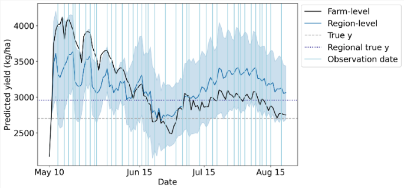
   
  <b>Wheat yield data. Blue vertical lines denote observation dates.</b>

Crop yield is a crucial metric in agriculture, as it determines the productivity and profitability of a farm. It is defined as the amount of crops produced per unit area of land and is influenced by a range of factors including soil fertility, weather conditions, the type of crop grown, and pest and disease control. By utilizing time series of satellite images, it is possible to perform accurate crop type classification and take advantage of the seasonal variations specific to certain crops. This information can be used to optimize crop management practices and ultimately improve crop yield. However, to achieve accurate results, it is essential to consider the quality and resolution of the input data, as well as the availability of labeled training data. Appropriate pre-processing and feature extraction techniques must also be employed. [Image source](https://www.mdpi.com/2072-4292/14/17/4193).

links

* [Crop yield Prediction with Deep Learning](https://github.com/JiaxuanYou/crop_yield_prediction) -> code for the paper Deep Gaussian Process for Crop Yield Prediction Based on Remote Sensing Data
* [Deep-Transfer-Learning-Crop-Yield-Prediction](https://github.com/sustainlab-group/Deep-Transfer-Learning-Crop-Yield-Prediction)
* [Crop-Yield-Prediction-using-ML](https://github.com/VaibhavSaini19/Crop-Yield-Prediction-using-ML) -> A simple Web application developed in order to provide the farmers/users an approximation on how much amount of crop yield will be produced depending upon the given input
* [Building a Crop Yield Prediction App in Senegal Using Satellite Imagery and Jupyter Voila](https://omdena.com/blog/yield-prediction/)
* [Crop Yield Prediction Using Deep Neural Networks and LSTM](https://omdena.com/blog/deep-learning-yield-prediction/)
* [Deep transfer learning techniques for crop yield prediction, published in COMPASS 2018](https://github.com/AnnaXWang/deep-transfer-learning-crop-prediction)
* [Understanding crop yield predictions from CNNs](https://github.com/brad-ross/crop-yield-prediction-project)
* [Advanced Deep Learning Techniques for Predicting Maize Crop Yield using Sentinel-2 Satellite Imagery](https://zionayomide.medium.com/advanced-deep-learning-techniques-for-predicting-maize-crop-yield-using-sentinel-2-satellite-1b63ac8b0789)
* [pycrop-yield-prediction](https://github.com/gabrieltseng/pycrop-yield-prediction) -> A PyTorch Implementation of Jiaxuan You's Deep Gaussian Process for Crop Yield Prediction
* [PredictYield](https://github.com/dberm312/PredictYield) -> using data scraped from Google Earth Engine, this predicts the yield of Corn, Soybean, and Wheat in the USA with Keras
* [Crop-Yield-Prediction-and-Estimation-using-Time-series-remote-sensing-data](https://github.com/mahimatendulkar/Crop-Yield-Prediction-and-Estimation-using-Time-series-remote-sensing-data.) -> student research
* [Yield-Prediction-Using-Sentinel-Data](https://github.com/meet-sapu/Crop-Yield-Prediction-Using-Satellite-Imagery)
* [SPACY](https://github.com/rlee360/PLaTYPI) -> Satellite Prediction of Aggregate Corn Yield
* [cropyieldArticle](https://github.com/myliheik/cropyieldArticle) -> code for 2022 [paper](https://www.mdpi.com/2072-4292/14/17/4193): Scalable Crop Yield Prediction with Sentinel-2 Time Series and Temporal Convolutional Network

#
## Wealth and economic activity

  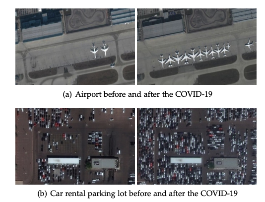
   
  <b>COVID-19 impacts on human and economic activities.</b>

The traditional approach of collecting economic data through ground surveys is a time-consuming and resource-intensive process. However, advancements in satellite technology and machine learning offer an alternative solution. By utilizing satellite imagery and applying machine learning algorithms, it is possible to obtain accurate and current information on economic activity with greater efficiency. This shift towards satellite imagery-based forecasting not only provides cost savings but also offers a wider and more comprehensive perspective of economic activity. As a result, it is poised to become a valuable asset for both policymakers and businesses. [Image source](https://arxiv.org/abs/2004.07438).

links

* [Using publicly available satellite imagery and deep learning to understand economic well-being in Africa, Nature Comms 22 May 2020](https://www.nature.com/articles/s41467-020-16185-w) -> Used CNN on Ladsat imagery (night & day) to predict asset wealth of African villages
* [Combining Satellite Imagery and machine learning to predict poverty](https://towardsdatascience.com/combining-satellite-imagery-and-machine-learning-to-predict-poverty-884e0e200969) -> review article
* [Measuring Human and Economic Activity from Satellite Imagery to Support City-Scale Decision-Making during COVID-19 Pandemic](https://arxiv.org/abs/2004.07438) -> arxiv article
* [Predicting Food Security Outcomes Using CNNs for Satellite Tasking](https://arxiv.org/pdf/1902.05433.pdf) -> arxiv article
* [Measuring the Impacts of Poverty Alleviation Programs with Satellite Imagery and Deep Learning](https://github.com/luna983/beyond-nightlight) -> code and paper
* [Building a Spatial Model to Classify Global Urbanity Levels](https://towardsdatascience.com/building-a-spatial-model-to-classify-global-urbanity-levels-e2fb9da7252) -> estimage global urbanity levels from population data, nightime lights and road networks
* [deeppop](https://deeppop.github.io/) -> Deep Learning Approach for Population Estimation from Satellite Imagery, also [on Github](https://github.com/deeppop)
* [Estimating telecoms demand in areas of poor data availability](https://github.com/edwardoughton/taddle) -> with papers on [arxiv](https://arxiv.org/abs/2006.07311) and [Science Direct](https://www.sciencedirect.com/science/article/abs/pii/S0736585321000617)
* [satimage](https://github.com/mani-shailesh/satimage) -> Code and models for the manuscript "Predicting Poverty and Developmental Statistics from Satellite Images using Multi-task Deep Learning". Predict the main material of a roof, source of lighting and source of drinking water for properties, from satellite imagery
* [africa_poverty](https://github.com/sustainlab-group/africa_poverty) -> Using publicly available satellite imagery and deep learning to understand economic well-being in Africa
* [Predicting-Poverty](https://github.com/jmather625/predicting-poverty-replication) -> Combining satellite imagery and machine learning to predict poverty, in PyTorch
* [income-prediction](https://github.com/tnarayanan/income-prediction) -> Predicting average yearly income based on satellite imagery using CNNs, uses pytorch
* [urban_score](https://github.com/Sungwon-Han/urban_score) -> Pytorch Implementation of paper: Learning to score economic development from satellite imagery
* [READ](https://github.com/Sungwon-Han/READ) -> Pytorch Implementation of paper: Lightweight and robust representation of economic scales from satellite imagery
* [Slum-classification](https://github.com/Jesse-DE/Slum-classification) -> Binary classification on a very high-resolution satellite image in case of mapping informal settlements using unet
* [Predicting_Poverty](https://github.com/cyuancheng/Predicting_Poverty) -> uses daytime & luminosity of nighttime satellite images
* [Cancer-Prevalence-Satellite-Images](https://github.com/theJamesChen/Cancer-Prevalence-Satellite-Images) -> Predict Health Outcomes from Features of Satellite Images
* [Mapping Poverty in Bangladesh with Satellite Images and Deep Learning](https://github.com/huydang90/Mapping-Poverty-With-Satellite-Images) -> combines health data with OpenStreetMaps Data & night and daytime satellite imagery
* [Population Estimation from Satellite Imagery](https://github.com/ManuelSerranoR/Population-Estimation-from-Satellite-Imagery-using-Deep-Learning)
* [Deep_Learning_Satellite_Imd](https://github.com/surendran-berkeley/Deep_Learning_Satellite_Imd) -> code for "Project Bhoomi" - Using Deep Learning on Satellite Imagery to predict population and economic indicators
* [satellite_led_liverpool](https://github.com/darribas/satellite_led_liverpool) -> code for 2017 paper: Remote Sensing-Based Measurement of Living Environment Deprivation - Improving Classical Approaches with Machine Learning
* [uganda-poverty-project](https://github.com/vinceranga/uganda-poverty-project) -> use through Object Detection on high-resolution satellite imagery to identify indicators of poverty and economic inequality within Uganda
* [Predicting_Energy_Consumption_With_Convolutional_Neural_Networks](https://github.com/healdz/Predicting_Energy_Consumption_With_Convolutional_Neural_Networks)

#
## Disaster response

  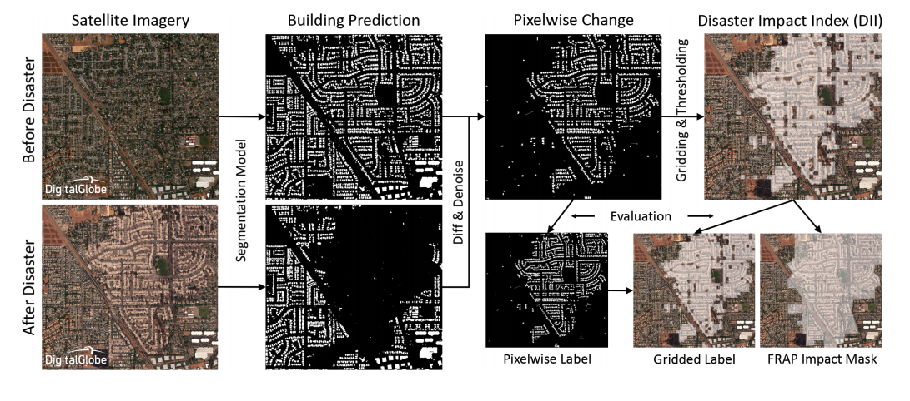
   
  <b>Detecting buildings destroyed in a disaster.</b>

Remote sensing images are used in disaster response to identify and assess damage to an area. This imagery can be used to detect buildings that are damaged or destroyed, identify roads and road networks that are blocked, determine the size and shape of a disaster area, and identify areas that are at risk of flooding. Remote sensing images can also be used to detect and monitor the spread of forest fires and monitor vegetation health. Also checkout the sections on change detection and water/fire/building segmentation. [Image source](https://developer.nvidia.com/blog/ai-helps-detect-disaster-damage-from-satellite-imagery/).

links

* [DisaVu](https://github.com/SrzStephen/DisaVu) -> combines building & damage detection and provides an app for viewing predictions
* [Soteria](https://github.com/Soteria-ai/Soteria) -> uses machine learning with satellite imagery to map natural disaster impacts for faster emergency response
* [DisasterHack](https://github.com/MarjorieRWillner/DisasterHack) -> Wildfire Mitigation: Computer Vision Identification of Hazard Fuels Using Landsat
* [forestcasting](https://github.com/ivanzvonkov/forestcasting) -> Forest fire prediction powered by analytics
* [Machine Learning-based Damage Assessment for Disaster Relief on Google AI blog](https://ai.googleblog.com/2020/06/machine-learning-based-damage.html) -> uses object detection to locate buildings, then a classifier to determine if a building is damaged. Challenge of generalising due to small dataset
* [hurricane_damage](https://github.com/allankapoor/hurricane_damage) -> Post-hurricane structure damage assessment based on aerial imagery with CNN
* [rescue](https://github.com/dbdmg/rescue) -> code of the paper: Attention to fires: multi-channel deep-learning models forwildfire severity prediction
* [Disaster-Classification](https://github.com/bostankhan6/Disaster-Classification) -> A disaster classification model to predict the type of disaster given an input image, trained on [this dataset](https://github.com/engrhamzaaliimran/cvassignmentdataset)
* [Coarse-to-fine weakly supervised learning method for green plastic cover segmentation](https://github.com/lauraset/Coarse-to-fine-weakly-supervised-GPC-segmentation) -> with [paper](https://www.sciencedirect.com/science/article/abs/pii/S0924271622001095)
* [Detection of destruction in satellite imagery](https://github.com/usmanali414/Destruction-Detection-in-Satellite-Imagery)
* [BDD-Net](https://github.com/jinyuan30/Recognize-damaged-buildings) -> code for 2020 paper: A General Protocol for Mapping Buildings Damaged by a Wide Range of Disasters Based on Satellite Imagery
* [Automatic_Disaster_Detection](https://github.com/yoji-kuretake-like/Automatic_Disaster_Detection) -> detect the affected area by natural disasters by using the way of semantic segmentation and change detection method
* [Flooding Damage Detection from Post-Hurricane Satellite Imagery Based on Convolutional Neural Networks](https://github.com/weining20000/Flooding-Damage-Detection-from-Post-Hurricane-Satellite-Imagery-Based-on-CNN)
* [IBM-Disaster-Response-Hack](https://github.com/NicoDeshler/IBM-Disaster-Response-Hack) -> identifying optimal terrestrial routes through calamity-stricken areas. Satellite image data informs road condition assessment and obstruction detection
* [Automatic Damage Annotation on Post-Hurricane Satellite Imagery](https://dds-lab.github.io/disaster-damage-detection/) -> detect damaged buildings using tensorflow object detection API. With repos [here](https://github.com/DDS-Lab/disaster-image-processing) and [here](https://github.com/annieyan/PreprocessSatelliteImagery-ObjectDetection)
* [Hurricane-Damage-Detection](https://github.com/Ryan-Awad/Hurricane-Damage-Detection) -> Waterloo's Hack the North 2020++ submission. A convolutional neural network model used to detect hurricane damage in RGB satellite images
* [wildfire_forecasting](https://github.com/Orion-AI-Lab/wildfire_forecasting) -> code for 2021 [paper](https://arxiv.org/abs/2111.02736): Deep Learning Methods for Daily Wildfire Danger Forecasting. Uses ConvLSTM
* [Satellite Image Analysis with fast.ai for Disaster Recovery](https://appsilon.com/satellite-image-analysis-with-fast-ai-for-disaster-recovery/)
* [shackleton](https://github.com/avanetten/shackleton) -> leverages remote sensing imagery and machine learning techniques to provide insights into various transportation and evacuation scenarios in an interactive dashboard that conducts real-time computation
* [ai-vegetation-fuel](https://github.com/ecmwf-projects/ai-vegetation-fuel) -> Predicting Fuel Load from earth observation data using Machine Learning, using LightGBM & CatBoost
* [AI Helps Detect Disaster Damage From Satellite Imagery](https://developer.nvidia.com/blog/ai-helps-detect-disaster-damage-from-satellite-imagery/) -> NVIDIA blog post

#
## Super-resolution

  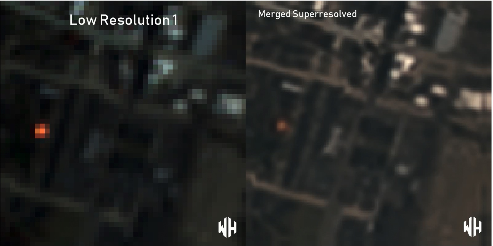
   
  <b>Super resolution using multiple low resolution images as input.</b>

Super-resolution is a technique aimed at improving the resolution of an imaging system. This process can be applied prior to other image processing steps to increase the visibility of small objects or boundaries. Despite its potential benefits, the use of super-resolution is controversial due to the possibility of introducing artifacts that could be mistaken for real features. Super-resolution techniques are broadly categorized into two groups: single image super-resolution (SISR) and multi-image super-resolution (MISR). SISR focuses on enhancing the resolution of a single image, while MISR utilizes multiple images of the same scene to create a high-resolution output. Each approach has its own advantages and limitations, and the choice of method depends on the specific application and desired outcome. [Image source](https://github.com/worldstrat/worldstrat).

links

* [The value of super resolution — real world use case](https://medium.com/sentinel-hub/the-value-of-super-resolution-real-world-use-case-2ba811f4cd7f) -> Medium article on parcel boundary detection with super-resolved satellite imagery
* [Super-Resolution on Satellite Imagery using Deep Learning](https://medium.com/the-downlinq/super-resolution-on-satellite-imagery-using-deep-learning-part-1-ec5c5cd3cd2) -> Nov 2016 blog post by CosmiQ Works with a nice introduction to the topic. Proposes and demonstrates a new architecture with perturbation layers with practical guidance on the methodology and [code](https://github.com/CosmiQ/super-resolution). [Three part series](https://medium.com/the-downlinq/super-resolution-on-satellite-imagery-using-deep-learning-part-3-2e2f61eee1d3)
* [Introduction to spatial resolution](https://medium.com/sentinel-hub/the-most-misunderstood-words-in-earth-observation-d0106adbe4b0)
* [Awesome-Super-Resolution](https://github.com/ptkin/Awesome-Super-Resolution) -> another 'awesome' repo, getting a little out of date now
* [Super-Resolution (python) Utilities for managing large satellite images](https://github.com/jshermeyer/SR_Utils)
* [pytorch-enhance](https://github.com/isaaccorley/pytorch-enhance) -> Library of Image Super-Resolution Models, Datasets, and Metrics for Benchmarking or Pretrained Use. Also [checkout this implementation in Jax](https://github.com/isaaccorley/jax-enhance)
* [Super Resolution in OpenCV](https://learnopencv.com/super-resolution-in-opencv/)
* [AI-based Super resolution and change detection to enforce Sentinel-2 systematic usage](https://medium.com/@sistema_gmbh/ai-based-super-resolution-and-change-detection-to-enforce-sentinel-2-systematic-usage-65aa37d0365) -> Worldview-2 images (2m) were used to create a reference dataset and increase the spatial resolution of the Copernicus sensor from 10m to 5m
* [SRCDNet](https://github.com/liumency/SRCDNet) -> The pytorch implementation for "Super-resolution-based Change Detection Network with Stacked Attention Module for Images with Different Resolutions ". SRCDNet is designed to learn and predict change maps from bi-temporal images with different resolutions
* [Model-Guided Deep Hyperspectral Image Super-resolution](https://github.com/chengerr/Model-Guided-Deep-Hyperspectral-Image-Super-resolution) -> code accompanying the paper [Model-Guided Deep Hyperspectral Image Super-Resolution](https://ieeexplore.ieee.org/document/9429905)
* [Super-resolving beyond satellite hardware](https://github.com/smpetrie/superres) -> [paper](https://arxiv.org/abs/2103.06270) assessing SR performance in reconstructing realistically degraded satellite images
* [satellite-pixel-synthesis-pytorch](https://github.com/KellyYutongHe/satellite-pixel-synthesis-pytorch) -> PyTorch implementation of NeurIPS 2021 paper: Spatial-Temporal Super-Resolution of Satellite Imagery via Conditional Pixel Synthesis
* [SRE-HAN](https://github.com/bostankhan6/SRE-HAN) -> Squeeze-and-Residual-Excitation Holistic Attention Network improves super-resolution (SR) on remote-sensing imagery compared to other state-of-the-art attention-based SR models
* [satsr](https://github.com/deephdc/satsr) -> A project to perform super-resolution on multispectral images from any satellite, including Sentinel 2, Landsat 8, VIIRS &MODIS
* [OLI2MSI](https://github.com/wjwjww/OLI2MSI) -> dataset for remote sensing imagery super-resolution composed of Landsat8-OLI and Sentinel2-MSI images
* [MMSR](https://github.com/palmdong/MMSR) -> Learning Mutual Modulation for Self-Supervised Cross-Modal Super-Resolution
* [HSRnet](https://github.com/liangjiandeng/HSRnet) -> code for the 2021 [paper](https://arxiv.org/abs/2005.14400): Hyperspectral Image Super-resolution via Deep Spatio-spectral Attention Convolutional Neural Networks
* [RRSGAN](https://github.com/dongrunmin/RRSGAN) -> code for 2021 [paper](https://ieeexplore.ieee.org/document/9328132): RRSGAN: Reference-Based Super-Resolution for Remote Sensing Image
* [HDR-DSP-SR](https://github.com/centreborelli/HDR-DSP-SR) -> code for 2021 [paper](https://ieeexplore.ieee.org/document/9522764): Self-supervised multi-image super-resolution for push-frame satellite images
* [GAN-HSI-SR](https://github.com/ZhuangChen25674/GAN-HSI-SR) -> code for 2020 [paper](https://ieeexplore.ieee.org/document/8960413): Hyperspectral Image Super-Resolution by Band Attention Through Adversarial Learning
* [Restoring old aerial images with Deep Learning](https://towardsdatascience.com/restoring-old-aerial-images-with-deep-learning-60f0cfd2658) -> Medium article Super Resolution with Perceptual Loss function and real images as input

### Single image super-resolution (SISR)
* [Super Resolution for Satellite Imagery - srcnn repo](https://github.com/WarrenGreen/srcnn)
* [TensorFlow implementation of "Accurate Image Super-Resolution Using Very Deep Convolutional Networks" adapted for working with geospatial data](https://github.com/CosmiQ/VDSR4Geo)
* [Random Forest Super-Resolution (RFSR repo)](https://github.com/jshermeyer/RFSR) including [sample data](https://github.com/jshermeyer/RFSR/tree/master/SampleImagery)
* [Enhancing Sentinel 2 images by combining Deep Image Prior and Decrappify](https://medium.com/omdena/pushing-the-limits-of-open-source-data-enhancing-satellite-imagery-through-deep-learning-9d8a3bbc0e0a). Repo for [deep-image-prior](https://github.com/DmitryUlyanov/deep-image-prior) and article on [decrappify](https://www.fast.ai/2019/05/03/decrappify/)
* [Image Super-Resolution using an Efficient Sub-Pixel CNN](https://keras.io/examples/vision/super_resolution_sub_pixel/) -> the keras docs have a great tutorial on this light weight but well performing model
* [super-resolution-using-gan](https://github.com/saraivaufc/super-resolution-using-gan) -> Super-Resolution of Sentinel-2 Using Generative Adversarial Networks
* [Super-resolution of Multispectral Satellite Images Using Convolutional Neural Networks](https://up42.com/blog/tech/super-resolution-of-multispectral-satellite-images-using-convolutional) with [paper](https://arxiv.org/abs/2002.00580)
* [Multi-temporal Super-Resolution on Sentinel-2 Imagery](https://medium.com/sentinel-hub/multi-temporal-super-resolution-on-sentinel-2-imagery-6089c2b39ebc) using HighRes-Net, [repo](https://github.com/sentinel-hub/multi-temporal-super-resolution)
* [SSPSR-Pytorch](https://github.com/junjun-jiang/SSPSR) -> A spatial-spectral prior deep network for single hyperspectral image super-resolution
* [Sentinel-2 Super-Resolution: High Resolution For All (Bands)](https://up42.com/blog/tech/sentinel-2-superresolution)
* [CinCGAN](https://github.com/Junshk/CinCGAN-pytorch) -> Unofficial Implementation of [Unsupervised Image Super-Resolution using Cycle-in-Cycle Generative Adversarial Networks](https://arxiv.org/abs/1809.00437)
* [Satellite-image-SRGAN using PyTorch](https://github.com/xjohnxjohn/Satellite-image-SRGAN)
* [EEGAN](https://github.com/kuijiang0802/EEGAN) -> Edge Enhanced GAN For Remote Sensing Image Super-Resolution, TensorFlow 1.1
* [PECNN](https://github.com/kuijiang0802/PECNN) -> A Progressively Enhanced Network for Video Satellite Imagery Super-Resolution, minimal documentation
* [hs-sr-tvtv](https://github.com/marijavella/hs-sr-tvtv) -> Enhanced Hyperspectral Image Super-Resolution via RGB Fusion and TV-TV Minimization
* [sr4rs](https://github.com/remicres/sr4rs) -> Super resolution for remote sensing, with pre-trained model for Sentinel-2, SRGAN-inspired
* [Restoring old aerial images with Deep Learning](https://towardsdatascience.com/restoring-old-aerial-images-with-deep-learning-60f0cfd2658) -> Medium article on Super Resolution with Perceptual Loss function and real images as input
* [RFSR_TGRS](https://github.com/wxywhu/RFSR_TGRS) -> code for the paper Hyperspectral Image Super-Resolution via Recurrent Feedback Embedding and Spatial-Spectral Consistency Regularization
* [SEN2VENµS](https://zenodo.org/record/6514159#.YoRxM5PMK3I) -> a dataset for the training of Sentinel-2 super-resolution algorithms. With [paper](https://www.mdpi.com/2306-5729/7/7/96)
* [TransENet](https://github.com/Shaosifan/TransENet) -> code for 2021 paper: Transformer-based Multi-Stage Enhancement for Remote Sensing Image Super-Resolution
* [SG-FBGAN](https://github.com/hanlinwu/SG-FBGAN) -> code for 2020 [paper](https://ieeexplore.ieee.org/document/9301233): Remote Sensing Image Super-Resolution via Saliency-Guided Feedback GANs
* [finetune_ESRGAN](https://github.com/johnjaniczek/finetune_ESRGAN) -> finetune the ESRGAN super resolution generator for remote sensing images and video
* [MIP](https://github.com/jiaming-wang/MIP) -> code for 2021 [paper](https://arxiv.org/abs/2105.03579): Unsupervised Remote Sensing Super-Resolution via Migration Image Prior
* [Optical-RemoteSensing-Image-Resolution](https://github.com/wenjiaXu/Optical-RemoteSensing-Image-Resolution) -> code for 2018 [paper](https://www.mdpi.com/2072-4292/10/12/1893): Deep Memory Connected Neural Network for Optical Remote Sensing Image Restoration. Two applications: Gaussian image denoising and single image super-resolution
* [HSENet](https://github.com/Shaosifan/HSENet) -> code for 2021 [paper](https://ieeexplore.ieee.org/document/9400474): Hybrid-Scale Self-Similarity Exploitation for Remote Sensing Image Super-Resolution
* [SR_RemoteSensing](https://github.com/Jing25/SR_RemoteSensing) -> Super-Resolution deep learning models for remote sensing data based on [BasicSR](https://github.com/XPixelGroup/BasicSR)
* [RSI-Net](https://github.com/EricBrock/RSI-Net) -> code for 2022 paper: A Deep Multi-task Convolutional Neural Network for Remote Sensing Image Super-resolution and Colorization
* [EDSR-Super-Resolution](https://github.com/RakeshRaj97/EDSR-Super-Resolution) -> EDSR model using PyTorch applied to satellite imagery
* [CycleCNN](https://github.com/haopzhang/CycleCNN) -> code for 2021 [paper](https://ieeexplore.ieee.org/abstract/document/9151194): Nonpairwise-Trained Cycle Convolutional Neural Network for Single Remote Sensing Image Super-Resolution
* [SISR with with Real-World Degradation Modeling](https://github.com/zhangjizhou-bit/Single-image-Super-Resolution-of-Remote-Sensing-Images-with-Real-World-Degradation-Modeling) -> code for 2022 [paper](https://www.mdpi.com/2072-4292/14/12/2895): Single-Image Super Resolution of Remote Sensing Images with Real-World Degradation Modeling
* [pixel-smasher](https://github.com/ekcomputer/pixel-smasher) -> code for 2020 [paper](https://www.tandfonline.com/doi/abs/10.1080/07038992.2021.1924646?journalCode=ujrs20): Super-Resolution Surface Water Mapping on the Canadian Shield Using Planet CubeSat Images and a Generative Adversarial Network

### Multi image super-resolution (MISR)
Note that nearly all the MISR publications resulted from the [PROBA-V Super Resolution competition](https://kelvins.esa.int/proba-v-super-resolution/)
* [deepsum](https://github.com/diegovalsesia/deepsum) -> Deep neural network for Super-resolution of Unregistered Multitemporal images (ESA PROBA-V challenge)
* [3DWDSRNet](https://github.com/frandorr/3DWDSRNet) -> code to reproduce Satellite Image Multi-Frame Super Resolution (MISR) Using 3D Wide-Activation Neural Networks
* [RAMS](https://github.com/EscVM/RAMS) -> Official TensorFlow code for paper Multi-Image Super Resolution of Remotely Sensed Images Using Residual Attention Deep Neural Networks
* [TR-MISR](https://github.com/Suanmd/TR-MISR) ->  Transformer-based MISR framework for the the PROBA-V super-resolution challenge. With [paper](https://ieeexplore.ieee.org/abstract/document/9684717)
* [HighRes-net](https://github.com/ElementAI/HighRes-net) -> Pytorch implementation of HighRes-net, a neural network for multi-frame super-resolution, trained and tested on the European Space Agency’s Kelvin competition
* [ProbaVref](https://github.com/centreborelli/ProbaVref) -> Repurposing the Proba-V challenge for reference-aware super resolution
* [The missing ingredient in deep multi-temporal satellite image super-resolution](https://towardsdatascience.com/the-missing-ingredient-in-deep-multi-temporal-satellite-image-super-resolution-78cac0f063d9) -> Permutation invariance harnesses the power of ensembles in a single model, with repo [piunet](https://github.com/diegovalsesia/piunet)
* [MSTT-STVSR](https://github.com/XY-boy/MSTT-STVSR) -> Space-time Super-resolution for Satellite Video: A Joint Framework Based on Multi-Scale Spatial-Temporal Transformer, JAG, 2022
* [Self-Supervised Super-Resolution for Multi-Exposure Push-Frame Satellites](https://centreborelli.github.io/HDR-DSP-SR/)
* [DDRN](https://github.com/kuijiang94/DDRN) -> Deep Distillation Recursive Network for Video Satellite Imagery Super-Resolution
* [worldstrat](https://github.com/worldstrat/worldstrat) -> SISR and MISR implementations of SRCNN
* [MISR-GRU](https://github.com/rarefin/MISR-GRU) -> Pytorch implementation of MISR-GRU, a deep neural network for multi image super-resolution (MISR), for ProbaV Super Resolution Competition

#
## Pansharpening

  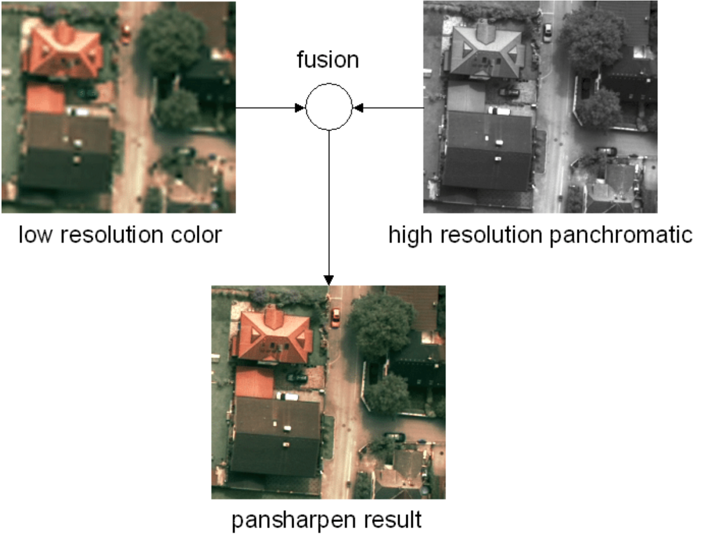
   
  <b>Pansharpening example with a resolution difference of factor 4.</b>

Pansharpening is a data fusion method that merges the high spatial detail from a high-resolution panchromatic image with the rich spectral information from a lower-resolution multispectral image. The result is a single, high-resolution color image that retains both the sharpness of the panchromatic band and the color information of the multispectral bands. This process enhances the spatial resolution while preserving the spectral qualities of the original images. [Image source](https://www.researchgate.net/publication/308121983_Computer_Vision_for_Large_Format_Digital_Aerial_Cameras)

links

* Several algorithms described [in the ArcGIS docs](http://desktop.arcgis.com/en/arcmap/10.3/manage-data/raster-and-images/fundamentals-of-panchromatic-sharpening.htm), with the simplest being taking the mean of the pan and RGB pixel value.
* For into to classical methods [see this notebook](http://nbviewer.jupyter.org/github/HyperionAnalytics/PyDataNYC2014/blob/master/panchromatic_sharpening.ipynb) and [this kaggle kernel](https://www.kaggle.com/resolut/panchromatic-sharpening)
* [rio-pansharpen](https://github.com/mapbox/rio-pansharpen) -> pansharpening Landsat scenes
* [Simple-Pansharpening-Algorithms](https://github.com/ThomasWangWeiHong/Simple-Pansharpening-Algorithms)
* [Working-For-Pansharpening](https://github.com/yuanmaoxun/Working-For-Pansharpening) -> long list of pansharpening methods and update of [Awesome-Pansharpening](https://github.com/Lihui-Chen/Awesome-Pansharpening)
* [PSGAN](https://github.com/liuqingjie/PSGAN) -> A Generative Adversarial Network for Remote Sensing Image Pan-sharpening, [arxiv paper](https://arxiv.org/abs/1805.03371)
* [Pansharpening-by-Convolutional-Neural-Network](https://github.com/ThomasWangWeiHong/Pansharpening-by-Convolutional-Neural-Network)
* [PBR_filter](https://github.com/dbuscombe-usgs/PBR_filter) -> {P}ansharpening by {B}ackground {R}emoval algorithm for sharpening RGB images
* [py_pansharpening](https://github.com/codegaj/py_pansharpening) -> multiple algorithms implemented in python
* [Deep-Learning-PanSharpening](https://github.com/xyc19970716/Deep-Learning-PanSharpening) -> deep-learning based pan-sharpening code package, we reimplemented include PNN, MSDCNN, PanNet, TFNet, SRPPNN, and our purposed network DIPNet
* [HyperTransformer](https://github.com/wgcban/HyperTransformer) -> A Textural and Spectral Feature Fusion Transformer for Pansharpening
* [DIP-HyperKite](https://github.com/wgcban/DIP-HyperKite) -> Hyperspectral Pansharpening Based on Improved Deep Image Prior and Residual Reconstruction
* [D2TNet](https://github.com/Meiqi-Gong/D2TNet) -> code for 2022 [paper](https://ieeexplore.ieee.org/abstract/document/9761261): A ConvLSTM Network with Dual-direction Transfer for Pan-sharpening
* [PanColorGAN-VHR-Satellite-Images](https://github.com/esertel/PanColorGAN-VHR-Satellite-Images) -> code for 2020 [paper](https://arxiv.org/abs/2006.16644): Rethinking CNN-Based Pansharpening: Guided Colorization of Panchromatic Images via GANs
* [MTL_PAN_SEG](https://github.com/andrewekhalel/MTL_PAN_SEG) -> code for 2019 paper: Multi-task deep learning for satellite image pansharpening and segmentation
* [Z-PNN](https://github.com/matciotola/Z-PNN) -> code for 2022 paper: Pansharpening by convolutional neural networks in the full resolution framework
* [GTP-PNet](https://github.com/HaoZhang1018/GTP-PNet) -> code for 2021 [paper](https://www.sciencedirect.com/science/article/abs/pii/S092427162030352X): GTP-PNet: A residual learning network based on gradient transformation prior for pansharpening
* [UDL](https://github.com/XiaoXiao-Woo/UDL) -> code for 2021 [paper](https://ieeexplore.ieee.org/document/9710135): Dynamic Cross Feature Fusion for Remote Sensing Pansharpening
* [PSData](https://github.com/yisun98/PSData) -> A Large-Scale General Pan-sharpening DataSet, which contains PSData3 (QB, GF-2, WV-3) and PSData4 (QB, GF-1, GF-2, WV-2).
* [AFPN](https://github.com/yisun98/AFPN) -> Adaptive Detail Injection-Based Feature Pyramid Network For Pan-sharpening
* [pan-sharpening](https://github.com/yisun98/pan-sharpening) -> multiple methods demonstrated for multispectral and panchromatic images
* [PSGan-Family](https://github.com/zhysora/PSGan-Family) -> code for 2020 [paper](https://ieeexplore.ieee.org/document/9306912): PSGAN: A Generative Adversarial Network for Remote Sensing Image Pan-Sharpening
* [PanNet-Landsat](https://github.com/oyam/PanNet-Landsat) -> code for 2017 paper: A Deep Network Architecture for Pan-Sharpening
* [DLPan-Toolbox](https://github.com/liangjiandeng/DLPan-Toolbox) -> code for 2022 paper: Machine Learning in Pansharpening: A Benchmark, from Shallow to Deep Networks
* [LPPN](https://github.com/ChengJin-git/LPPN) -> code for 2021 [paper](https://www.sciencedirect.com/science/article/abs/pii/S1566253521001809): Laplacian pyramid networks: A new approach for multispectral pansharpening
* [S2_SSC_CNN](https://github.com/hvn2/S2_SSC_CNN) -> code for 2020 [paper](https://ieeexplore.ieee.org/document/9323614): Zero-shot Sentinel-2 Sharpening Using A Symmetric Skipped Connection Convolutional Neural Network
* [S2S_UCNN](https://github.com/hvn2/S2S_UCNN) -> code for 2021 [paper](https://ieeexplore.ieee.org/document/9464640): Sentinel 2 sharpening using a single unsupervised convolutional neural network with MTF-Based degradation model
* [SSE-Net](https://github.com/RSMagneto/SSE-Net) -> code for 2022 [paper](https://ieeexplore.ieee.org/abstract/document/9810290): Spatial and Spectral Extraction Network With Adaptive Feature Fusion for Pansharpening
* [UCGAN](https://github.com/zhysora/UCGAN) -> code for 2022 [paper](https://ieeexplore.ieee.org/abstract/document/9755137): Unsupervised Cycle-consistent Generative Adversarial Networks for Pan-sharpening
* [GCPNet](https://github.com/Keyu-Yan/GCPNet) -> code for 2022 [paper](https://ieeexplore.ieee.org/abstract/document/9758796): When Pansharpening Meets Graph Convolution Network and Knowledge Distillation
* [PanFormer](https://github.com/zhysora/PanFormer) -> code for 2022 [paper](https://arxiv.org/abs/2203.02916): PanFormer: a Transformer Based Model for Pan-sharpening
* [Pansharpening](https://github.com/nithin-gr/Pansharpening) -> code for 2021 [paper](https://www.researchgate.net/publication/356974466_Pansformers_Transformer-Based_Self-Attention_Network_for_Pansharpening): Pansformers: Transformer-Based Self-Attention Network for Pansharpening

#
## Image-to-image translation

  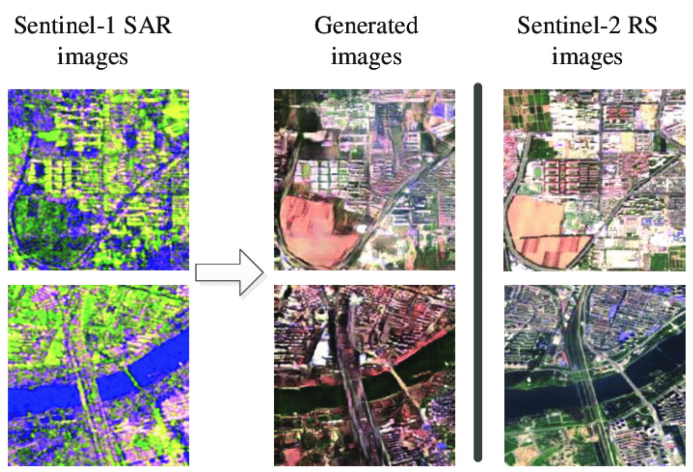
   
  <b>(left) Sentinel-1 SAR input, (middle) translated to RGB and (right) Sentinel-2 true RGB image for comparison.</b>

Image-to-image translation is a crucial aspect of computer vision that utilizes machine learning models to transform an input image into a new, distinct output image. In the field of remote sensing, it plays a significant role in bridging the gap between different imaging domains, such as converting Synthetic Aperture Radar (SAR) images into RGB (Red Green Blue) images. This technology has a wide range of applications, including improving image quality, filling in missing information, and facilitating cross-domain image analysis and comparison. By leveraging deep learning algorithms, image-to-image translation has become a powerful tool in the arsenal of remote sensing researchers and practitioners. [Image source](https://www.researchgate.net/publication/335648375_SAR-to-Optical_Image_Translation_Using_Supervised_Cycle-Consistent_Adversarial_Networks)

links

* [How to Develop a Pix2Pix GAN for Image-to-Image Translation](https://machinelearningmastery.com/how-to-develop-a-pix2pix-gan-for-image-to-image-translation/) -> how to develop a Pix2Pix model for translating satellite photographs to Google map images. A good intro to GANS
* [A growing problem of ‘deepfake geography’: How AI falsifies satellite images](https://www.washington.edu/news/2021/04/21/a-growing-problem-of-deepfake-geography-how-ai-falsifies-satellite-images/)
* [Kaggle Pix2Pix Maps](https://www.kaggle.com/alincijov/pix2pix-maps) -> dataset for pix2pix to take a google map satellite photo and build a street map
* [guided-deep-decoder](https://github.com/tuezato/guided-deep-decoder) -> With guided deep decoder, you can solve different image pair fusion problems, allowing super-resolution, pansharpening or denoising
* [hackathon-ci-2020](https://github.com/paulaharder/hackathon-ci-2020) -> generate nighttime imagery from infrared observations
* [satellite-to-satellite-translation](https://github.com/anonymous-ai-for-earth/satellite-to-satellite-translation) -> VAE-GAN architecture for unsupervised image-to-image translation with shared spectral reconstruction loss. Model is trained on GOES-16/17 and Himawari-8 L1B data
* [Pytorch implementation of UNet for converting aerial satellite images into google maps kinda images](https://github.com/greed2411/unet_pytorch)
* [Seamless-Satellite-image-Synthesis](https://github.com/Misaliet/Seamless-Satellite-image-Synthesis) -> generate abitrarily large RGB images from a map
* [How to Develop a Pix2Pix GAN for Image-to-Image Translation](https://machinelearningmastery.com/how-to-develop-a-pix2pix-gan-for-image-to-image-translation/) -> article on machinelearningmastery.com
* [Satellite-Imagery-to-Map-Translation-using-Pix2Pix-GAN-framework](https://github.com/anh-nn01/Satellite-Imagery-to-Map-Translation-using-Pix2Pix-GAN-framework)
* [RSIT_SRM_ISD](https://github.com/summitgao/RSIT_SRM_ISD) -> PyTorch implementation of Remote sensing image translation via style-based recalibration module and improved style discriminator
* [pix2pix_google_maps](https://github.com/manishemirani/pix2pix_google_maps) -> Converts satellite images to map images using pix2pix models
* [sar2color-igarss2018-chainer](https://github.com/enomotokenji/sar2color-igarss2018-chainer) -> code for 2018 paper: Image Translation Between Sar and Optical Imagery with Generative Adversarial Nets
* [HSI2RGB](https://github.com/JakobSig/HSI2RGB) -> Create realistic looking RGB images using remote sensing hyperspectral images
* [sat_to_map](https://github.com/shagunuppal/sat_to_map) -> Learning mappings to generate city maps images from corresponding satellite images
* [pix2pix-GANs](https://github.com/shashi7679/pix2pix-GANs) -> Generate Map using Satellite Image & PyTorch

#
## Data fusion

  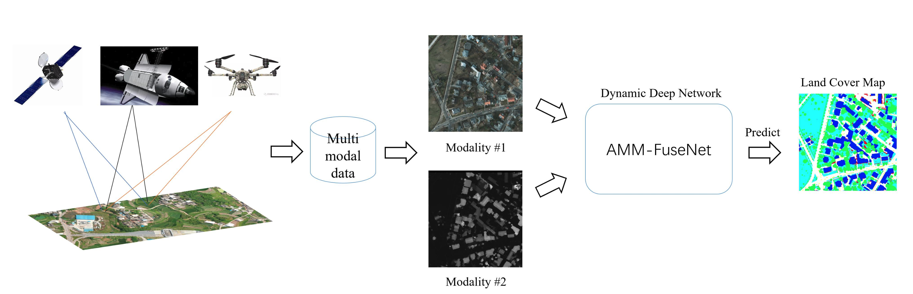
   
  <b>Illustration of a fusion workflow.</b>

Data fusion is a technique for combining information from different sources such as Synthetic Aperture Radar (SAR), optical imagery, and non-imagery data such as Internet of Things (IoT) sensor data. The integration of diverse data sources enables data fusion to overcome the limitations of individual sources, leading to the creation of models that are more accurate and informative than those constructed from a single source. [Image source](https://www.mdpi.com/2072-4292/14/18/4458)

links

* [Awesome-Data-Fusion-for-Remote-Sensing](https://github.com/px39n/Awesome-Data-Fusion-for-Remote-Sensing)
* [UDALN_GRSL](https://github.com/JiaxinLiCAS/UDALN_GRSL) -> Deep Unsupervised Blind Hyperspectral and Multispectral Data Fusion
* [CropTypeMapping](https://github.com/ellaampy/CropTypeMapping) -> Crop type mapping from optical and radar (Sentinel-1&2) time series using attention-based deep learning
* [Multimodal-Remote-Sensing-Toolkit](https://github.com/likyoo/Multimodal-Remote-Sensing-Toolkit) -> uses Hyperspectral and LiDAR Data
* [Aerial-Template-Matching](https://github.com/m-hamza-mughal/Aerial-Template-Matching) -> development of an algorithm for template Matching on aerial imagery applied to UAV dataset
* [DS_UNet](https://github.com/SebastianHafner/DS_UNet) -> code for 2021 paper: Sentinel-1 and Sentinel-2 Data Fusion for Urban Change Detection using a Dual Stream U-Net, uses Onera Satellite Change Detection dataset
* [DDA_UrbanExtraction](https://github.com/SebastianHafner/DDA_UrbanExtraction) -> Unsupervised Domain Adaptation for Global Urban Extraction using Sentinel-1 and Sentinel-2 Data
* [swinstfm](https://github.com/LouisChen0104/swinstfm) -> code for paper: Remote Sensing Spatiotemporal Fusion using Swin Transformer
* [LoveCS](https://github.com/Junjue-Wang/LoveCS) -> code for 2022 [paper](https://www.researchgate.net/publication/360484883_Cross-sensor_domain_adaptation_for_high_spatial_resolution_urban_land-cover_mapping_From_airborne_to_spaceborne_imagery): Cross-sensor domain adaptation for high-spatial resolution urban land-cover mapping: from airborne to spaceborne imagery
* [comingdowntoearth](https://github.com/aysim/comingdowntoearth) -> code for 2021 paper: Implementation of 'Coming Down to Earth: Satellite-to-Street View Synthesis for Geo-Localization'
* [Matching between acoustic and satellite images](https://github.com/giovgiac/neptune)
* [MapRepair](https://github.com/zorzi-s/MapRepair) -> Deep Cadastre Maps Alignment and Temporal Inconsistencies Fix in Satellite Images
* [Compressive-Sensing-and-Deep-Learning-Framework](https://github.com/rahulgite94/Compressive-Sensing-and-Deep-Learning-Framework) ->  Compressive Sensing is used as an initial guess to combine data from multiple sources, with LSTM used to refine the result
* [DeepSim](https://github.com/wangxiaodiu/DeepSim) -> code for paper: DeepSIM: GPS Spoofing Detection on UAVs using Satellite Imagery Matching
* [MHF-net](https://github.com/XieQi2015/MHF-net) -> code for 2019 [paper](https://ieeexplore.ieee.org/document/8953470): Multispectral and Hyperspectral Image Fusion by MS/HS Fusion Net
* [Remote_Sensing_Image_Fusion](https://github.com/huangshanshan33/Remote_Sensing_Image_Fusion) -> code for 2021 [paper](https://www.researchgate.net/publication/352580177_Semi-Supervised_Remote_Sensing_Image_Fusion_Using_Multi-Scale_Conditional_Generative_Adversarial_network_with_Siamese_Structure): Semi-Supervised Remote Sensing Image Fusion Using Multi-Scale Conditional Generative Adversarial network with Siamese Structure
* [CNNs for Multi-Source Remote Sensing Data Fusion](https://github.com/yyyyangyi/CNNs-for-Multi-Source-Remote-Sensing-Data-Fusion) -> code for 2021 [paper](https://arxiv.org/abs/2109.06094): Single-stream CNN with Learnable Architecture for Multi-source Remote Sensing Data
* [Deep Generative Reflectance Fusion](https://github.com/Cervest/ds-generative-reflectance-fusion) -> Achieving Landsat-like reflectance at any date by fusing Landsat and MODIS surface reflectance with deep generative models
* [IEEE_TGRS_MDL-RS](https://github.com/danfenghong/IEEE_TGRS_MDL-RS) -> code for 2021 [paper](https://ieeexplore.ieee.org/document/9174822): More Diverse Means Better: Multimodal Deep Learning Meets Remote-Sensing Imagery Classification
* [SSRNET](https://github.com/hw2hwei/SSRNET) -> code for 2022 [paper](https://ieeexplore.ieee.org/document/9186332): SSR-NET: Spatial-Spectral Reconstruction Network for Hyperspectral and Multispectral Image Fusion
* [cross-view-image-matching](https://github.com/kregmi/cross-view-image-matching) -> code for 2019 paper: Bridging the Domain Gap for Ground-to-Aerial Image Matching
* [CoF-MSMG-PCNN](https://github.com/WeiTan1992/CoF-MSMG-PCNN) -> code for 2020 paper: Remote Sensing Image Fusion via Boundary Measured Dual-Channel PCNN in Multi-Scale Morphological Gradient Domain
* [robust_matching_network_on_remote_sensing_imagery_pytorch](https://github.com/mrk1992/robust_matching_network_on_remote_sensing_imagery_pytorch) -> code for 2019 paper: A Robust Matching Network for Gradually Estimating Geometric Transformation on Remote Sensing Imagery
* [edcstfn](https://github.com/theonegis/edcstfn) -> code for 2019 [paper](https://www.mdpi.com/2072-4292/11/24/2898): An Enhanced Deep Convolutional Model for Spatiotemporal Image Fusion
* [ganstfm](https://github.com/theonegis/ganstfm) -> code for 2021 [paper](https://ieeexplore.ieee.org/document/9336033): A Flexible Reference-Insensitive Spatiotemporal Fusion Model for Remote Sensing Images Using Conditional Generative Adversarial Network
* [CMAFF](https://github.com/DocF/CMAFF) -> code for 2021 [paper](https://arxiv.org/abs/2112.02991): Cross-Modality Attentive Feature Fusion for Object Detection in Multispectral Remote Sensing Imagery
* [SOLC](https://github.com/yisun98/SOLC) -> code for 2022 [paper](https://www.sciencedirect.com/science/article/pii/S0303243421003457): MCANet: A joint semantic segmentation framework of optical and SAR images for land use classification. Uses [WHU-OPT-SAR-dataset](https://github.com/AmberHen/WHU-OPT-SAR-dataset)
* [MFT](https://github.com/AnkurDeria/MFT) -> code for 2022 [paper](https://arxiv.org/abs/2203.16952): Multimodal Fusion Transformer for Remote Sensing Image Classification
* [ISPRS_S2FL](https://github.com/danfenghong/ISPRS_S2FL) -> code for 2021 [paper](https://www.sciencedirect.com/science/article/pii/S0924271621001362): Multimodal Remote Sensing Benchmark Datasets for Land Cover Classification with A Shared and Specific Feature Learning Model
* [HSHT-Satellite-Imagery-Synthesis](https://github.com/yuvalofek/HSHT-Satellite-Imagery-Synthesis) -> code for thesis - Improving Flood Maps by Increasing the Temporal Resolution of Satellites Using Hybrid Sensor Fusion
* [MDC](https://github.com/Kasra2020/MDC) -> code for 2021 [paper](https://ieeexplore.ieee.org/document/9638348): Unsupervised Data Fusion With Deeper Perspective: A Novel Multisensor Deep Clustering Algorithm
* [FusAtNet](https://github.com/ShivamP1993/FusAtNet) -> code for 2020 [paper](https://ieeexplore.ieee.org/document/9150738): FusAtNet: Dual Attention based SpectroSpatial Multimodal Fusion Network for Hyperspectral and LiDAR Classification
* [AMM-FuseNet](https://github.com/oktaykarakus/ReSIF/tree/main/AMM-FuseNet) -> code for 2022 [paper](https://www.mdpi.com/2072-4292/14/18/4458): AMM-FuseNet: Attention-Based Multi-Modal Image Fusion Network for Land Cover Mapping
* [MANet](https://github.com/caohuimin/MANet) -> code for 2022 [paper](https://www.mdpi.com/2072-4292/14/18/4600): MANet: A Network Architecture for Remote Sensing Spatiotemporal Fusion Based on Multiscale and Attention Mechanisms
* [DCSA-Net](https://github.com/Julia90/DCSA-Net) -> code for 2022 [paper](https://www.mdpi.com/2072-4292/14/19/4941): Dynamic Convolution Self-Attention Network for Land-Cover Classification in VHR Remote-Sensing Images

#
## Generative Adversarial Networks (GANs)

  
   
  <b>Example generated images using a GAN.</b>

Generative Adversarial Networks (GANs) are a type of deep learning architecture that leverages the power of competition between two neural networks. The objective of a GAN is to generate new, synthetic data that appears similar to real-world data. This is achieved by training the two networks, the generator and the discriminator, in a zero-sum game, where the generator attempts to produce data that is indistinguishable from the real data, while the discriminator tries to distinguish between the generated data and the real data. In the field of remote sensing, GANs have found numerous applications, particularly in generating synthetic data. This synthetic data can be used for a wide range of purposes, including data augmentation, data imbalance correction, and filling in missing or corrupted data. By generating realistic synthetic data, GANs can improve the performance of remote sensing algorithms and models, leading to more accurate and reliable results. Additionally, GANs can also be used for various other tasks in remote sensing, such as super-resolution, denoising, and inpainting. [Image source](https://arxiv.org/abs/2207.14580)

links

* [Using Generative Adversarial Networks to Address Scarcity of Geospatial Training Data](https://medium.com/radiant-earth-insights/using-generative-adversarial-networks-to-address-scarcity-of-geospatial-training-data-e61cacec986e) -> GAN perform better than CNN in segmenting land cover classes outside of the training dataset (article, no code)
* [Building-A-Nets](https://github.com/lixiang-ucas/Building-A-Nets) -> robust building extraction from high-resolution remote sensing images with adversarial networks
* [GANmapper](https://github.com/ualsg/GANmapper) -> a building footprint generator using Generative Adversarial Networks
* [CSA-CDGAN](https://github.com/wangle53/CSA-CDGAN) -> Channel Self-Attention Based Generative Adversarial Network for Change Detection of Remote Sensing Images
* [DSGAN](https://github.com/lzhengchun/DSGAN) -> a conditinal GAN for dynamic precipitation downscaling
* [MarsGAN](https://github.com/kheyer/MarsGAN) -> GAN trained on satellite photos of Mars
* [HC_ADGAN](https://github.com/summitgao/HC_ADGAN) -> codes for the paper Adaptive Dropblock Enhanced GenerativeAdversarial Networks for Hyperspectral Image Classification
* [SCALAE](https://github.com/LendelTheGreat/SCALAE) -> code for our [paper](https://arxiv.org/abs/2101.05069) Formatting the Landscape: Spatial conditional GAN for varying population in satellite imagery. Method to generate satellite imagery from custom 2D population maps
* [Satellite-Image-Forgery-Detection-and-Localization](https://github.com/tailongnguyen/Satellite-Image-Forgery-Detection-and-Localization)
* [STGAN](https://github.com/ermongroup/STGAN) -> PyTorch Implementation of STGAN for Cloud Removal in Satellite Images, with [paper](https://arxiv.org/abs/1912.06838)
* [ds-gan-spatiotemporal-evaluation](https://github.com/Cervest/ds-gan-spatiotemporal-evaluation) -> evaluating use of deep generative models in remote sensing applications
* [pub-ffi-gan](https://github.com/awweide/pub-ffi-gan) -> code for 2018 paper: Applying generative adversarial networks for anomaly detection in hyperspectral remote sensing imagery
* [GAN-based method to generate high-resolution remote sensing for data augmentation and image classification](https://github.com/weihancug/GAN-based-HRRS-Sample-Generation-for-Image-Classification)
* [Remote-Sensing-Image-Generation](https://github.com/aashishrai3799/Remote-Sensing-Image-Generation) -> Generate RS Images using Generative Adversarial Networks (GAN)
* [RoadDA](https://github.com/LANMNG/RoadDA) -> code for 2021 [paper](https://arxiv.org/abs/2108.12611): Stagewise Unsupervised Domain Adaptation with Adversarial Self-Training for Road Segmentation of Remote Sensing Images
* [PSGan-Family](https://github.com/zhysora/PSGan-Family) -> code for 2020 [paper](https://ieeexplore.ieee.org/document/9306912): PSGAN: A Generative Adversarial Network for Remote Sensing Image Pan-Sharpening
* [Satellite Image Augmetation with GANs](https://github.com/Oarowolo11/11785-Project) -> code for 2022 [paper](https://arxiv.org/abs/2207.14580): Image Augmentation for Satellite Images

#
## Autoencoders, dimensionality reduction, image embeddings & similarity search

  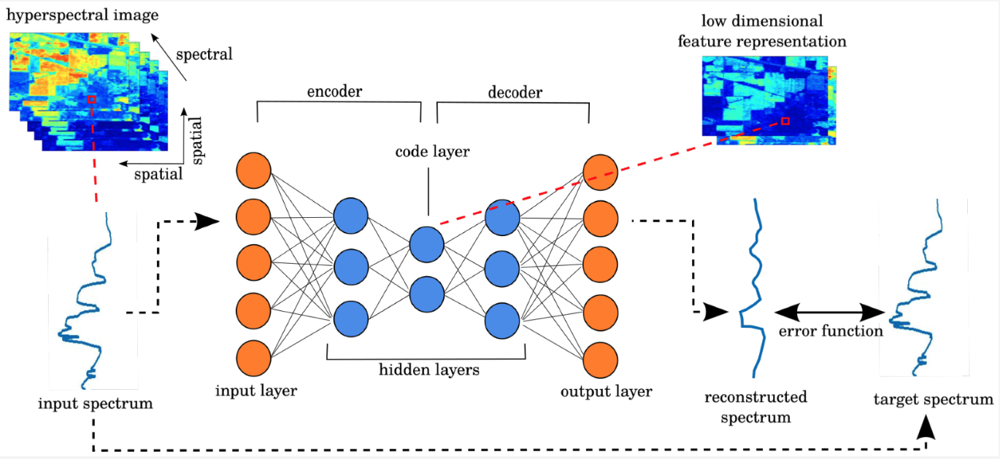
   
  <b>Example of using an autoencoder to create a low dimensional representation of hyperspectral data.</b>

Autoencoders are a type of neural network that aim to simplify the representation of input data by compressing it into a lower dimensional form. This is achieved through a two-step process of encoding and decoding, where the encoding step compresses the data into a lower dimensional representation, and the decoding step restores the data back to its original form. The goal of this process is to reduce the data's dimensionality, making it easier to store and process, while retaining the essential information. Dimensionality reduction, as the name suggests, refers to the process of reducing the number of dimensions in a dataset. This can be achieved through various techniques such as principal component analysis (PCA) or singular value decomposition (SVD). Autoencoders are one type of neural network that can be used for dimensionality reduction. In the field of computer vision, image embeddings are vector representations of images that capture the most important features of the image. These embeddings can then be used to perform similarity searches, where images are compared based on their features to find similar images. This process can be used in a variety of applications, such as image retrieval, where images are searched based on certain criteria like color, texture, or shape. It can also be used to identify duplicate images in a dataset. [Image source](https://www.mdpi.com/2072-4292/11/7/864)

links

* [Autoencoders & their Application in Remote Sensing](https://towardsdatascience.com/autoencoders-their-application-in-remote-sensing-95f6e2bc88f) -> intro article and example use case applied to SAR data for land classification
* [LEt-SNE](https://github.com/meghshukla/LEt-SNE) -> Dimensionality Reduction and visualization technique that compensates for the curse of dimensionality
* [AutoEncoders for Land Cover Classification of Hyperspectral Images](https://towardsdatascience.com/autoencoders-for-land-cover-classification-of-hyperspectral-images-part-1-c3c847ebc69b) -> An autoencoder nerual net is used to reduce 103 band data to 60 features (dimensionality reduction), keras. Also read [part 2](https://syamkakarla.medium.com/auto-encoders-for-land-cover-classification-in-hyperspectral-images-part-2-f8978d443d6d) which implements K-NNC, SVM and Gradient Boosting
* [Image-Similarity-Search](https://github.com/spaceml-org/Image-Similarity-Search) -> an app that helps perform super fast image retrieval on PyTorch models for better embedding space interpretability
* [Interactive-TSNE](https://github.com/spaceml-org/Interactive-TSNE) -> a tool that provides a way to visually view a PyTorch model's feature representation for better embedding space interpretability
* [How Airbus Detects Anomalies in ISS Telemetry Data Using TFX](https://blog.tensorflow.org/2020/04/how-airbus-detects-anomalies-iss-telemetry-data-tfx.html) -> uses an autoencoder
* [RoofNet](https://github.com/ultysim/RoofNet) -> identify roof age using historical satellite images to lower the customer acquisition cost for new solar installations. Uses a VAE: Variational Autoencoder
* [Visual search over billions of aerial and satellite images](https://arxiv.org/abs/2002.02624) -> implemented [at Descartes labs](https://blog.descarteslabs.com/geovisual-search-for-rapid-generation-of-annotated-datasets)
* [parallax](https://github.com/uber-research/parallax) -> Tool for interactive embeddings visualization
* [Deep-Gapfill](https://github.com/remicres/Deep-Gapfill) -> Official implementation of Optical image gap filling using deep convolutional autoencoder from optical and radar images
* [Mxnet repository for generating embeddings on satellite images](https://github.com/fisch92/Metric-embeddings-for-satellite-image-classification) -> Includes sampling of images, mining algorithms, different architectures, error functions, measures for evaluation.
* [Fine tuning CLIP with Remote Sensing (Satellite) images and captions](https://huggingface.co/blog/fine-tune-clip-rsicd) -> fine tuning CLIP on the [RSICD](https://github.com/201528014227051/RSICD_optimal) image captioning dataset, to enable querying large catalogues in natural language. With [repo](https://github.com/arampacha/CLIP-rsicd), uses 🤗
* [Image search with 🤗 datasets](https://huggingface.co/blog/image-search-datasets) -> tutorial on fine tuning an image search model
* [SynImageAnalysis](https://github.com/FlorenceJiang/SynImageAnalysis) -> comparing synthetic and real satellite images in the latent feature space (embeddings)
* [GRN-SNDL](https://github.com/jiankang1991/GRN-SNDL) -> model the relations between samples (or scenes) by making use of a graph structure which is fed into network learning
* [SauMoCo](https://github.com/jiankang1991/SauMoCo) -> codes for TGRS paper: Deep Unsupervised Embedding for Remotely Sensed Images Based on Spatially Augmented Momentum Contrast
* [TGRS_RiDe](https://github.com/jiankang1991/TGRS_RiDe) -> Rotation Invariant Deep Embedding for RemoteSensing Images
* [RaVAEn](https://github.com/spaceml-org/RaVAEn) -> RaVAEn is a lightweight, unsupervised approach for change detection in satellite data based on Variational Auto-Encoders (VAEs) with the specific purpose of on-board deployment
* [Reverse image search using deep discrete feature extraction and locality-sensitive hashing](https://github.com/martenjostmann/deep-discrete-image-retrieval) 
* [SNCA_CE](https://github.com/jiankang1991/SNCA_CE) -> code for the paper Deep Metric Learning based on Scalable Neighborhood Components for Remote Sensing Scene Characterization
* [LandslideDetection-from-satellite-imagery](https://github.com/shulavkarki/LandslideDetection-from-satellite-imagery) -> Using Attention and Autoencoder boosted CNN
* [split-brain-remote-sensing](https://github.com/vladan-stojnic/split-brain-remote-sensing) -> code for 2018 paper: Analysis of Color Space Quantization in Split-Brain Autoencoder for Remote Sensing Image Classification
* [image-similarity-measures](https://github.com/up42/image-similarity-measures) -> Implementation of eight evaluation metrics to access the similarity between two images. [Blog post here](https://up42.com/blog/tech/image-similarity-measures)
* [Large_Scale_GeoVisual_Search](https://github.com/sdhayalk/Large_Scale_GeoVisual_Search) -> ResNet architecture on UC Merced Land Use Dataset with hamming distance for similarity based search
* [geobacter](https://github.com/JakeForsey/geobacter) -> Generates useful feature embeddings for geospatial locations
* [Satellite-Image-Segmentation](https://github.com/kunnalparihar/Satellite-Image-Segmentation) -> the KV-Net model uses this feature of autoencoders to reconnect the disconnected roads
* [Satellite-Image-Enhancement](https://github.com/VNDhanush/Satellite-Image-Enhancement) -> Image enhancement using GAN's and autoencoders
* [Variational-Autoencoder-For-Satellite-Imagery](https://github.com/RayanAAY-ops/Variational-Autoencoder-For-Satellite-Imagery) -> a special VAE to squeeze N images into one single representation with colors segmentating the different objects
* [DINCAE](https://github.com/gher-ulg/DINCAE) -> Data-Interpolating Convolutional Auto-Encoder is a neural network to reconstruct missing data in satellite observations
* [3D_SITS_Clustering](https://github.com/ekalinicheva/3D_SITS_Clustering) -> code for 2020 [paper](https://www.researchgate.net/publication/341902683_Unsupervised_Satellite_Image_Time_Series_Clustering_Using_Object-Based_Approaches_and_3D_Convolutional_Autoencoder): Unsupervised Satellite Image Time Series Clustering Using Object-Based Approaches and 3D Convolutional Autoencoder
* [sat_cnn](https://github.com/GDSL-UL/sat_cnn) -> code for 2022 [paper](https://www.sciencedirect.com/science/article/pii/S0198971522000461?via%3Dihub): Estimating Generalized Measures of Local Neighbourhood Context from Multispectral Satellite Images Using a Convolutional Neural Network. Uses a convolutional autoencoder (CAE)
* [you-are-here](https://github.com/ZhouMengjie/you-are-here) -> Matlab code for 2020 paper: You Are Here: Geolocation by Embedding Maps and Images
* [Tensorflow similarity](https://github.com/tensorflow/similarity) -> offers state-of-the-art algorithms for metric learning and all the necessary components to research, train, evaluate, and serve similarity-based models
* [Train SimSiam on Satellite Images](https://docs.lightly.ai/tutorials/package/tutorial_simsiam_esa.html) using lightly.ai to generate embeddings that can be used for data exploration and understanding
* [Airbus_SDC_dup](https://github.com/WillieMaddox/Airbus_SDC_dup) -> Project focused on detecting duplicate regions of overlapping satellite imagery. Applied to Airbus ship detection dataset

#
## Image retrieval

  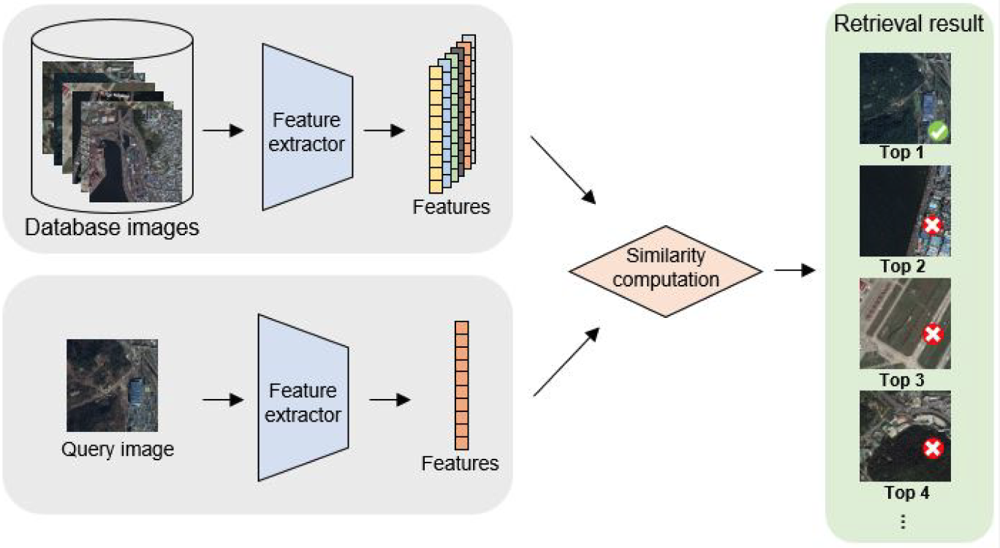
   
  <b>Illustration of the remote sensing image retrieval process.</b>

Image retrieval is the task of retrieving images from a collection that are similar to a query image. Image retrieval plays a vital role in remote sensing by enabling the efficient and effective search for relevant images from large image archives, and by providing a way to quantify changes in the environment over time. [Image source](https://www.mdpi.com/2072-4292/12/2/219)

links

* [Demo_AHCL_for_TGRS2022](https://github.com/weiweisong415/Demo_AHCL_for_TGRS2022) -> code for 2022 paper: Asymmetric Hash Code Learning (AHCL) for remote sensing image retrieval
* [GaLR](https://github.com/xiaoyuan1996/GaLR) -> code for 2022 [paper](https://ieeexplore.ieee.org/abstract/document/9745546): Remote Sensing Cross-Modal Text-Image Retrieval Based on Global and Local Information
* [retrievalSystem](https://github.com/xiaoyuan1996/retrievalSystem) -> cross-modal image retrieval system
* [AMFMN](https://github.com/xiaoyuan1996/AMFMN) -> code for the 2021 paper: Exploring a Fine-grained Multiscale Method for Cross-modal Remote Sensing Image Retrieval
* [Active-Learning-for-Remote-Sensing-Image-Retrieval](https://github.com/flateon/Active-Learning-for-Remote-Sensing-Image-Retrieval) -> unofficial implementation of paper: A Novel Active Learning Method in Relevance Feedback for Content-Based Remote Sensing Image Retrieval
* [CMIR-NET](https://github.com/ushasi/CMIR-NET-A-deep-learning-based-model-for-cross-modal-retrieval-in-remote-sensing) -> code for 2020 [paper](https://www.sciencedirect.com/science/article/abs/pii/S0167865520300453?via%3Dihub): A deep learning based model for cross-modal retrieval in remote sensing
* [Deep-Hash-learning-for-Remote-Sensing-Image-Retrieval](https://github.com/smallsmallflypigtang/Deep-Hash-learning-for-Remote-Sensing-Image-Retrieval) -> code for 2020 [paper](https://ieeexplore.ieee.org/document/9143474): Deep Hash Learning for Remote Sensing Image Retrieval
* [MHCLN](https://github.com/MLEnthusiast/MHCLN) -> code for 2018 [paper](https://ieeexplore.ieee.org/abstract/document/8518381): Deep Metric and Hash-Code Learning for Content-Based Retrieval of Remote Sensing Images
* [HydroViet_VOR](https://github.com/lannguyen0910/HydroViet_VOR) -> Object Retrieval in satellite images with Triplet Network
* [AMFMN](https://github.com/AICyberTeam/AMFMN) -> code for 2021 [paper](https://ieeexplore.ieee.org/document/9437331): Exploring a Fine-Grained Multiscale Method for Cross-Modal Remote Sensing Image Retrieval

# 
## Image Captioning

  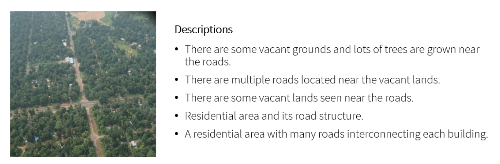
   
  <b>Example captioned image.</b>

Image Captioning is the task of automatically generating a textual description of an image. In remote sensing, image captioning can be used to automatically generate captions for satellite or aerial images, which can be useful for a variety of purposes, such as image search and retrieval, data cataloging, and data dissemination. The generated captions can provide valuable information about the content of the images, including the location, the type of terrain or objects present, and the weather conditions, among others. This information can be used to quickly and easily understand the content of the images, without having to manually examine each image. [Image source](https://github.com/chan64/remote_sensing_image_captioning)

links

* [remote-sensing-image-caption](https://github.com/TalentBoy2333/remote-sensing-image-caption) -> image classification and image caption by PyTorch
* [Fine tuning CLIP with Remote Sensing (Satellite) images and captions](https://huggingface.co/blog/fine-tune-clip-rsicd) -> fine tuning CLIP on the [RSICD](https://github.com/201528014227051/RSICD_optimal) image captioning dataset, to enable querying large catalogues in natural language. With [repo](https://github.com/arampacha/CLIP-rsicd), uses 🤗
* [CapFormer](https://github.com/Junjue-Wang/CapFormer) -> Pure transformer for remote sensing image caption
* [remote_sensing_image_captioning](https://github.com/chan64/remote_sensing_image_captioning) -> code for 2019 [paper](https://www.sciencedirect.com/science/article/pii/S1877050920300752): Region Driven Remote Sensing Image Captioning
* [Remote Sensing Image Captioning with Transformer and Multilabel Classification](https://github.com/hiteshK03/Remote-sensing-image-captioning-with-transformer-and-multilabel-classification)
* [Siamese-spatial-Graph-Convolution-Network](https://github.com/ushasi/Siamese-spatial-Graph-Convolution-Network) -> code for 2019 [paper](https://www.sciencedirect.com/science/article/abs/pii/S1077314219300578): Siamese graph convolutional network for content based remote sensing image retrieval
* [MLAT](https://github.com/Chen-Yang-Liu/MLAT) -> code for 2022 [paper](https://ieeexplore.ieee.org/document/9709791): Remote-Sensing Image Captioning Based on Multilayer Aggregated Transformer
* [WordSent](https://github.com/hw2hwei/WordSent) -> code for 2020 [paper](https://ieeexplore.ieee.org/document/9308980): Word–Sentence Framework for Remote Sensing Image Captioning
* [a-mask-guided-transformer-with-topic-token](https://github.com/Meditation0119/a-mask-guided-transformer-with-topic-token-for-remote-sensing-image-captioning) -> code for 2022 [paper](https://www.mdpi.com/2072-4292/14/12/2939): A Mask-Guided Transformer Network with Topic Token for Remote Sensing Image Captioning
* [MetaCaptioning](https://github.com/QiaoqiaoYang/MetaCaptioning) -> code for 2022 [paper](https://www.sciencedirect.com/science/article/abs/pii/S0924271622000351): Meta captioning: A meta learning based remote sensing image captioning framework
* [Transformer-for-image-captioning](https://github.com/RicRicci22/Transformer-for-image-captioning) -> a transformer for image captioning, trained on the UCM dataset

# 
## Visual Question Answering

Visual Question Answering (VQA) is the task of automatically answering a natural language question about an image. In remote sensing, VQA enables users to interact with the images and retrieve information using natural language questions. For example, a user could ask a VQA system questions such as "What is the type of land cover in this area?", "What is the dominant crop in this region?" or "What is the size of the city in this image?". The system would then analyze the image and generate an answer based on its understanding of the image content.

links

* [VQA-easy2hard](https://gitlab.lrz.de/ai4eo/reasoning/VQA-easy2hard) -> code for 2022 [paper](https://arxiv.org/abs/2205.03147): From Easy to Hard: Learning Language-guided Curriculum for Visual Question Answering on Remote Sensing Data

#
## Mixed data learning
Mixed data learning is the process of learning from datasets that may contain an mix of images, textual and numeric data. Mixed data learning can help improve the accuracy of models by allowing them to learn from multiple sources at once and use more sophisticated methods to identify patterns and correlations.

links

* [Predicting the locations of traffic accidents with satellite imagery and convolutional neural networks](https://towardsdatascience.com/teaching-a-neural-network-to-see-roads-74bff240c3e5) -> Combining satellite imagery and structured data to predict the location of traffic accidents with a neural network of neural networks, with [repo](https://github.com/L-Lewis/Predicting-traffic-accidents-CNN)
* [Multi-Input Deep Neural Networks with PyTorch-Lightning - Combine Image and Tabular Data](https://rosenfelder.ai/multi-input-neural-network-pytorch/) -> excellent intro article using pytorch, not actually applied to satellite data but to real estate data, with [repo](https://github.com/MarkusRosen/pytorch_multi_input_example)
* [Joint Learning from Earth Observation and OpenStreetMap Data to Get Faster Better Semantic Maps](https://arxiv.org/abs/1705.06057) -> fusion based architectures and coarse-to-fine segmentation to include the OpenStreetMap layer into multispectral-based deep fully convolutional networks, arxiv paper
* [Composing Decision Forest and Neural Network models](https://www.tensorflow.org/decision_forests/tutorials/model_composition_colab) tensorflow documentation
* [pyimagesearch article on mixed-data](https://www.pyimagesearch.com/2019/02/04/keras-multiple-inputs-and-mixed-data/)
* [pytorch-widedeep](https://github.com/jrzaurin/pytorch-widedeep) -> A flexible package for multimodal-deep-learning to combine tabular data with text and images using Wide and Deep models in Pytorch
* [accidentRiskMap](https://github.com/songtaohe/accidentRiskMap) -> Inferring high-resolution traffic accident risk maps based on satellite imagery and GPS trajectories

#
## Few-shot learning
This is a class of techniques which attempt to make predictions for classes with few, one or even zero examples provided during training. In zero shot learning (ZSL) the model is assisted by the provision of auxiliary information which typically consists of descriptions/semantic attributes/word embeddings for both the seen and unseen classes at train time ([ref](https://learnopencv.com/zero-shot-learning-an-introduction/)). These approaches are particularly relevant to remote sensing, where there may be many examples of common classes, but few or even zero examples for other classes of interest.

links

* [Unseen Land Cover Classification from High-Resolution Orthophotos Using Integration of Zero-Shot Learning and Convolutional Neural Networks](https://www.mdpi.com/2072-4292/12/10/1676)
* [FSODM](https://github.com/lixiang-ucas/FSODM) -> Official Code for paper "Few-shot Object Detection on Remote Sensing Images" on [arxiv](https://arxiv.org/abs/2006.07826)
* [Few-Shot Classification of Aerial Scene Images via Meta-Learning](https://www.mdpi.com/2072-4292/13/1/108/htm) -> 2020 publication, a classification model that can quickly adapt to unseen categories using only a few labeled samples
* [Papers about Few-shot Learning / Meta-Learning on Remote Sensing](https://github.com/lx709/Few-shot-Learning-Meta-Learning-on-Remote-Sensing-Papers)
* [SPNet](https://github.com/zoraup/SPNet) -> code for 2021 [paper](https://ieeexplore.ieee.org/document/9501951): Siamese-Prototype Network for Few-Shot Remote Sensing Image Scene Classification
* [MDL4OW](https://github.com/sjliu68/MDL4OW) -> code for 2020 [paper](https://ieeexplore.ieee.org/document/9186822): Few-Shot Hyperspectral Image Classification With Unknown Classes Using Multitask Deep Learning
* [P-CNN](https://github.com/Ybowei/P-CNN) -> code for 2021 [paper](https://ieeexplore.ieee.org/document/9435769): Prototype-CNN for Few-Shot Object Detection in Remote Sensing Images
* [CIR-FSD-2022](https://github.com/Li-ZK/CIR-FSD-2022) -> code for 2022 [paper](https://www.mdpi.com/2072-4292/14/14/3255): Context Information Refinement for Few-Shot Object Detection in Remote Sensing Images
* [IEEE_TNNLS_Gia-CFSL](https://github.com/YuxiangZhang-BIT/IEEE_TNNLS_Gia-CFSL) -> code for 2022 [paper](https://ieeexplore.ieee.org/document/9812472): Graph Information Aggregation Cross-Domain Few-Shot Learning for Hyperspectral Image Classification
* [TIP_2022_CMFSL](https://github.com/B-Xi/TIP_2022_CMFSL) -> code for 2022 [paper](https://ieeexplore.ieee.org/document/9841445): Few-shot Learning with Class-Covariance Metric for Hyperspectral Image Classification
* [sen12ms-human-few-shot-classifier](https://github.com/MarcCoru/sen12ms-human-few-shot-classifier) -> code for paper: Humans are poor few-shot classifiers for Sentinel-2 land cover
* [S3Net](https://github.com/ZhaohuiXue/S3Net) -> code for 2022 [paper](https://ieeexplore.ieee.org/document/9791365): S3Net: Spectral–Spatial Siamese Network for Few-Shot Hyperspectral Image Classification
* [SiameseNet-for-few-shot-Hyperspectral-Classification](https://github.com/jjwwczy/jjwwczy-SiameseNet-for-few-shot-Hyperspectral-Classification) -> code for 2020 paper: 3DCSN:SiameseNet-for-few-shot-Hyperspectral-Classification

#
## Self-supervised, unsupervised & contrastive learning
Self-supervised, unsupervised & contrastive learning are all methods of machine learning that use unlabeled data to train algorithms. Self-supervised learning uses labeled data to create an artificial supervisor, while unsupervised learning uses only the data itself to identify patterns and similarities. Contrastive learning uses pairs of data points to learn representations of data, usually for classification tasks.

links

* [Seasonal Contrast: Unsupervised Pre-Training from Uncurated Remote Sensing Data](https://devblog.pytorchlightning.ai/seasonal-contrast-transferable-visual-representations-for-remote-sensing-73a17863ed07) -> Seasonal Contrast (SeCo) is an effective pipeline to leverage unlabeled data for in-domain pre-training of remote sensing representations. Models trained with SeCo achieve better performance than their ImageNet pre-trained counterparts and state-of-the-art self-supervised learning methods on multiple downstream tasks. [paper](https://arxiv.org/abs/2103.16607) and [repo](https://github.com/ElementAI/seasonal-contrast)
* [Unsupervised Learning for Land Cover Classification in Satellite Imagery](https://omdena.com/blog/land-cover-classification/)
* [Tile2Vec: Unsupervised representation learning for spatially distributed data](https://ermongroup.github.io/blog/tile2vec/)
* [Contrastive Sensor Fusion](https://github.com/descarteslabs/contrastive_sensor_fusion) -> Code implementing Contrastive Sensor Fusion, an approach for unsupervised learning of multi-sensor representations targeted at remote sensing imagery
* [hyperspectral-autoencoders](https://github.com/lloydwindrim/hyperspectral-autoencoders) -> Tools for training and using unsupervised autoencoders and supervised deep learning classifiers for hyperspectral data, built on tensorflow. Autoencoders are unsupervised neural networks that are useful for a range of applications such as unsupervised feature learning and dimensionality reduction.
* [Sentinel-2 image clustering in python](https://towardsdatascience.com/sentinel-2-image-clustering-in-python-58f7f2c8a7f6)
* [MARTA GANs: Unsupervised Representation Learning for Remote Sensing Image Classification](https://arxiv.org/abs/1612.08879) and [code](https://github.com/BUPTLdy/MARTA-GAN)
* [A generalizable and accessible approach to machine learning with global satellite imagery](https://www.nature.com/articles/s41467-021-24638-z) nature publication -> MOSAIKS is designed to solve an unlimited number of tasks at planet-scale quickly using feature vectors, [with repo](https://github.com/Global-Policy-Lab/mosaiks-paper). Also see [mosaiks-api](https://github.com/calebrob6/mosaiks-api)
* [contrastive-satellite](https://github.com/hakeemtfrank/contrastive-satellite) -> Using contrastive learning to create embeddings from optical EuroSAT Satellite-2 imagery
* [Self-Supervised Learning of Remote Sensing Scene Representations Using Contrastive Multiview Coding](https://arxiv.org/abs/2104.07070) -> arxiv paper and [code](https://github.com/vladan-stojnic/CMC-RSSR)
* [Self-Supervised-Learner by spaceml-org](https://github.com/spaceml-org/Self-Supervised-Learner) -> train a classifier with fewer labeled examples needed using self-supervised learning, example applied to UC Merced land use dataset
* [deepsentinel](https://github.com/Lkruitwagen/deepsentinel) -> a sentinel-1 and -2 self-supervised sensor fusion model for general purpose semantic embedding
* [contrastive_SSL_ship_detection](https://github.com/alina2204/contrastive_SSL_ship_detection) -> Contrastive self supervised learning for ship detection in Sentinel 2 images
* [geography-aware-ssl](https://github.com/sustainlab-group/geography-aware-ssl) -> uses spatially aligned images over time to construct temporal positive pairs in contrastive learning and geo-location to design pre-text tasks
* [CNN-Supervised Classification](https://github.com/geojames/CNN-Supervised-Classification) -> Python code for self-supervised classification of remotely sensed imagery - part of the Deep Riverscapes project
* [clustimage](https://github.com/erdogant/clustimage) -> a python package for unsupervised clustering of images
* [LandSurfaceClustering](https://github.com/lhalloran/LandSurfaceClustering) -> Land surface classification using remote sensing data with unsupervised machine learning (k-means)
* [K-Means Clustering for Surface Segmentation of Satellite Images](https://medium.com/@maxfieldeland/k-means-clustering-for-surface-segmentation-of-satellite-images-ad1902791ebf)
* [Sentinel-2 satellite imagery for crop classification using unsupervised clustering](https://medium.com/devseed/sentinel-2-satellite-imagery-for-crop-classification-part-2-47db3745eb49) -> label groups of pixels based on temporal trends of their NDVI values
* [TheColorOutOfSpace](https://github.com/stevinc/TheColorOutOfSpace) -> Pytorch code for the paper "The color out of space: learning self-supervised representations for Earth Observation imagery" using the BigEarthNet dataset
* [Semantic segmentation of SAR images using a self supervised technique](https://github.com/cattale93/pytorch_self_supervised_learning)
* [STEGO](https://github.com/mhamilton723/STEGO) -> Unsupervised Semantic Segmentation by Distilling Feature Correspondences, with [paper](https://arxiv.org/abs/2203.08414)
* [Unsupervised Segmentation of Hyperspectral Remote Sensing Images with Superpixels](https://github.com/mpBarbato/Unsupervised-Segmentation-of-Hyperspectral-Remote-Sensing-Images-with-Superpixels)
* [SoundingEarth](https://github.com/khdlr/SoundingEarth) -> Self-supervised Audiovisual Representation Learning for Remote Sensing Data, uses the SoundingEarth [Dataset](https://zenodo.org/record/5600379#.Yom4W5PMK3I)
* [singleSceneSemSegTgrs2022](https://github.com/sudipansaha/singleSceneSemSegTgrs2022) -> code for 2022 [paper](https://ieeexplore.ieee.org/document/9773162): Unsupervised Single-Scene Semantic Segmentation for Earth Observation
* [SSLRemoteSensing](https://github.com/flyakon/SSLRemoteSensing) -> code for 2021 [paper](https://ieeexplore.ieee.org/abstract/document/9460820): Semantic Segmentation of Remote Sensing Images With Self-Supervised Multitask Representation Learning
* [CBT](https://github.com/VMarsocci/CBT) code for 2022 [paper](https://arxiv.org/abs/2205.11319): Continual Barlow Twins: continual self-supervised learning for remote sensing semantic segmentation
* [Unsupervised Satellite Image Classification based on Partial Adversarial Domain Adaptation](https://github.com/lwpyh/Unsupervised-Satellite-Image-Classfication-based-on-Partial-Domain-Adaptation) -> Code for course project
* [T2FTS](https://github.com/wdzhao123/T2FTS) -> code for 2022 [paper](https://ieeexplore.ieee.org/document/9781379): Teaching Teachers First and Then Student: Hierarchical Distillation to Improve Long-Tailed Object Recognition in Aerial Images
* [SSLTransformerRS](https://github.com/HSG-AIML/SSLTransformerRS) -> code for 2022 paper: Self-supervised Vision Transformers for Land-cover Segmentation and
Classification
* [DINO-MM](https://github.com/zhu-xlab/DINO-MM) -> code for 2022 [paper](https://arxiv.org/abs/2204.05381): Self-supervised Vision Transformers for Joint SAR-optical Representation Learning
* [SSL4EO-S12](https://github.com/zhu-xlab/SSL4EO-S12) -> a large-scale dataset for self-supervised learning in Earth observation
* [SSL4EO-Review](https://github.com/zhu-xlab/SSL4EO-Review) -> code for 2022 [paper](https://arxiv.org/abs/2206.13188): Self-supervised Learning in Remote Sensing: A Review
* [transfer_learning_cspt](https://github.com/ZhAnGToNG1/transfer_learning_cspt) -> code for 2022 [paper](https://arxiv.org/abs/2207.03860): Consecutive Pretraining: A Knowledge Transfer Learning Strategy with Relevant Unlabeled Data for Remote Sensing Domain
* [OTL](https://github.com/qlilx/OTL) -> code for 2022 [paper](https://www.mdpi.com/2072-4292/14/14/3361): Clustering-Based Representation Learning through Output Translation and Its Application to Remote-Sensing Images
* [Push-and-Pull-Network](https://github.com/WindVChen/Push-and-Pull-Network) -> code for 2022 paper: Contrastive Learning for Fine-grained Ship Classification in Remote Sensing Images
* [vissl_experiments](https://github.com/lewfish/ssl/tree/main/vissl_experiments) -> Self-supervised Learning using Facebook [VISSL](https://github.com/facebookresearch/vissl) on the RESISC-45 satellite imagery classification dataset
* [MS2A-Net](https://github.com/Kasra2020/MS2A-Net) -> code for 2022 [paper](https://ieeexplore.ieee.org/document/9855229): MS 2 A-Net: Multi-scale spectral-spatial association network for hyperspectral image clustering
* [UDA_for_RS](https://github.com/Levantespot/UDA_for_RS) -> code for paper: Unsupervised Domain Adaptation for Remote Sensing Semantic Segmentation with Transformer
* [pytorch-ssl-building_extract](https://github.com/Chendeyue/pytorch-ssl-building_extract) -> code for 2022 [paper](https://www.mdpi.com/2072-4292/14/21/5350): Research on Self-Supervised Building Information Extraction with High-Resolution Remote Sensing Images for Photovoltaic Potential Evaluation
* [self-rare-wildlife](https://github.com/xcvil/self-rare-wildlife) -> code for 2021 [paper](https://arxiv.org/abs/2108.07582): Self-Supervised Pretraining and Controlled Augmentation Improve Rare Wildlife Recognition in UAV Images
* [SatMAE](https://github.com/sustainlab-group/SatMAE) -> code for 2022 [paper](https://arxiv.org/abs/2207.08051): SatMAE: Pre-training Transformers for Temporal and Multi-Spectral Satellite Imagery
* [FireCLR-Wildfires](https://github.com/spaceml-org/FireCLR-Wildfires) -> code for 2022 [paper](https://arxiv.org/abs/2211.14654): Unsupervised Wildfire Change Detection based on Contrastive Learning
* [FALSE](https://github.com/GeoX-Lab/FALSE) -> code for 2022 [paper](https://arxiv.org/abs/2211.07928): False: False Negative Samples Aware Contrastive Learning for Semantic Segmentation of High-Resolution Remote Sensing Image

#
## Weakly & semi-supervised learning
Weakly & semi-supervised learning are two methods of machine learning that use both labeled and unlabeled data for training. Weakly supervised learning uses weakly labeled data, which may be incomplete or inaccurate, while semi-supervised learning uses both labeled and unlabeled data. Weakly supervised learning is typically used in situations where labeled data is scarce and unlabeled data is abundant. Semi-supervised learning is typically used in situations where labeled data is abundant but also contains some noise or errors. Both techniques can be used to improve the accuracy of machine learning models by making use of additional data sources.

links

* [MARE](https://github.com/VMarsocci/MARE) -> self-supervised Multi-Attention REsu-net for semantic segmentation in remote sensing
* [SSGF-for-HRRS-scene-classification](https://github.com/weihancug/SSGF-for-HRRS-scene-classification) -> code for 2018 [paper](https://www.sciencedirect.com/science/article/abs/pii/S0924271617303428): A semi-supervised generative framework with deep learning features for high-resolution remote sensing image scene classification
* [SFGAN](https://github.com/MLEnthusiast/SFGAN) -> code for 2018 [paper](https://ieeexplore.ieee.org/abstract/document/8451836): Semantic-Fusion Gans for Semi-Supervised Satellite Image Classification
* [SSDAN](https://github.com/alhichri/SSDAN) -> code for 2021 [paper](https://www.mdpi.com/2072-4292/13/19/3861): Multi-Source Semi-Supervised Domain Adaptation Network for Remote Sensing Scene Classification
* [HR-S2DML](https://github.com/jiankang1991/HR-S2DML) -> code for 2020 [paper](https://www.mdpi.com/2072-4292/12/16/2603): High-Rankness Regularized Semi-Supervised Deep Metric Learning for Remote Sensing Imagery
* [Semantic Segmentation of Satellite Images Using Point Supervision](https://github.com/KambachJannis/MasterThesis)
* [fcd](https://github.com/jnyborg/fcd) -> code for 2021 paper: Fixed-Point GAN for Cloud Detection. A weakly-supervised approach, training with only image-level labels
* [weak-segmentation](https://github.com/LendelTheGreat/weak-segmentation) -> Weakly supervised semantic segmentation for aerial images in pytorch
* [TNNLS_2022_X-GPN](https://github.com/B-Xi/TNNLS_2022_X-GPN) -> Code for paper: Semisupervised Cross-scale Graph Prototypical Network for Hyperspectral Image Classification
* [weakly_supervised](https://github.com/LobellLab/weakly_supervised) -> code for the paper Weakly Supervised Deep Learning for Segmentation of Remote Sensing Imagery. Demonstrates that segmentation can be performed using small datasets comprised of pixel or image labels
* [wan](https://github.com/engrjavediqbal/wan) -> Weakly-Supervised Domain Adaptation for Built-up Region Segmentation in Aerial and Satellite Imagery, with [arxiv paper](https://arxiv.org/abs/2007.02277)
* [sourcerer](https://github.com/benjaminmlucas/sourcerer) -> A Bayesian-inspired deep learning method for semi-supervised domain adaptation designed for land cover mapping from satellite image time series (SITS). [Paper](https://link.springer.com/article/10.1007/s10994-020-05942-z)
* [MSMatch](https://github.com/gomezzz/MSMatch) -> Semi-Supervised Multispectral Scene Classification with Few Labels. Includes code to work with both the RGB and the multispectral (MS) versions of EuroSAT dataset and the UC Merced Land Use (UCM) dataset. [Paper](https://arxiv.org/abs/2103.10368)
* [Flood Segmentation on Sentinel-1 SAR Imagery with Semi-Supervised Learning](https://github.com/sidgan/ETCI-2021-Competition-on-Flood-Detection) with [arxiv paper](https://arxiv.org/abs/2107.08369)
* [Semi-supervised learning in satellite image classification](https://medium.com/sentinel-hub/semi-supervised-learning-in-satellite-image-classification-e0874a76fc61) -> experimenting with MixMatch and the EuroSAT data set
* [ScRoadExtractor](https://github.com/weiyao1996/ScRoadExtractor) -> code for 2020 [paper](https://arxiv.org/abs/2010.13106): Scribble-based Weakly Supervised Deep Learning for Road Surface Extraction from Remote Sensing Images
* [ICSS](https://github.com/alteia-ai/ICSS) -> code for 2022 [paper](https://arxiv.org/abs/2201.01029): Weakly-supervised continual learning for class-incremental segmentation
* [es-CP](https://github.com/majidseydgar/Res-CP) -> code for 2022 [paper](https://ieeexplore.ieee.org/abstract/document/9849704): Semi-Supervised Hyperspectral Image Classification Using a Probabilistic Pseudo-Label Generation Framework
* [Flood_Mapping_SSL](https://github.com/YJ-He/Flood_Mapping_SSL) -> code for 2022 [paper](https://ieeexplore.ieee.org/abstract/document/9924583): Enhancement of Urban Floodwater Mapping From Aerial Imagery With Dense Shadows via Semisupervised Learning

#
## Active learning
Supervised deep learning techniques typically require a huge number of annotated/labelled examples to provide a training dataset. However labelling at scale take significant time, expertise and resources. Active learning techniques aim to reduce the total amount of annotation that needs to be performed by selecting the most useful images to label from a large pool of unlabelled images, thus reducing the time to generate useful training datasets. These processes may be referred to as [Human-in-the-Loop Machine Learning](https://medium.com/pytorch/https-medium-com-robert-munro-active-learning-with-pytorch-2f3ee8ebec)

links

* [Active learning for object detection in high-resolution satellite images](https://arxiv.org/abs/2101.02480) -> arxiv paper
* [AIDE V2 - Tools for detecting wildlife in aerial images using active learning](https://github.com/microsoft/aerial_wildlife_detection)
* [AstronomicAL](https://github.com/grant-m-s/AstronomicAL) -> An interactive dashboard for visualisation, integration and classification of data using Active Learning
* Read about [active learning on the lightly platform](https://docs.lightly.ai/getting_started/active_learning.html)
* [Active-Labeler by spaceml-org](https://github.com/spaceml-org/Active-Labeler) -> a CLI Tool that facilitates labeling datasets with just a SINGLE line of code
* [Labelling platform for Mapping Africa active learning project](https://github.com/agroimpacts/labeller)
* [ChangeDetectionProject](https://github.com/previtus/ChangeDetectionProject) -> Trying out Active Learning in with deep CNNs for Change detection on remote sensing data
* [ALS4GAN](https://github.com/immuno121/ALS4GAN) -> Active Learning for Improved Semi Supervised Semantic Segmentation in Satellite Images, with [paper](https://arxiv.org/abs/2110.07782)
* [Active-Learning-for-Remote-Sensing-Image-Retrieval](https://github.com/flateon/Active-Learning-for-Remote-Sensing-Image-Retrieval) -> unofficial implementation of paper: A Novel Active Learning Method in Relevance Feedback for Content-Based Remote Sensing Image Retrieval
* [DIAL](https://github.com/alteia-ai/DIAL) -> code for 2022 [paper](https://arxiv.org/abs/2201.01047): DIAL: Deep Interactive and Active Learning for Semantic Segmentation in Remote Sensing

#
## Federated learning
Federated learning is an approach to distributed machine learning where a central processor coordinates the training of an individual model in each of its clients. It is a type of distributed ML which means that the data is distributed among different devices or locations and the model is trained on all of them. The central processor aggregates the model updates from all the clients and then sends the global model parameters back to the clients. This is done to protect the privacy of data, as the data remains on the local device and only the global model parameters are shared with the central processor. This technique can be used to train models with large datasets that cannot be stored in a single device, as well as to enable certain privacy-preserving applications.

links

* [Federated-Learning-for-Remote-Sensing](https://github.com/anandcu3/Federated-Learning-for-Remote-Sensing) ->  implementation of three Federated Learning models

#
## Transformers
Vision transformers are state-of-the-art models for vision tasks such as image classification and object detection. They differ from CNNs as they use self-attention instead of convolution to learn global relations between all pixels in the image. Vision transformers employ a transformer encoder architecture, composed of multi-layer blocks with multi-head self-attention and feed-forward layers, enabling the capture of rich contextual information for more accurate predictions.

links

* [Transformer-in-Remote-Sensing](https://github.com/VIROBO-15/Transformer-in-Remote-Sensing) -> code for 2022 [paper](https://arxiv.org/abs/2209.01206): Transformers in Remote Sensing: A Survey
* [Remote-Sensing-RVSA](https://github.com/ViTAE-Transformer/Remote-Sensing-RVSA) -> code for 2022 [paper](https://arxiv.org/abs/2208.03987): Advancing Plain Vision Transformer Towards Remote Sensing Foundation Model
* [SatViT](https://github.com/antofuller/SatViT) -> self-supervised training of multispectral optical and SAR vision transformers
* [UDA_for_RS](https://github.com/Levantespot/UDA_for_RS) -> code for 2022 [paper](https://www.mdpi.com/2072-4292/14/19/4942): Unsupervised Domain Adaptation for Remote Sensing Semantic Segmentation with Transformer
* [Vision Transformers for Low Earth Orbit Satellites](https://myrtle.ai/learn/leo-1-low-earth-orbit-satellites/) -> blog post that investigates deploying Vision Transformers on low earth orbit satellites

#
## Adversarial ML
Efforts to detect falsified images & deepfakes

links

* [UAE-RS](https://github.com/YonghaoXu/UAE-RS) -> dataset that provides black-box adversarial samples in the remote sensing field
* [PSGAN](https://github.com/xuxiangsun/PSGAN) -> code for paper: Perturbation Seeking Generative Adversarial Networks: A Defense Framework for Remote Sensing Image Scene Classification
* [SACNet](https://github.com/YonghaoXu/SACNet) -> code for 2021 [paper](https://ieeexplore.ieee.org/document/9573256): Self-Attention Context Network: Addressing the Threat of Adversarial Attacks for Hyperspectral Image Classification

#
## Image registration
Image registration is the process of registering one or more images onto another (typically well georeferenced) image. Traditionally this is performed manually by identifying control points (tie-points) in the images, for example using QGIS. This section lists approaches which mostly aim to automate this manual process. There is some overlap with the data fusion section but the distinction I make is that image registration is performed as a prerequisite to downstream processes which will use the registered data as an input.

links

* [Wikipedia article on registration](https://en.wikipedia.org/wiki/Image_registration) -> register for change detection or [image stitching](https://mono.software/2018/03/14/Image-stitching/)
* [Phase correlation](https://en.wikipedia.org/wiki/Phase_correlation) is used to estimate the XY translation between two images with sub-pixel accuracy. Can be used for accurate registration of low resolution imagery onto high resolution imagery, or to register a [sub-image on a full image](https://www.mathworks.com/help/images/registering-an-image-using-normalized-cross-correlation.html) -> Unlike many spatial-domain algorithms, the phase correlation method is resilient to noise, occlusions, and other defects. With [additional pre-processing](https://scikit-image.org/docs/dev/auto_examples/registration/plot_register_rotation.html) image rotation and scale changes can also be calculated.
* [How to Co-Register Temporal Stacks of Satellite Images](https://medium.com/sentinel-hub/how-to-co-register-temporal-stacks-of-satellite-images-5167713b3e0b)
* [ImageRegistration](https://github.com/jandremarais/ImageRegistration) -> Interview assignment for multimodal image registration using SIFT
* [imreg_dft](https://github.com/matejak/imreg_dft) -> Image registration using discrete Fourier transform. Given two images it can calculate the difference between scale, rotation and position of imaged features. Used by the [up42 co-registration service](https://up42.com/marketplace/blocks/processing/up42-coregistration)
* [arosics](https://danschef.git-pages.gfz-potsdam.de/arosics/doc/about.html) -> Perform automatic subpixel co-registration of two satellite image datasets using phase-correlation, XY translations only.
* [SubpixelAlignment](https://github.com/vldkhramtsov/SubpixelAlignment) -> Implementation of tiff image alignment through phase correlation for pixel- and subpixel-bias
* [cnn-registration](https://github.com/yzhq97/cnn-registration) -> A image registration method using convolutional neural network features written in Python2, Tensorflow 1.5
* [Detecting Ground Control Points via Convolutional Neural Network for Stereo Matching](https://arxiv.org/abs/1605.02289) -> code?
* [ImageCoregistration](https://github.com/ily-R/ImageCoregistration) -> Image registration with openCV using sift and RANSAC
* [mapalignment](https://github.com/Lydorn/mapalignment) -> Aligning and Updating Cadaster Maps with Remote Sensing Images
* [CVPR21-Deep-Lucas-Kanade-Homography](https://github.com/placeforyiming/CVPR21-Deep-Lucas-Kanade-Homography) -> deep learning pipeline to accurately align challenging multimodality images. The method is based on traditional Lucas-Kanade algorithm with feature maps extracted by deep neural networks.
* [eolearn](https://eo-learn.readthedocs.io/en/latest/_modules/eolearn/coregistration/coregistration.html) implements phase correlation, feature matching and [ECC](https://learnopencv.com/image-alignment-ecc-in-opencv-c-python/)
* RStoolbox supports [Image to Image Co-Registration based on Mutual Information](https://bleutner.github.io/RStoolbox/rstbx-docu/coregisterImages.html)
* [Reprojecting the Perseverance landing footage onto satellite imagery](https://matthewearl.github.io/2021/03/06/mars2020-reproject/)
* Kornia provides [image registration by gradient decent](https://kornia-tutorials.readthedocs.io/en/latest/image_registration.html)
* [LoFTR](https://github.com/zju3dv/LoFTR) -> Detector-Free Local Feature Matching with Transformers. Good performance matching satellite image pairs, tryout the web demo on your data
* [image-to-db-registration](https://gitlab.orfeo-toolbox.org/remote_modules/image-to-db-registration) -> This remote module implements an algorithm for automated vector Database registration onto an Image. Implemented in the orfeo-toolbox
* [MS_HLMO_registration](https://github.com/MrPingQi/MS_HLMO_registration) -> Multi-scale Histogram of Local Main Orientation for Remote Sensing Image Registration, with [paper](https://arxiv.org/abs/2204.00260)
* [cnn-matching](https://github.com/lan-cz/cnn-matching) -> code and datadset for paper: Deep learning algorithm for feature matching of cross modality remote sensing images
* [Imatch-P](https://github.com/geoyee/Imatch-P) -> A demo using SuperGlue and SuperPoint to do the image matching task based PaddlePaddle
* [NBR-Net](https://github.com/xuyingxiao/NBR-Net) -> A Non-rigid Bi-directional Registration Network for Multi-temporal Remote Sensing Images
* [MU-Net](https://github.com/woshiybc/Multi-Scale-Unsupervised-Framework-MSUF) -> code for paper: A Multi-Scale Framework with Unsupervised Learning for Remote Sensing Image Registration
* [unsupervisedDeepHomographyRAL2018](https://github.com/tynguyen/unsupervisedDeepHomographyRAL2018) -> Unsupervised Deep Homography applied to aerial data
* [registration_cnn_ntg](https://github.com/zhangliukun/registration_cnn_ntg) -> code for paper: A Multispectral Image Registration Method Based on Unsupervised Learning
* [remote-sensing-images-registration-dataset](https://github.com/liliangzhi110/remote-sensing-images-registration-dataset) -> at 0.23m, 3.75m & 30m resolution
* [semantic-template-matching](https://github.com/liliangzhi110/semantictemplatematching) -> code for 2021 [paper](https://www.sciencedirect.com/science/article/abs/pii/S0924271621002446): A deep learning semantic template matching framework for remote sensing image registration
* [GMN-Generative-Matching-Network](https://github.com/ei1994/GMN-Generative-Matching-Network) -> code for 2018 paper: Deep Generative Matching Network for Optical and SAR Image Registration
* [SOMatch](https://github.com/system123/SOMatch) -> code for 2020 [paper](https://www.sciencedirect.com/science/article/pii/S0924271620302598): A deep learning framework for matching of SAR and optical imagery
* [Interspectral image registration dataset](https://medium.com/dronehub/datasets-96fc4f9a92e5) -> including satellite and drone imagery
* [RISG-image-matching](https://github.com/lan-cz/RISG-image-matching) -> A rotation invariant SuperGlue image matching algorithm
* [DeepAerialMatching_pytorch](https://github.com/jaehyunnn/DeepAerialMatching_pytorch) -> code for 2020 [paper](https://arxiv.org/abs/2002.01325): A Two-Stream Symmetric Network with Bidirectional Ensemble for Aerial Image Matching
* [DPCN](https://github.com/ZJU-Robotics-Lab/DPCN) -> code for 2020 [paper](https://arxiv.org/abs/2008.09474): Deep Phase Correlation for End-to-End Heterogeneous Sensor Measurements Matching
* [FSRA](https://github.com/Dmmm1997/FSRA) -> code for 2022 [paper](https://arxiv.org/abs/2201.09206): A Transformer-Based Feature Segmentation and Region Alignment Method For UAV-View Geo-Localization
* [IHN](https://github.com/imdumpl78/IHN) -> code for 2022 [paper](https://arxiv.org/abs/2203.15982): Iterative Deep Homography Estimation
* [OSMNet](https://github.com/zhanghan9718/OSMNet) -> code for 2021 [paper](https://ieeexplore.ieee.org/document/9609993): Explore Better Network Framework for High-Resolution Optical and SAR Image Matching
* [L2_Siamese](https://github.com/TheKiteFlier/L2_Siamese) -> code for the 2020 [paper](https://ieeexplore.ieee.org/document/9264687): Registration of Multiresolution Remote Sensing Images Based on L2-Siamese Model

#
## Terrain mapping, Disparity Estimation, Lidar, DEMs & NeRF
Measure surface contours & locate 3D points in space from 2D images. NeRF stands for Neural Radiance Fields and is the term used in deep learning communities to describe a model that generates views of complex 3D scenes based on a partial set of 2D images

links

* [Wikipedia DEM article](https://en.wikipedia.org/wiki/Digital_elevation_model) and [phase correlation](https://en.wikipedia.org/wiki/Phase_correlation) article
* [Intro to depth from stereo](https://github.com/IntelRealSense/librealsense/blob/master/doc/depth-from-stereo.md)
* Map terrain from stereo images to produce a digital elevation model (DEM) -> high resolution & paired images required, typically 0.3 m, e.g. [Worldview](https://dg-cms-uploads-production.s3.amazonaws.com/uploads/document/file/37/DG-WV2ELEVACCRCY-WP.pdf)
* Process of creating a DEM [here](https://www.int-arch-photogramm-remote-sens-spatial-inf-sci.net/XLI-B1/327/2016/isprs-archives-XLI-B1-327-2016.pdf)
* [ArcGIS can generate DEMs from stereo images](http://pro.arcgis.com/en/pro-app/help/data/imagery/generate-elevation-data-using-the-dems-wizard.htm)
* https://github.com/MISS3D/s2p -> produces elevation models from images taken by high resolution optical satellites -> demo code on https://gfacciol.github.io/IS18/
* [Predict the fate of glaciers](https://github.com/geohackweek/glacierhack_2018)
* [monodepth - Unsupervised single image depth prediction with CNNs](https://github.com/mrharicot/monodepth)
* [Stereo Matching by Training a Convolutional Neural Network to Compare Image Patches](https://github.com/jzbontar/mc-cnn)
* [Terrain and hydrological analysis based on LiDAR-derived digital elevation models (DEM) - Python package](https://github.com/giswqs/lidar)
* [Phase correlation in scikit-image](https://scikit-image.org/docs/0.13.x/auto_examples/transform/plot_register_translation.html)
* [s2p](https://github.com/cmla/s2p) -> a Python library and command line tool that implements a stereo pipeline which produces elevation models from images taken by high resolution optical satellites such as Pléiades, WorldView, QuickBird, Spot or Ikonos
* The [Mapbox API](https://docs.mapbox.com/help/troubleshooting/access-elevation-data/) provides images and elevation maps, [article here](https://towardsdatascience.com/creating-high-resolution-satellite-images-with-mapbox-and-python-750b3ac83dd7)
* [Reconstructing 3D buildings from aerial LiDAR with Mask R-CNN](https://medium.com/geoai/reconstructing-3d-buildings-from-aerial-lidar-with-ai-details-6a81cb3079c0)
* [ResDepth](https://github.com/stuckerc/ResDepth) -> A Deep Prior For 3D Reconstruction From High-resolution Satellite Images
* [overhead-geopose-challenge](https://www.drivendata.org/competitions/78/overhead-geopose-challenge/) -> competition to build computer vision algorithms that can effectively model the height and pose of ground objects for monocular satellite images taken from oblique angles. Blog post [MEET THE WINNERS OF THE OVERHEAD GEOPOSE CHALLENGE](https://www.drivendata.co/blog/overhead-geopose-challenge-winners/)
* [cars](https://github.com/CNES/cars) -> a dedicated and open source 3D tool to produce Digital Surface Models from satellite imaging by photogrammetry. This Multiview stereo pipeline is intended for massive DSM production with a robust and performant design
* [ImageToDEM](https://github.com/Panagiotou/ImageToDEM) -> Generating Elevation Surface from a Single RGB Remotely Sensed Image Using a U-Net for generator and a PatchGAN for the discriminator
* [IMELE](https://github.com/speed8928/IMELE) -> Building Height Estimation from Single-View Aerial Imagery
* [ridges](https://github.com/mikeskaug/ridges) -> deep semantic segmentation model for identifying ridges in topography
* [planet_tools](https://github.com/disbr007/planet_tools) -> Selection of imagery from Planet API for creation of stereo elevation models
* [SatelliteNeRF](https://github.com/Kai-46/SatelliteNeRF) -> PyTorch-based Neural Radiance Fields adapted to satellite domain
* [SatelliteSfM](https://github.com/Kai-46/SatelliteSfM) -> A library for solving the satellite structure from motion problem
* [SatelliteSurfaceReconstruction](https://github.com/SBCV/SatelliteSurfaceReconstruction) -> 3D Surface Reconstruction From Multi-Date Satellite Images, ISPRS, 2021
* [son2sat](https://github.com/giovgiac/son2sat) -> A neural network coded in TensorFlow 1 that produces satellite images from acoustic images
* [aerial_mtl](https://github.com/marcelampc/aerial_mtl) -> PyTorch implementation for multi-task learning with aerial images to learn both semantics and height from aerial image datasets; fuses RGB & lidar
* [ReKlaSat-3D](https://github.com/MacOS/ReKlaSat-3D) -> 3D Reconstruction and Classification from Very High Resolution Satellite Imagery
* [M3Net](https://github.com/lauraset/BuildingHeightModel) -> A deep learning method for building height estimation using high-resolution multi-view imagery over urban areas
* [HMSM-Net](https://github.com/Sheng029/HMSM-Net) -> code for 2022 [paper](https://www.sciencedirect.com/science/article/abs/pii/S092427162200123X): Hierarchical multi-scale matching network for disparity estimation of high-resolution satellite stereo images
* [StereoMatchingRemoteSensing](https://github.com/Sheng029/StereoMatchingRemoteSensing) -> code for 2021 [paper](https://www.mdpi.com/2072-4292/13/24/5050): Dual-Scale Matching Network for Disparity Estimation of High-Resolution Remote Sensing Images
* [satnerf](https://centreborelli.github.io/satnerf/) -> Learning Multi-View Satellite Photogrammetry With Transient Objects and Shadow Modeling Using RPC Cameras
* [SatMVS](https://github.com/WHU-GPCV/SatMVS) -> code for 2021 paper: Rational Polynomial Camera Model Warping for Deep Learning Based Satellite Multi-View Stereo Matching
* [ImpliCity](https://github.com/prs-eth/ImpliCity) -> reconstructs digital surface models (DSMs) from raw photogrammetric 3D point clouds and ortho-images with the help of an implicit neural 3D scene representation
* [WHU-Stereo](https://github.com/Sheng029/WHU-Stereo) -> a large-scale dataset for stereo matching of high-resolution satellite imagery & several deep learning methods for stereo matching. Methods include StereoNet, Pyramid Stereo Matching Network & HMSM-Net
* [Photogrammetry-Guide](https://github.com/mikeroyal/Photogrammetry-Guide) -> A guide covering Photogrammetry including the applications, libraries and tools that will make you a better and more efficient Photogrammetry development
* [DSM-to-DTM](https://github.com/mdmeadows/DSM-to-DTM) -> Exploring the use of machine learning to convert a Digital Surface Model (e.g. SRTM) to a Digital Terrain Model
* [GF-7_Stereo_Matching](https://github.com/Sheng029/GF-7_Stereo_Matching) -> code for paper: Large Scene DSM Generation of Gaofen-7 Imagery Combined with Deep Learning
* [Mapping drainage ditches in forested landscapes using deep learning and aerial laser scanning](https://github.com/williamlidberg/Mapping-drainage-ditches-in-forested-landscapes-using-deep-learning-and-aerial-laser-scanning)

#
## Thermal Infrared
Thermal infrared remote sensing is a technique used to detect and measure thermal radiation emitted from the Earth’s surface. This technique can be used to measure the temperature of the ground and any objects on it and can detect the presence of different materials. Thermal infrared remote sensing is used to assess land cover, detect land-use changes, and monitor urban heat islands, as well as to measure the temperature of the ground during nighttime or in areas of limited visibility.

links

* [The World Needs (a lot) More Thermal Infrared Data from Space](https://towardsdatascience.com/the-world-needs-a-lot-more-thermal-infrared-data-from-space-dbbba389be8a)
* [IR2VI thermal-to-visible image translation framework based on GANs](https://arxiv.org/abs/1806.09565) with [code](https://github.com/linty5/IR2VI_CycleGAN)
* [Object_Classification_in_Thermal_Images](https://www.researchgate.net/publication/328400392_Object_Classification_in_Thermal_Images_using_Convolutional_Neural_Networks_for_Search_and_Rescue_Missions_with_Unmanned_Aerial_Systems) -> classification accuracy was improved by adding the object size as a feature directly within the CNN
* [Thermal imaging with satellites](https://chrieke.medium.com/thermal-imaging-with-satellites-34f381856dd1) blog post by Christoph Rieke

#
## SAR
SAR (synthetic aperture radar) is used to detect and measure the properties of objects and surfaces on the Earth's surface. SAR can be used to detect changes in terrain, features, and objects over time, as well as to measure the size, shape, and composition of objects and surfaces. SAR can also be used to measure moisture levels in soil and vegetation, or to detect and monitor changes in land use.

links

* [awesome-sar](https://github.com/RadarCODE/awesome-sar) -> A curated list of awesome Synthetic Aperture Radar (SAR) software, libraries, and resources
* [Removing speckle noise from Sentinel-1 SAR using a CNN](https://medium.com/upstream/denoising-sentinel-1-radar-images-5f764faffb3e)
* [You do not need clean images for SAR despeckling with deep learning](https://towardsdatascience.com/you-do-not-need-clean-images-for-sar-despeckling-with-deep-learning-fe9c44350b69) -> How Speckle2Void learned to stop worrying and love the noise
* [PySAR - InSAR (Interferometric Synthetic Aperture Radar) timeseries analysis in python](https://github.com/hfattahi/PySAR)
* [Synthetic Aperture Radar (SAR) Analysis With Clarifai](https://www.clarifai.com/blog/synthetic-aperture-radar-sar-analysis-with-clarifai)
* [Labeled SAR imagery dataset of ten geophysical phenomena from Sentinel-1 wave mode](https://www.seanoe.org/data/00456/56796/) consists of more than 37,000 SAR vignettes divided into ten defined geophysical categories
* [Deep Learning and SAR Applications](https://towardsdatascience.com/deep-learning-and-sar-applications-81ba1a319def)
* [Implementing an Ensemble Convolutional Neural Network on Sentinel-1 Synthetic Aperture Radar data and Sentinel-3 Radiometric data for the detecting of forest fires](https://github.com/aalling93/ECNN-on-SAR-data-and-Radiometry-data)
* [s1_parking_occupancy](https://github.com/sdrdis/s1_parking_occupancy) -> Source code for PARKING OCCUPANCY ESTIMATION ON SENTINEL-1 IMAGES, ISPRS 2020
* [Experiments on Flood Segmentation on Sentinel-1 SAR Imagery with Cyclical Pseudo Labeling and Noisy Student Training](https://github.com/sidgan/ETCI-2021-Competition-on-Flood-Detection)
* [SpaceNet_SAR_Buildings_Solutions](https://github.com/SpaceNetChallenge/SpaceNet_SAR_Buildings_Solutions) -> The winning solutions for the SpaceNet 6 Challenge
* [Mapping and monitoring of infrastructure in desert regions with Sentinel-1](https://github.com/ESA-PhiLab/infrastructure)
* [xView3](https://iuu.xview.us/) is a competition to detect dark vessels using computer vision and global SAR satellite imagery. [First place solution](https://github.com/DIUx-xView/xView3_first_place) and [second place solution](https://github.com/DIUx-xView/xView3_second_place). Additional places up to fifth place are available at the [xView GitHub Organization page](https://github.com/DIUx-xView/)
* [Winners of the STAC Overflow: Map Floodwater from Radar Imagery competition](https://github.com/drivendataorg/stac-overflow)
* [deSpeckNet-TF-GEE](https://github.com/adugnag/deSpeckNet-TF-GEE) -> implementation of the paper 'deSpeckNet: Generalizing Deep Learning Based SAR Image Despeckling'
* [cnn_sar_image_classification](https://github.com/diogosens/cnn_sar_image_classification) -> CNN for classifying SAR images of the Amazon Rainforest
* [s1_icetype_cnn](https://github.com/nansencenter/s1_icetype_cnn) -> Retrieve sea ice type from Sentinel-1 SAR with CNN
* [SARSeg](https://github.com/ggsDing/SARSeg) -> pytorch code for the paper 'MP-ResNet: Multi-path Residual Network for the Semantic segmentation of PolSAR Images'
* [TGRS_DisOptNet](https://github.com/jiankang1991/TGRS_DisOptNet) -> Distilling Semantic Knowledge from Optical Images for Weather-independent Building Segmentation
* [SAR_CD_DDNet](https://github.com/summitgao/SAR_CD_DDNet) -> PyTorch implementation of Change Detection in Synthetic Aperture Radar Images Using a Dual Domain Network
* [SAR_CD_MS_CapsNet](https://github.com/summitgao/SAR_CD_MS_CapsNet) -> Code for the paper "Change Detection in SAR Images Based on Multiscale Capsule Network" IEEE GRSL 2021
* [anomaly-detection-in-SAR-imagery](https://github.com/iamyadavabhishek/anomaly-detection-in-SAR-imagery) -> identify an unknown ship in docks using keras &  retinanet
* [sar_transformer](https://github.com/malshaV/sar_transformer) -> Transformer based SAR image despeckling, trained with synthetic imagery, with [paper](https://arxiv.org/abs/2201.09355)
* [SSDD ship detection dataset](https://github.com/TianwenZhang0825/Official-SSDD)
* [Semantic segmentation of SAR images using a self supervised technique](https://github.com/cattale93/pytorch_self_supervised_learning)
* [Ship Detection on Remote Sensing Synthetic Aperture Radar Data](https://github.com/JasonManesis/Ship-Detection-on-Remote-Sensing-Synthetic-Aperture-Radar-Data) -> based on the architectures of the Faster-RCNN and YOLOv5 networks
* [Target Recognition in SAR](https://github.com/NateDiR/sar_target_recognition_deep_learning) -> Identify Military Vehicles in Satellite Imagery with TensorFlow, with [article](https://python.plainenglish.io/identifying-military-vehicles-in-satellite-imagery-with-tensorflow-96015634129d)
* [DSN](https://github.com/Alien9427/DSN) -> code for 2020 paper: Deep SAR-Net: Learning objects from signals
* [SAR_denoising](https://github.com/MathieuRita/SAR_denoising) -> project on application of FFDNet to SAR images
* [sarCdUsingDeepTranscoding](https://github.com/sudipansaha/sarCdUsingDeepTranscoding) -> Details of a SAR to optical transcoder training. The generator of the transcoder is subsequently used for transfer learning in a change detection framework
* [cnninsar](https://github.com/subhayanmukherjee/cnninsar) -> code for 2018 [paper](https://ieeexplore.ieee.org/document/8589920): CNN-Based InSAR Denoising and Coherence Metric
* [sar](https://github.com/GeomaticsAndRS/sar) -> Despeckling Synthetic Aperture Radar Images using a Deep Residual CNN
* [GCBANet](https://github.com/TianwenZhang0825/GCBANet) -> code for 2022 [paper](https://www.mdpi.com/2072-4292/14/9/2165): A Global Context Boundary-Aware Network for SAR Ship Instance Segmentation
* [SAR_CD_GKSNet](https://github.com/summitgao/SAR_CD_GKSNet) -> code for 2022 [paper](https://arxiv.org/abs/2201.08954): Change Detection from Synthetic Aperture Radar Images via Graph-Based Knowledge Supplement Network
* [pixel-wise-segmentation-of-sar](https://github.com/flyingshan/pixel-wise-segmentation-of-sar-imagery-using-encoder-decoder-network-and-fully-connected-crf) -> code for 2020 [paper](https://link.springer.com/chapter/10.1007/978-3-030-39431-8_15): Pixel-Wise Segmentation of SAR Imagery Using Encoder-Decoder Network and Fully-Connected CRF
* [SAR_Ship_detection_CFAR](https://github.com/Rc-W024/SAR_Ship_detection_CFAR) -> An improved two-parameter CFAR algorithm based on Rayleigh distribution and Mathematical Morphology for SAR ship detection
* [sar_snow_melt_timing](https://github.com/egagli/sar_snow_melt_timing) -> notebooks and tools to identify snowmelt timing using timeseries analysis of backscatter of Sentinel-1 C-band SAR
* [Denoising radar satellite images using deep learning in Python](https://medium.com/@petebch/denoising-radar-satellite-images-using-deep-learning-in-python-946daad31022) -> Medium article on [deepdespeckling](https://github.com/hi-paris/deepdespeckling)
* [random-wetlands](https://github.com/ekcomputer/random-wetlands) -> Random forest classification for wetland vegetation from synthetic aperture radar dataset
* [AGSDNet](https://github.com/RTSIR/AGSDNet) -> code for 2022 [paper](https://ieeexplore.ieee.org/abstract/document/9755131): AGSDNet: Attention and Gradient-Based SAR Denoising Network
* [LFG-Net](https://github.com/Evarray/LFG-Net) -> code for 2022 [paper](https://ieeexplore.ieee.org/abstract/document/9815311): LFG-Net: Low-Level Feature Guided Network for Precise Ship Instance Segmentation in SAR Images
* [sar_sift](https://github.com/yishiliuhuasheng/sar_sift) -> Image registration algorithm
* [SAR-Despeckling](https://github.com/ImageRestorationToolbox/SAR-Despeckling) -> toolbox
* [cogsima2022](https://github.com/galatolofederico/cogsima2022) -> code for 2022 [paper](https://ieeexplore.ieee.org/document/9830661): Enhancing land subsidence awareness via InSAR data and Deep Transformers
* [XAI4SAR-PGIL](https://github.com/Alien9427/XAI4SAR-PGIL) -> code for 2021 [paper](https://arxiv.org/abs/2110.14144): Physically Explainable CNN for SAR Image Classification
* [PolSARFormer](https://github.com/aj1365/PolSARFormer) -> code for 2023 [paper](https://ieeexplore.ieee.org/document/10024822): Local Window Attention Transformer for Polarimetric SAR Image Classification

#
## NDVI - vegetation index
Normalized Difference Vegetation Index (NDVI) is an index used to measure the amount of healthy vegetation in a given area. It is calculated by taking the difference between the near-infrared (NIR) and red (red) bands of a satellite image, and dividing by the sum of the two bands. NDVI can be used to identify areas of healthy vegetation and to assess the health of vegetation in a given area.

links

* Calculated via band math `ndvi = np.true_divide((ir - r), (ir + r))` but challenging due to the size of the imagery
* [Example notebook local](http://nbviewer.jupyter.org/github/HyperionAnalytics/PyDataNYC2014/blob/master/ndvi_calculation.ipynb)
* [Landsat data in cloud optimised (COG) format analysed for NDVI](https://github.com/pangeo-data/pangeo-example-notebooks/blob/master/landsat8-cog-ndvi.ipynb) with [medium article here](https://medium.com/pangeo/cloud-native-geoprocessing-of-earth-observation-satellite-data-with-pangeo-997692d91ca2).
* [Identifying Buildings in Satellite Images with Machine Learning and Quilt](https://github.com/jyamaoka/LandUse) -> NDVI & edge detection via gaussian blur as features, fed to TPOT for training with labels from OpenStreetMap, modelled as a two class problem, “Buildings” and “Nature”
* [Seeing Through the Clouds - Predicting Vegetation Indices Using SAR](https://medium.com/descarteslabs-team/seeing-through-the-clouds-34a24f84b599)
* [A walkthrough on calculating NDWI water index for flooded areas](https://towardsdatascience.com/how-to-compute-satellite-image-statistics-and-use-it-in-pandas-81864a489144) -> Derive zonal statistics from Sentinel 2 images using Rasterio and Geopandas
* [NDVI-Net](https://github.com/HaoZhang1018/NDVI-Net) -> code for 2020 [paper](https://www.sciencedirect.com/science/article/abs/pii/S0924271620302185): NDVI-Net: A fusion network for generating high-resolution normalized difference vegetation index in remote sensing
* [Awesome-Vegetation-Index](https://github.com/px39n/Awesome-Vegetation-Index)
* [Remote-Sensing-Indices-Derivation-Tool](https://github.com/rander38/Remote-Sensing-Indices-Derivation-Tool) -> Calculate spectral remote sensing indices from satellite imagery

#
## General image quality
Image quality describes the degree of accuracy with which an image can represent the original object. Image quality is typically measured by the amount of detail, sharpness, and contrast that an image contains. Factors that contribute to image quality include the resolution, format, and compression of the image.

links

* Convolutional autoencoder network can be employed to image denoising, [read about this on the Keras blog](https://blog.keras.io/building-autoencoders-in-keras.html)
* [jitter-compensation](https://github.com/caiya55/jitter-compensation) -> Remote Sensing Image Jitter Detection and Compensation Using CNN
* [DeblurGANv2](https://github.com/VITA-Group/DeblurGANv2) -> Deblurring (Orders-of-Magnitude) Faster and Better
* [image-quality-assessment](https://github.com/idealo/image-quality-assessment) -> CNN to predict the aesthetic and technical quality of images
* [Convolutional autoencoder for image denoising](https://keras.io/examples/vision/autoencoder/) -> keras guide
* [piq](https://github.com/photosynthesis-team/piq) -> a collection of measures and metrics for image quality assessment
* [FFA-Net](https://github.com/zhilin007/FFA-Net) -> Feature Fusion Attention Network for Single Image Dehazing
* [DeepCalib](https://github.com/alexvbogdan/DeepCalib) -> A Deep Learning Approach for Automatic Intrinsic Calibration of Wide Field-of-View Cameras
* [PerceptualSimilarity](https://github.com/richzhang/PerceptualSimilarity) -> LPIPS is a perceptual metric which aims to overcome the limitations of traditional metrics such as PSNR & SSIM, to better represent the features the human eye picks up on
* [Optical-RemoteSensing-Image-Resolution](https://github.com/wenjiaXu/Optical-RemoteSensing-Image-Resolution) -> code for 2018 [paper](https://www.mdpi.com/2072-4292/10/12/1893): Deep Memory Connected Neural Network for Optical Remote Sensing Image Restoration. Two applications: Gaussian image denoising and single image super-resolution
* [Hyperspectral-Deblurring-and-Destriping](https://github.com/ImageRestorationToolbox/Hyperspectral-Deblurring-and-Destriping)
* [HyDe](https://github.com/Helmholtz-AI-Energy/HyDe) -> Hyperspectral Denoising algorithm toolbox in Python, with [paper](https://arxiv.org/abs/2204.06979)
* [HLF-DIP](https://github.com/Keiv4n/HLF-DIP) -> code for 2022 [paper](https://ieeexplore.ieee.org/document/9813381): Unsupervised Hyperspectral Denoising Based on Deep Image Prior and Least Favorable Distribution
* [RQUNetVAE](https://github.com/trile83/RQUNetVAE) -> code for 2022 [paper](https://arxiv.org/abs/2208.12810): Riesz-Quincunx-UNet Variational Auto-Encoder for Satellite Image Denoising
* [deep-hs-prior](https://github.com/acecreamu/deep-hs-prior) -> code for 2019 [paper](https://arxiv.org/abs/1902.00301): Deep Hyperspectral Prior: Denoising, Inpainting, Super-Resolution
* [iquaflow](https://github.com/satellogic/iquaflow) -> from Satellogic, an image quality framework that aims at providing a set of tools to assess image quality by using the performance of AI models trained on the images as a proxy.

#
## Synthetic data
Training data can be hard to acquire, particularly for rare events such as change detection after disasters, or imagery of rare classes of objects. In these situations, generating synthetic training data might be the only option. This has become quite sophisticated, with 3D models being use with open source games engines such as [Unreal](https://www.unrealengine.com/en-US/).

links

* [The Synthinel-1 dataset: a collection of high resolution synthetic overhead imagery for building segmentation](https://arxiv.org/ftp/arxiv/papers/2001/2001.05130.pdf) with [repo](https://github.com/timqqt/Synthinel)
* [RarePlanes](https://registry.opendata.aws/rareplanes/) -> incorporates both real and synthetically generated satellite imagery including aircraft. Read the [arxiv paper](https://arxiv.org/abs/2006.02963) and checkout [this repo](https://github.com/jdc08161063/RarePlanes). Note the dataset is available through the AWS Open-Data Program for free download
* Read [this article from NVIDIA](https://developer.nvidia.com/blog/preparing-models-for-object-detection-with-real-and-synthetic-data-and-tao-toolkit/) which discusses fine tuning a model pre-trained on synthetic data (Rareplanes) with 10% real data, then pruning the model to reduce its size, before quantizing the model to improve inference speed
* [Combining Synthetic Data with Real Data to Improve Detection Results in Satellite Imagery](https://one-view.ai/combining-synthetic-data-with-real-data-to-improve-detection-results-in-satellite-imagery-case-study/)
* [BlenderGIS](https://github.com/domlysz/BlenderGIS) could be used for synthetic data generation
* [bifrost.ai](https://www.bifrost.ai/) -> simulated data service with geospatial output data formats
* [oktal-se](https://www.oktal-se.fr/deep-learning/) -> software for generating simulated data across a wide range of bands including optical and SAR
* [The Nuances of Extracting Utility from Synthetic Data](https://www.iqt.org/synthesizing-robustness-yoltv4-results-part-1/) -> We find that strategically augmenting the real dataset is nearly as effective as adding synthetic data in the quest to improve the detection or rare object classes, and that fully extracting the utility of synthetic data is a nuanced process
* [Synthesizing Robustness](https://www.iqt.org/synthesizing-robustness/) -> explores how to best leverage and enhance synthetic data
* [rendered.ai](https://rendered.ai/) -> The Platform as a Service for Creating Synthetic Data
* [synthetic_xview_airplanes](https://github.com/yangxu351/synthetic_xview_airplanes) -> creation of airplanes synthetic dataset using ArcGIS CityEngine
* [Combining Synthetic Data with Real Data to Improve Detection Results in Satellite Imagery: Case Study](https://one-view.ai/combining-synthetic-data-with-real-data-to-improve-detection-results-in-satellite-imagery-case-study/)
* [SynImageAnalysis](https://github.com/FlorenceJiang/SynImageAnalysis) -> comparing syn and real sattlelite images in the latent feature space (embeddings)
* [Import OpenStreetMap data into Unreal Engine 4](https://github.com/ue4plugins/StreetMap)
* [deepfake-satellite-images](https://github.com/RijulGupta-DM/deepfake-satellite-images) -> dataset that includes over 1M images of synthetic aerial images
* [synthetic-disaster](https://github.com/JakeForsey/synthetic-disaster) -> Generate synthetic satellite images of natural disasters using deep neural networks
* [STPLS3D](https://github.com/meidachen/STPLS3D) -> A Large-Scale Synthetic and Real Aerial Photogrammetry 3D Point Cloud Dataset
* [LESS](https://github.com/jianboqi/lessrt) -> LargE-Scale remote sensing data and image Simulation framework over heterogeneous 3D scenes
* [Synthesizing Robustness: Dataset Size Requirements and Geographic Insights](https://avanetten.medium.com/synthesizing-robustness-dataset-size-requirements-and-geographic-insights-a687192e8004) -> Medium article, concludes that synthetic data is most beneficial to the rarest object classes and that extracting utility from synthetic data often takes significant effort and creativity
* [rs_img_synth](https://github.com/gbaier/rs_img_synth) -> code for 2020 [paper](https://arxiv.org/abs/2011.11314): Synthesizing Optical and SAR Imagery From Land Cover Maps and Auxiliary Raster Data

----
- *Logo created with* [*Brandmark*](https://app.brandmark.io/v3/)
